---
versionFrom: 8.0.0
meta.Title: "Members Registration and Logins"
meta.Description: "In this article you can learn about how to create Member registration and login functionality for the frontend of your application."
needsV9Update: "true"
---

# Member registration and login 

Using tools available on a fresh install of Umbraco CMS, you can create a frontend-based registration and login functions and restrict access to specific areas of your site based on this system.

By the end of this tutorial, you will know how to implement a basic register/login functionality on your website, hide pages from non-logged-in members, and assign newly registered members to specific member groups.


## Create the necessary macros and partial files

Navigate to the Settings dashboard in the Backoffice, and under Templating section, expand the Partial View Macro Files folder and create a new partial view.

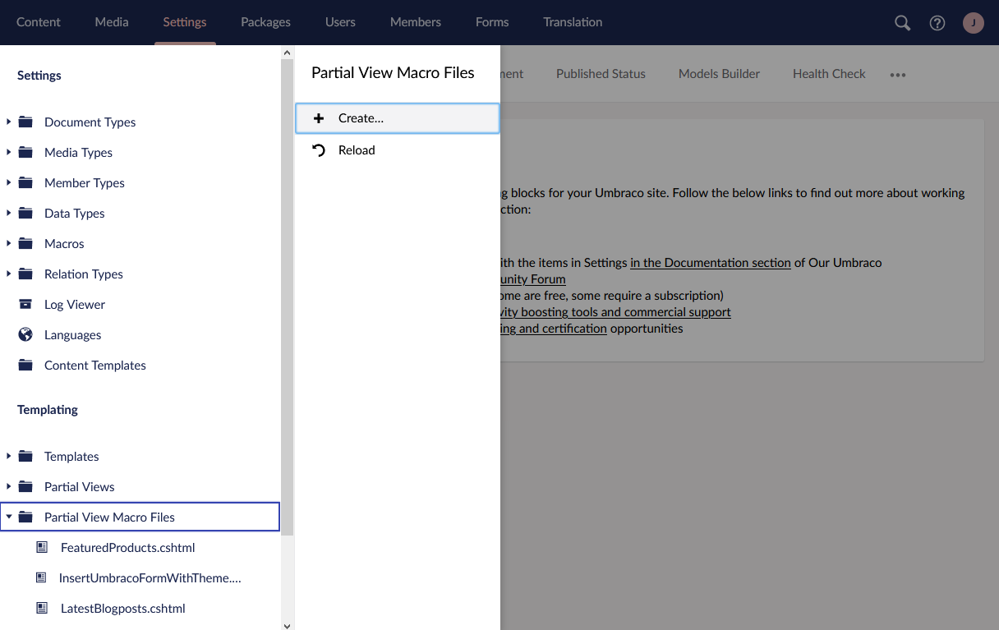

Make sure to create this Macro view from available snippets.

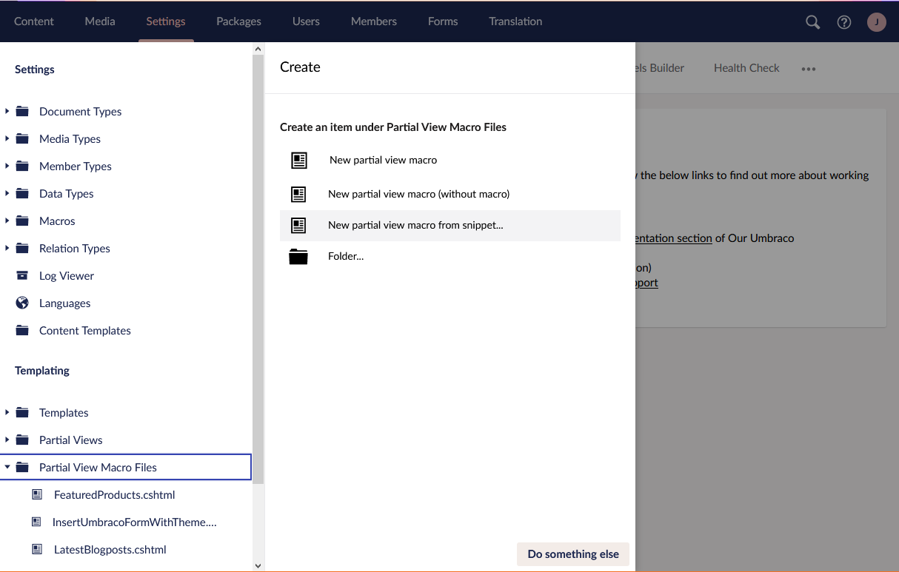

Start with the Register Member snippet.

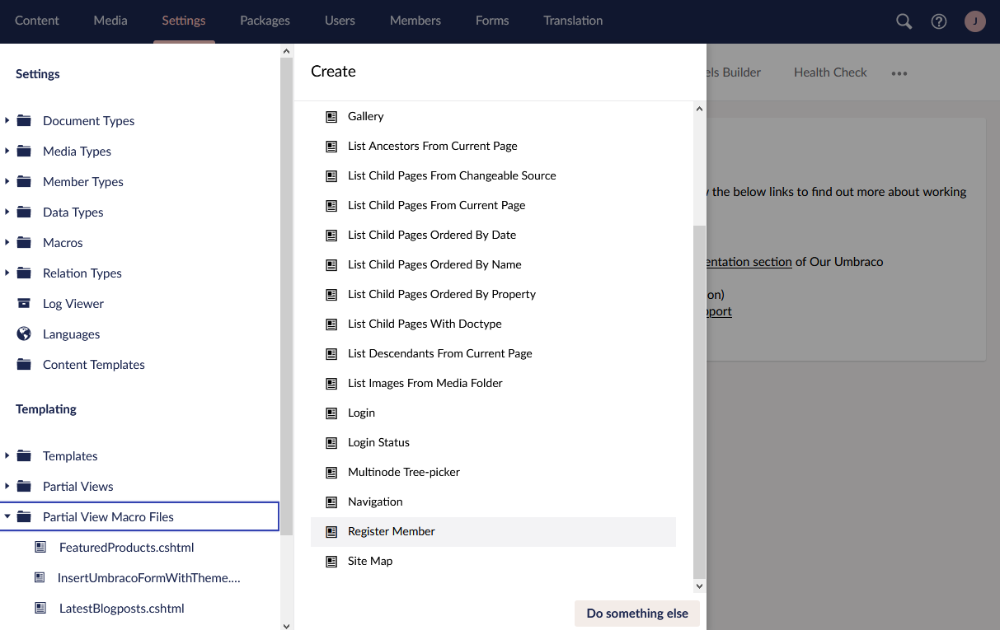

Make sure to fill out the name of the partial view (you can call it "Register", for example).
Afterward, using the same approach, create a Macro Partial View using the Login snippet and name it "Login".

With that done, navigate to the Partial Views folder above Partial View Macro Files, and create a New partial view from the snippet.
This view should be using the Login Status snippet.

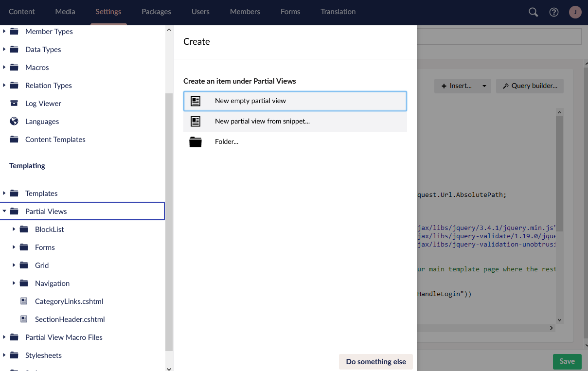

These three partials already contain all the necessary code to make the register, login, and logout functionality work.

Since the Register and Login were created as macro partials, you will have corresponding Macros with the same names available under the Macros folder above the Templating section.
Make sure to expand the Macros view, and in Editor Settings enable log in and Register macros to be used in Richtext Editor and the grid.

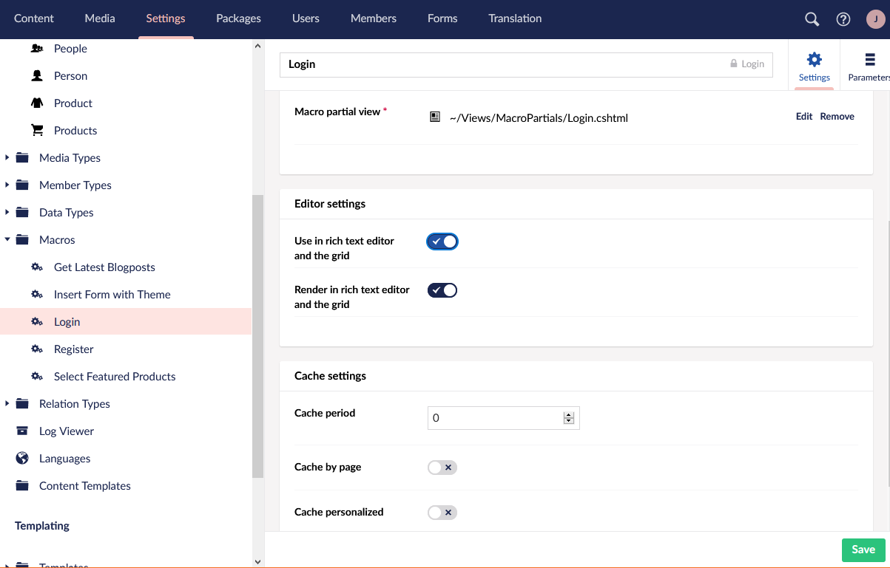

## Include the Macros and Partials in Content and Templates

Halfway there! Next, navigate to your Content section. Since we created Register and Login partials as macro partials, we can paste them into a Richtext Editor.
Create a new page that is using this editor, give it a name (e.g. Login/Signup), and in any RTE or Grid layouts you have on the page, insert a Macro.

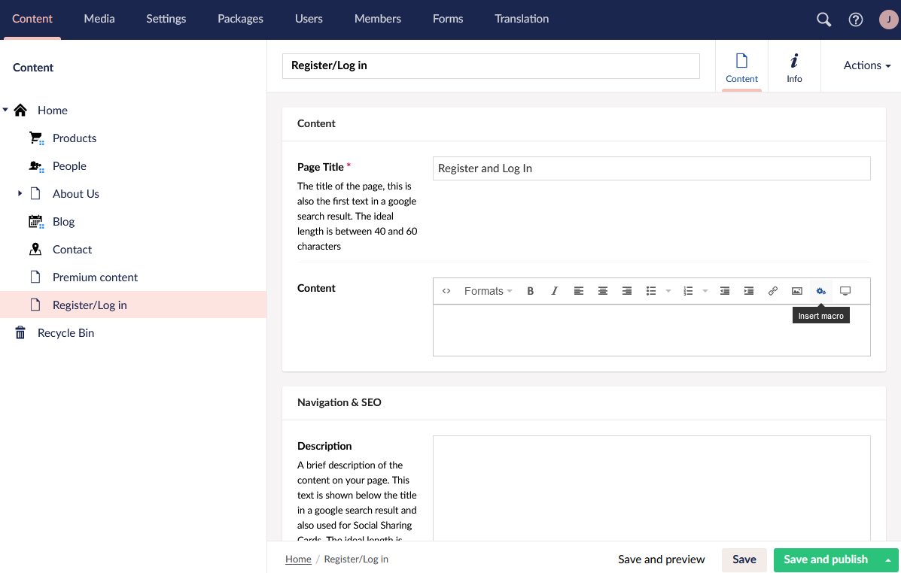

Choose the Macro you created. Depending on how you would like to structure your signup/login pages, you can include one of the macros or place both of them next to each other.

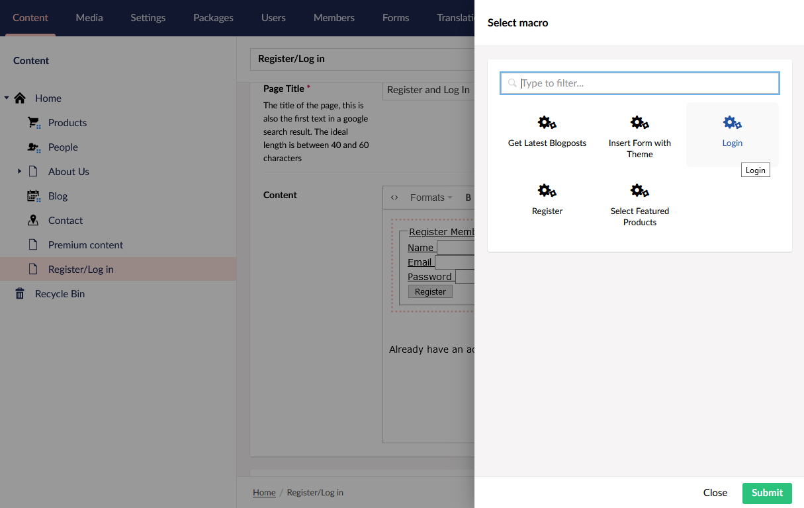

Save and publish the new page. Now the Register/Login functionality should be rendered on the new page you made.

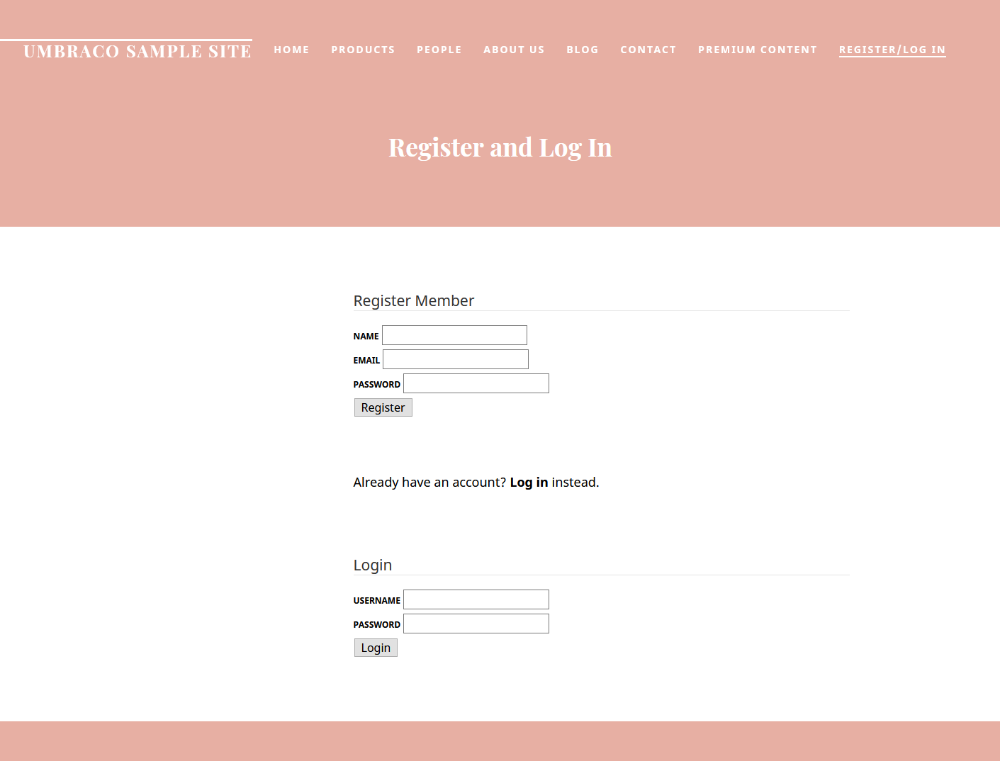

With the above macros in place, you can now use the page to register new Members.
Every registered person will show up in the Members section in the backoffice.


Now, we have our signup and login functionality - though there is one partial view we have not used yet, the Login Status.
We created it as a Partial View, not as a Macro, for a singular reason - we are going to include it directly in a template, not in a property editor in the Content section.
This partial view will show the current status - whether the person is logged in or not.

To insert the partial, type `@Html.Partial("")` and enter the name of your partial view in the quotes.

A good place to put it would be either the Master page, or a navigation component.

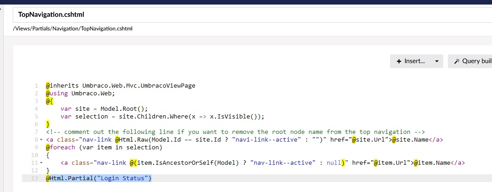

With this partial in place, provided we put it in navigation or a layout page, we will be able to see the login status no matter on which page we currently are. It also allows the member to log out.
Do keep in mind that you might need to style the partial a bit to make it fit with the rest of the site.


## Member-only pages/Restricted access

Now that we have the options to:

- Register a member
- Log in as a member
- Check the current login status
- Log out a member

We can also go a bit further and specify which parts of our website should be accessible to logged-in members.
To do this, head on over to the Member section in the Backoffice, and create a new Member Group.

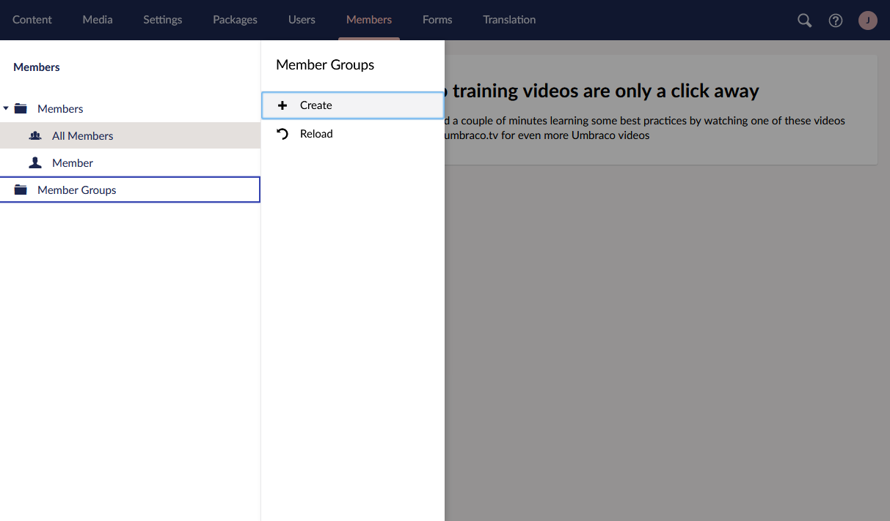

Give the group a name, and save it. Next, move over to the Members folder, click on any of the Members you have, and assign the newly created Member Group to them. To do that, click on the member who you would like to assign to the group.
Under `Properties`, you have the option to pick a group to assign the member to `(Member Group` property).

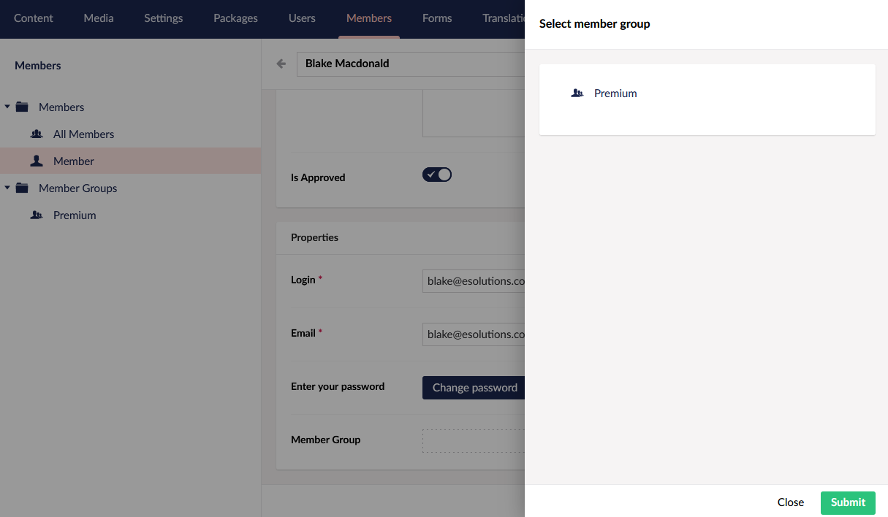

Almost there. Save the member, move to the Content section and find the page you would like to restrict. Right-click on that content node and find the option "Restrict Public Access".

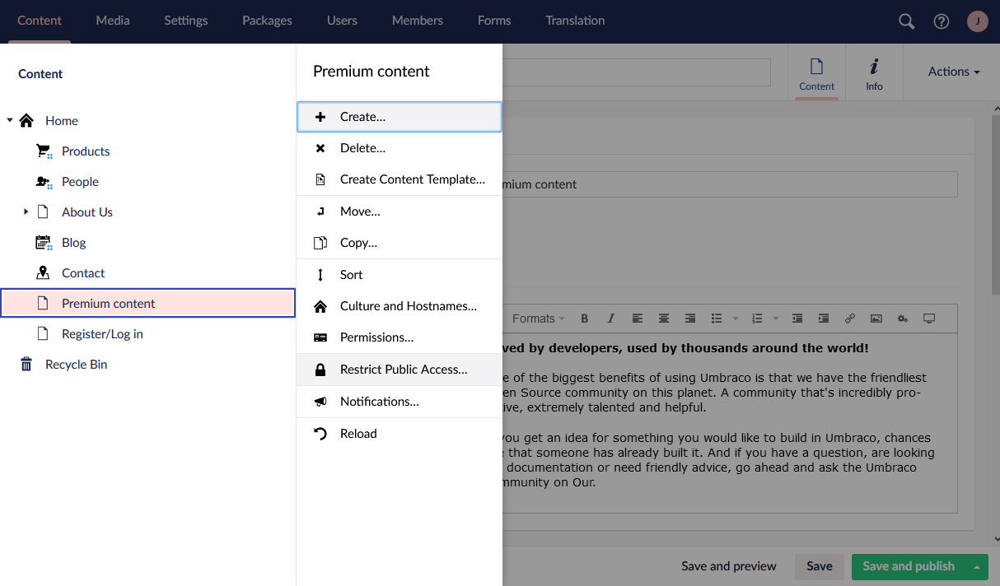

You will be able to restrict access to a specific member, or a specific group. Choose the latter option.
On this menu, you will be able to select the group that will have access to the page, the page with the login form, and the page that would be displayed if selected content would be inaccessible to the chosen group.

:::note
To restrict access you need to have made a member group, and a page containing the login partial. Having a "No access"/error page is recommended, as well - though you can use any content page you have.
:::

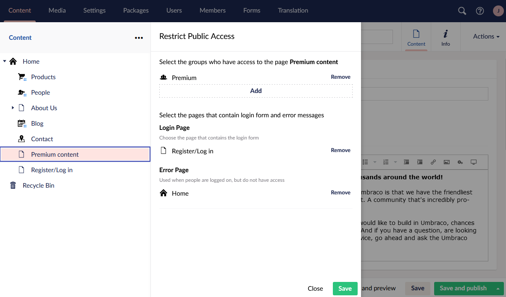

Congratulations! With all of that setup, the page you chose will redirect the user to the Login page if they are not logged in, and if they are logged in - they will be able to see the page's contents.

In the navigation, you will be able to tell the content node is restricted - the small red icon that is added on top of the document type icon signifies that.

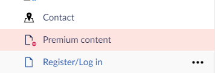

:::note
The above approach relies on two Macro partial views and a non-macro partial view. It is also possible to achieve the same result by working entirely with plain Partial Views, three Macros, and even plain HTML/Razor code copied from the Snippets into your Templates.
:::

However, with the above approach, members will not be assigned to any group automatically - for this to happen, we would need to write a bit of custom code.

## Assigning new members to groups automatically¨

### Creating a new SurfaceController

Since the member saving form is processed in a controller, we can copy the default [UmbRegisterController](https://github.com/umbraco/Umbraco-CMS/blob/v10/contrib/src/Umbraco.Web.Website/Controllers/UmbRegisterController.cs) and add a function to assign the newly created member to a group.

```csharp
using Microsoft.AspNetCore.Identity;
using Microsoft.AspNetCore.Mvc;
using System;
using System.Threading.Tasks;
using System.Linq;
using Umbraco.Cms.Core.Cache;
using Umbraco.Cms.Core.Logging;
using Umbraco.Cms.Core.Models;
using Umbraco.Cms.Core.Routing;
using Umbraco.Cms.Core.Scoping;
using Umbraco.Cms.Core.Security;
using Umbraco.Cms.Core.Services;
using Umbraco.Cms.Core.Web;
using Umbraco.Cms.Infrastructure.Persistence;
using Umbraco.Cms.Web.Common.Filters;
using Umbraco.Cms.Web.Common.Security;
using Umbraco.Cms.Web.Website.Controllers;
using Umbraco.Cms.Web.Website.Models;
using Umbraco.Extensions;

namespace Umbraco.Web.Controllers
{ 
    public class UmbAlternativeRegisterController : SurfaceController
    {
        private readonly IMemberManager _memberManager;
        private readonly IMemberService _memberService;
        private readonly IMemberSignInManager _memberSignInManager;
        private readonly ICoreScopeProvider _scopeProvider;

        public UmbAlternativeRegisterController(
            IMemberManager memberManager,
            IMemberService memberService,
            IUmbracoContextAccessor umbracoContextAccessor,
            IUmbracoDatabaseFactory databaseFactory,
            ServiceContext services,
            AppCaches appCaches,
            IProfilingLogger profilingLogger,
            IPublishedUrlProvider publishedUrlProvider,
            IMemberSignInManager memberSignInManager,
            ICoreScopeProvider scopeProvider)
            : base(umbracoContextAccessor, databaseFactory, services, appCaches, profilingLogger, publishedUrlProvider)
        {
            _memberManager = memberManager;
            _memberService = memberService;
            _memberSignInManager = memberSignInManager;
            _scopeProvider = scopeProvider;
        }

        [HttpPost]
        [ValidateAntiForgeryToken]
        [ValidateUmbracoFormRouteString]
        public async Task<IActionResult> HandleRegisterMember([Bind(Prefix = "registerModel")] RegisterModel model)
        {
            if (ModelState.IsValid == false)
            {
                return CurrentUmbracoPage();
            }

            MergeRouteValuesToModel(model);

            IdentityResult result = await RegisterMemberAsync(model);
            if (result.Succeeded)
            {
                TempData["FormSuccess"] = true;

               
                if (model.RedirectUrl.IsNullOrWhiteSpace() == false)
                {
                    return Redirect(model.RedirectUrl!);
                }

                
                return RedirectToCurrentUmbracoPage();
            }

            AddErrors(result);
            return CurrentUmbracoPage();
        }

        /// <summary>
        /// 
        /// </summary>
        /// <param name="model"></param>
        private void MergeRouteValuesToModel(RegisterModel model)
        {
            if (RouteData.Values.TryGetValue(nameof(RegisterModel.RedirectUrl), out var redirectUrl) && redirectUrl != null)
            {
                model.RedirectUrl = redirectUrl.ToString();
            }

            if (RouteData.Values.TryGetValue(nameof(RegisterModel.MemberTypeAlias), out var memberTypeAlias) &&
                memberTypeAlias != null)
            {
                model.MemberTypeAlias = memberTypeAlias.ToString()!;
            }

            if (RouteData.Values.TryGetValue(nameof(RegisterModel.UsernameIsEmail), out var usernameIsEmail) &&
                usernameIsEmail != null)
            {
                model.UsernameIsEmail = usernameIsEmail.ToString() == "True";
            }
        }

        private void AddErrors(IdentityResult result)
        {
            foreach (IdentityError? error in result.Errors)
            {
                ModelState.AddModelError("registerModel", error.Description);
            }
        }

        //Here we created a helper Method to assign a MemberGroup to a member.
        private void AssignMemberGroup(string email, string group)
        {
            try
            {
                _memberService.AssignRole(email, group);
            }
            catch (Exception ex)
            {
                //handle the exception
            }

        }


        /// <summary>
    
        /// </summary>
        /// <param name="model">Register member model.</param>
        /// <param name="logMemberIn">Flag for whether to log the member in upon successful registration.</param>
        /// <returns>Result of registration operation.</returns>
        private async Task<IdentityResult> RegisterMemberAsync(RegisterModel model, bool logMemberIn = true)
        {
            using ICoreScope scope = _scopeProvider.CreateCoreScope(autoComplete: true);

           
            if (string.IsNullOrEmpty(model.Name) && string.IsNullOrEmpty(model.Email) == false)
            {
                model.Name = model.Email;
            }

            model.Username = model.UsernameIsEmail || model.Username == null ? model.Email : model.Username;

            var identityUser =
                MemberIdentityUser.CreateNew(model.Username, model.Email, model.MemberTypeAlias, true, model.Name);
            IdentityResult identityResult = await _memberManager.CreateAsync(
                identityUser,
                model.Password);

            if (identityResult.Succeeded)
            {
               
                IMember? member = _memberService.GetByKey(identityUser.Key);
                if (member == null)
                {
                    
                    throw new InvalidOperationException($"Could not find a member with key: {member?.Key}.");
                }

                foreach (MemberPropertyModel property in model.MemberProperties.Where(p => p.Value != null).Where(property => member.Properties.Contains(property.Alias)))
                {
                    member.Properties[property.Alias]?.SetValue(property.Value);
                }

                //Before we save the member we make sure to assigne the group, for this the "Group" must exist in the backoffice.
                string memberGroup = "professionals";
                AssignMemberGroup(model.Email, memberGroup);

                _memberService.Save(member);

                if (logMemberIn)
                {
                    await _memberSignInManager.SignInAsync(identityUser, false);
                }
            }

            return identityResult;
        }
    }
}
```

For an easier implementation, you can copy the above code to a new .cs file and place it in a folder in your solution so that it will be compiled on application startup.

With the above controller in place, it is time to adjust the macro/view files as well.

:::note
In the example above we have only hardcoded the Member group, which we are assigning to someone who is registering in our example.

To be able to add the Member Group that we automatically assign from the backoffice you will need to extend the controller further, which we won't cover in this tutorial.
:::

### Adjusting the Registration partial to use the new controller

In the Backoffice, navigate to the Register partial you created before. Where we would normally be using

```csharp
using (Html.BeginUmbracoForm<UmbRegisterController>(
            "HandleRegisterMember",
            new {
                MemberTypeAlias = registerModel.MemberTypeAlias,
                UsernameIsEmail = registerModel.UsernameIsEmail,
                RedirectUrl = registerModel.RedirectUrl
            }))
```

we have to instead use the custom controller we added, as well as include an anti-forgery token:

```csharp
    using (Html.BeginUmbracoForm<UmbAlternativeRegisterController>(
            "HandleRegisterMember",
            new {
                MemberTypeAlias = registerModel.MemberTypeAlias,
                UsernameIsEmail = registerModel.UsernameIsEmail,
                RedirectUrl = registerModel.RedirectUrl,
                memberGroup = "Professionals"
            }))

            @Html.AntiForgeryToken()
```

:::note
Make sure to replace `UmbRegisterController` with the name of the controller you created in the earlier step - in our example, that is `UmbAlternativeRegisterController`.
:::

We are also passing a member group as a parameter - people who register with this form will be automatically assigned to the "Professionals" member group, assuming it already exists in the Backoffice.
