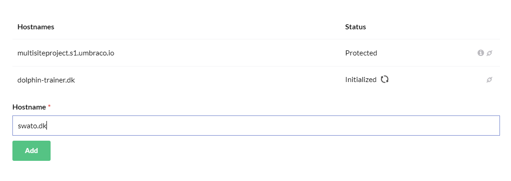
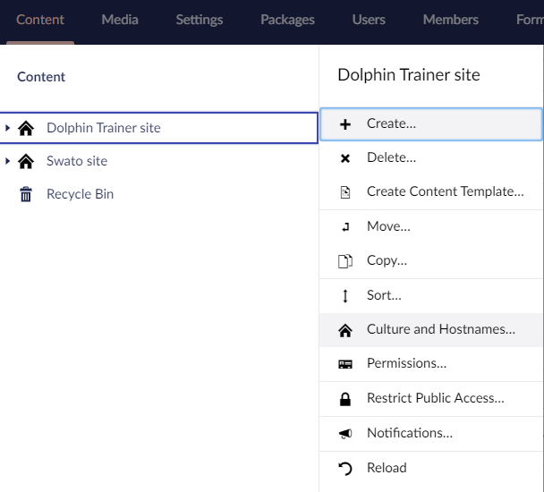
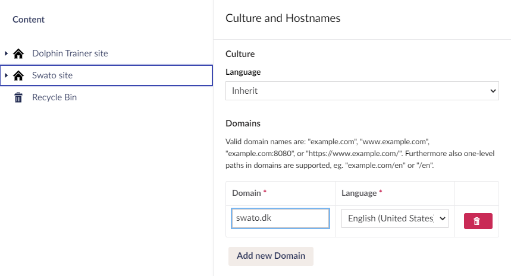

# Multisite setup on Umbraco Cloud

This tutorial explains how to host multiple sites from one project/installation of Umbraco.
For practical reasons, we recommend using [Baselines](../../Umbraco-Cloud/Getting-Started/Baselines/) on the Cloud projects.

If you are planning to create a multilingual site in Umbraco 8, please take a look at the [Multilanguage Setup](../Multilanguage-Setup/) tutorial instead.

## Structuring your website

The best way to handle a multisite solution is to have multiple root nodes in the Content section, where each root node would act as a separate website.

Keep in mind all the websites in your solution will be using the same schema - meaning, in most cases, your content pages on website A will be using the same properties as on website B. 

## Binding the hostnames to the project

Before you can map your hostnames to individual websites in the solution, you should add them in the Hostnames section on the Cloud portal to ensure they are secured with TLS.

Keep in mind the [hostnames have to be configured in a specific way.](../../Umbraco-Cloud/Set-Up/Manage-Hostnames/).

## Mapping the hostnames to individual websites/root nodes

Once the hostnames are protected by TLS, navigate to the backoffice of your site, to the Content section.
At this point you should have several root nodes, where each is a separate website.
Right click on the root node you wish to assign the hostname to, then choose the Culture and Hostnames option.

Add a new Domain and choose the matching hostname to be applied.
If  you have a multilanguage solution, you can map different hostnames to specific languages.

Click Save and that should do it! The sites you have should now be available under the hostnames you provided.

## Best practices

While such a setup might be handy, it also comes with drawbacks.
It is important to keep in mind that having multiple sites on one Umbraco project:
- might increase resource usage
- could interfere with editors' workflows, especially if there are multiple people working on both websites at once
(that is because the solution will still use one database for both websites)
- limit your options in regards to developing new features and making schema changes

In general, while on the Cloud, we instead recommend using the [Baseline](../../Umbraco-Cloud/Getting-Started/Baselines/) functionality - which comes with added benefits, and offers increased stability compared to the multisite solution in a single project.
