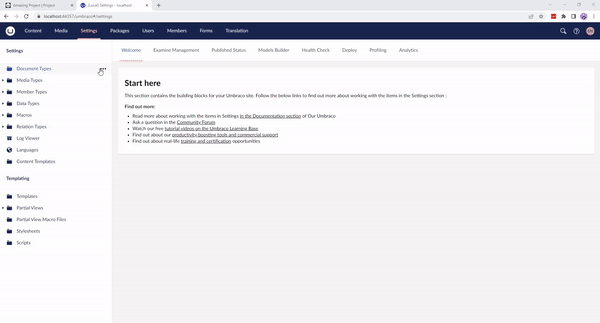

# Deploying changes with Umbraco Deploy

In this article, you can learn more about how to deploy your code changes and metadata from a local instance to your Cloud environment.

## Deploying from local to your Cloud environments

When you are working with your Umbraco Cloud project locally, all changes you make will automatically be identified and picked up by your local Git client.

Here's a quick step-by-step on how you deploy these changes to your Cloud environment:

- You've cloned a site to your local machine to work on.
- You've made some changes to a Document Type.
- The corresponding `.uda` file for this Document Type is now updated with the changes. The file is located in the `/umbraco/Deploy/Revision` folder.
- You've also created a new Data Type that's used on the Document Type. This Data Type is also stored as a new file in the `/umbraco/Deploy/Revision` folder.
- Using Git, commit those two changed files to your local repository and push them to your Cloud repository.
- A deployment kicks in and the Document Type is updated and the new Data Type you created locally is now automatically created on the remote environment as well.



In the above example, Git Bash is used to stage, commit, and deploy changes made to a Document type plus a newly added data type from a local environment to a Cloud Development environment. You are welcome to use any Git client or command line interface of your choice.

Once you've deployed your local changes to your Cloud environment deploying to your remaining Cloud environments (e.g. Staging and/or Live) is done using the **'Deploy changes to ..'** button in the Umbraco Cloud portal. For more information, see the [Deploying between Cloud environments](../Cloud-to-Cloud) article.

## Deploying without using a Git client

If you don't have a Git client installed on your local machine, or prefer to work with Git through the command line, you can use eg. [Git for Windows](https://gitforwindows.org/) and the following commands:

```cs
# Navigate to the repository folder
cd mySite
# Check the status of the repository for pending changes
git status
# Add pending changes
git add -A
# Commit staged files
git commit -m "Adding updated schema changes"
# Push to the environment
git push

# If the push is rejected you will need to pull first
git pull
# Try to push again if there were no conflicts
git push
```

If you have to pull down new commits, it is a good idea to see if any of these commits contain changes to the schema (anything in `umbraco/Deploy/Revision/`). To ensure that your local site is up-to-date, and your changes work with the updated schema, you can navigate to the `umbraco/Deploy/` folder and create a deploy marker if one doesn't already exist. From a command line type the following command:

```cs
/UmbracoProject/umbraco/Deploy> echo > deploy
```

The local site should be running when you do this. The deploy marker will change to `deploy-progress` while updating the site and to `deploy-complete` when done. If there are any conflicts/errors, you will see a `deploy-failed` marker instead, which contains an error message with a description of what went wrong.

Another way is to use the **Deploy** Dashboard in the **Settings** section of the Umbraco backoffice. Here, you can see the status of ongoing or completed deployment processes. The status will show whether an operation has been triggered and whether it is in progress, has been completed, or has failed.

The dashboard will show the status based on the marker files on the disk, eg. `deploy-progress`. From the **Deploy** Dashboard, it is also possible to trigger various processes. Learn more about this dashboard in the [Deployment](../) article.
