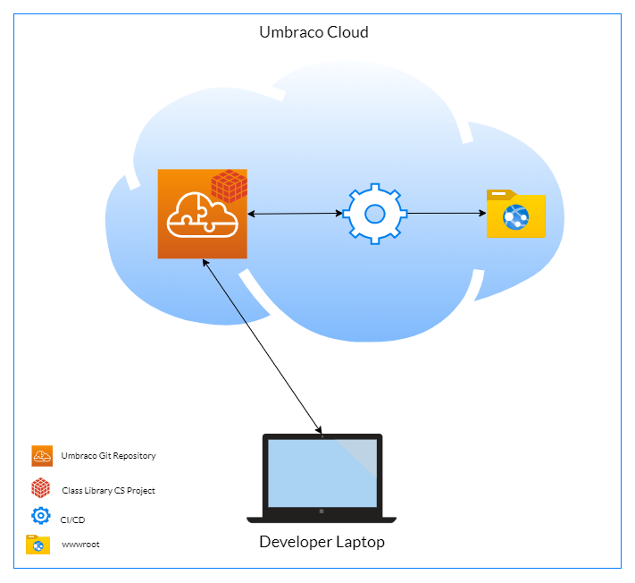

# Repositories in an Umbraco cloud Project

Each Umbraco Cloud project can have multiple environments: Development, Staging, and Live depending on your Cloud project plan. Each environment has it's own git repository that is hosted on Umbraco’s Cloud platform.

:::note
Umbraco Cloud repositories are *only* deployment repositories and should not be used as source code repositories.
:::

Ideally, your Umbraco Cloud setup should look like this:

- [A source control repository with your own code](#a-source-control-repository-with-your-own-code)
- [A Umbraco Cloud source control repository with the locally cloned Umbraco project](#a-git-umbraco-cloud-source-control-repository-with-the-locally-cloned-umbraco-project)

## A source control repository with your own code

Source control is a way to control changes to files and directories. You can keep a record of changes and revert to specific versions of a file in the event you would like to back up to an earlier time. A source control repository is used as the single source of truth that has the latest version of your project source code with all the git branches.

There are different source code management tools that you can use such as GitHub, Git, GitLab, Apache Subversion (SVN), Mercurial, etc.

The external Git repository can be used to store the entire source code of your project. Additionally, the Umbraco Cloud project must have all your source code too. You can no longer store dll files in your Umbraco Cloud project.

## A Git Umbraco Cloud source control repository with the locally cloned Umbraco project

When you create a Cloud project you get two environments: a Development environment and a Live environment. To work with a local copy of your site, you clone down the Development environment using the **Clone project** option from the Cloud Portal and start building your website locally. This repository is different from your source control repository.

Once you're happy with the results or wish to see how your website has progressed, you push the changes back to the Development environment. If everything is working as expected you then deploy your changes to the Live environment.

### Code Deployment Summary

In the above diagram, the Umbraco Git repository contains the source code of a class library CS project.

With this setup, once you commit your code in the Umbraco Cloud Git repository, your C# source code is built by Umbraco Cloud and then deployed to the `wwwroot` folder.

## Disadvantages of using an Umbraco Cloud Project repository as a source code repository

- We only guarantee to maintain and keep the `master` branch. If there are any other branches, they might be removed without any notification causing data loss.

- You will need to commit your frontend artifacts as the build pipeline only builds dlls from your C# code.
