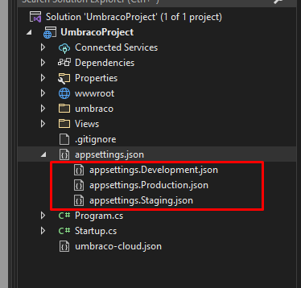

# Config Transforms

In this article you can learn how to use config transform files to apply environment specific configuration and settings to your Umbraco Cloud project using both Web.Config files as well as the appSettings.json file.

## What are Config Transforms?

Config Transforms are a way to transform your config files without changing the actual config file.

To transform a config file, you need to create a new file in your project with the following naming convention: `{config-file name}.{environment}.config`.

If you want to do a transform on your `Web.config` file for the Live environment of your project, the config transform you need to create will look like this:

`Web.Production.config`

The `{environment}` part needs to be replaced with the target environment, for which there are currently 3 possibilities for each project:

1. `Production`
2. `Staging`
3. `Development`

This file needs to be created on a local clone of your project, as this will ensure that the file is added to the project repository.

When the file is deployed to the Live environment the transforms will be applied to the `Web.config` file in the `Root` of your project. In the case that you also have a Development and/or Staging environment, the `Web.Production.config` will **only** transform the `Web.config` on the Live environment.

For each deploy, the Umbraco Cloud engine searches for all of the `.{environment}.config` files in your site and applies the transforms.

:::note
Using config transforms to remove and/or add sections to config files is currently only possible for the `Web.config` file.
:::

## Syntax and testing

When creating config transforms you need to follow these three rules:

1. Use the correct file-naming convention
2. Place the transform file in the same folder as the file you want to transform
3. Follow the correct [Config Transform syntax](https://docs.microsoft.com/en-us/aspnet/core/host-and-deploy/iis/transform-webconfig?view=aspnetcore-5.0)

Before applying the config transform files to your environments we recommend that you run a test using this tool: [Webconfig Transformation Tester](https://elmah.io/tools/webconfig-transformation-tester/)

Using the tool will let you test whether the transform file transforms your config files correctly. The tool can be used for all config files.

## Examples

Rewrite rules are often something you only want to apply to your Live environment. To avoid the rewrites being applied to your Development and/or Staging environments, you can create a transform file to apply the rewrite rules to your Live environment only.

Here is an example of how that config transform would look:

```xml
<?xml version="1.0" encoding="utf-8"?>
<configuration xmlns:xdt="http://schemas.microsoft.com/XML-Document-Transform">
	<location>
		<system.webServer>
			<rewrite xdt:Transform="InsertIfMissing">
				<rules>
					<rule xdt:Locator="Match(name)" xdt:Transform="InsertIfMissing" name="Redirects umbraco.io to actual domain" stopProcessing="true">
						<match url=".*" />
						<conditions>
							<add input="{HTTP_HOST}" pattern="^(.*)?.euwest01.umbraco.io$" />
							<add input="{REQUEST_URI}" negate="true" pattern="^/umbraco" />
							<add input="{REQUEST_URI}" negate="true" pattern="^/DependencyHandler.axd" />
							<add input="{REQUEST_URI}" negate="true" pattern="^/App_Plugins" />
							<add input="{REQUEST_URI}" negate="true" pattern="localhost" />
						</conditions>
						<action type="Redirect" url="http://swato.dk/{R:0}" appendQueryString="true" redirectType="Permanent" />
					</rule>
				</rules>
			</rewrite>
		</system.webServer>
	</location>
</configuration>
```

This config transform will add a new `<rule>` to `<system.webServer><rewrite><rules>`. The `xdt:Transform` attribute is used to tell the system what to transform. In this case the value is `InsertIfMissing`, which means it will add the section if it's not already in the config file. In order to be able to identify the correct section the `xdt:Locator` attribute is used to *match* the value of the `name` attribute.

:::note
Keep in mind that a misconfigured config transform may block Data Extraction on your project. Please see [here](../../Troubleshooting/Deployments/Changes-Not-Being-Applied) for more details.
:::

## appSettings.json transforms

On Umbraco Cloud, projects come with an **appSettings.json** file for each of your different environments.

With this you can add different  environment specific settings to your project.

To edit the **appSetting.json** files for the different environments, the Umbraco Cloud project needs to be cloned down to your local machine and edit the files from your code editor.



Once you've added the settings you want to the files, it will need to be pushed up to your Umbraco Cloud project to make sure that it is added to your projects repository.

Once pushed up, when the file is deployed to the next environment, the **appSettings** files will be transformed based on the environment you are pushing to and the settings that have been added will be applied for that specific environment.
