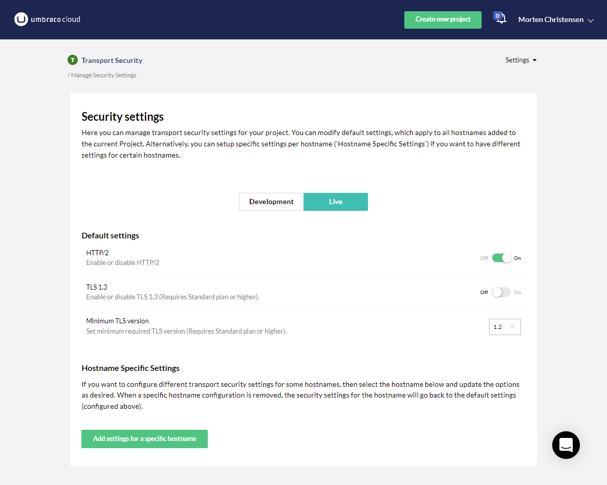
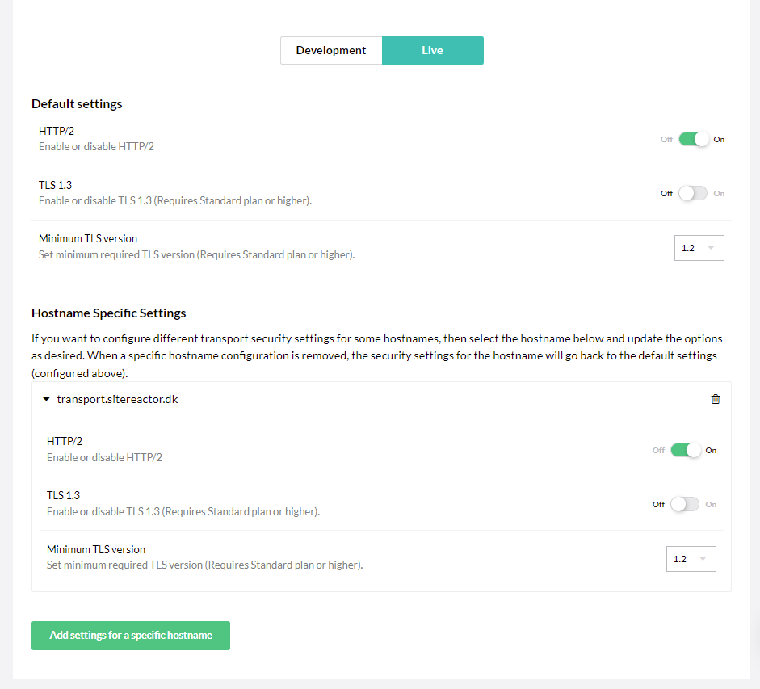

# Managing Transport Security

Once you have added your own hostnames to your Umbraco Cloud project it's possible to configure certain transport security options for all or for specific hostnames within your project.
These security options all relate to the traffic that goes through your hostname from the origin (Umbraco Cloud) to the end-user - meaning the protocols and encryption used to transport your website and assets from the webserver to the browser.

The options that are currently available are
- HTTP/2 (default: on)
- TLS 1.3 (default: off)
- Minimum TLS Version (default: 1.2)

When a new hostname is added to a Project it will have the default settings applied. But you can change the defaults for your Project, so new hostnames will get the default settings you have chosen.

## HTTP/2 Explained

The first usable version of HTTP was created in 1997. Because it went through several stages of development, this first version of HTTP was called HTTP/1.1. This version is still in use on the web. In 2015, a new version of HTTP called HTTP/2 was created. HTTP/2 progressively enhances your website’s performance. When a browser supports HTTP/2, Umbraco Cloud will take full advantage of HTTP/2 performance benefits end to end. 
For older browsers or non-HTTPS requests, the traffic will fall back to HTTP/1.1. You don’t need to choose between better performance and backwards-compatibility, which is why HTTP/2 is enabled by default for all new hostnames added to an Umbraco Cloud project.

## TLS 1.3 Explained

Transport Layer Security (TLS) TLS 1.3 is the newest, fastest, and most secure version of the TLS protocol. SSL/TLS is the protocol that encrypts communication between users and your website. When web traffic is encrypted with TLS, users will see the green padlock in their browser window.
By turning on the TLS 1.3 option, traffic to and from your website will be served over the TLS 1.3 protocol when supported by clients. TLS 1.3 protocol has improved latency over older versions, has several new features, and is currently supported in both Chrome (starting with release 66), Firefox (starting with release 60), and in development for Safari and Edge browsers.

## Minimum TLS Version Explained

Minimum TLS Version only allows HTTPS connections from visitors that support the selected TLS protocol version or newer.
This option relates to the TLS versions mentioned above and the current default, which is TLS 1.2. If you want your website traffic to only use TLS 1.3 you can change the minimum version. But be mindful of the implications that this might have (see browser support above). You don't need to change the minimum version in order to use TLS 1.3.

## Plan specific features

Access to the different options vary depending on the Umbraco Cloud Plan your project is on.
Currently the features are available as follows:

- Starter: HTTP/2
- Standard: HTTP/2, TLS 1.3, Minimum TLS Version
- Pro: HTTP/2, TLS 1.3, Minimum TLS Version

## Security subpage

From your Umbraco Cloud Project, click Security from the Settings dropdown to get to the Security subpage.
The Security settings are scoped per environment, so if you have multiple environments and add your own hostnames to different environments you can select the environment at the top of the page.
Aside from environments the Security subpage is divded into two parts: 'Default Settings' and 'Hostname Specific Settings'.
Use the default settings to configure what should be applied by default to new and existing hostnames.

If you want to have different security options for different hostnames, then select the hostname under Hostname specific settings and adjust the options for that specific hostname.
This might be useful if you want to test the different options on another hostname then your primary hostname.

