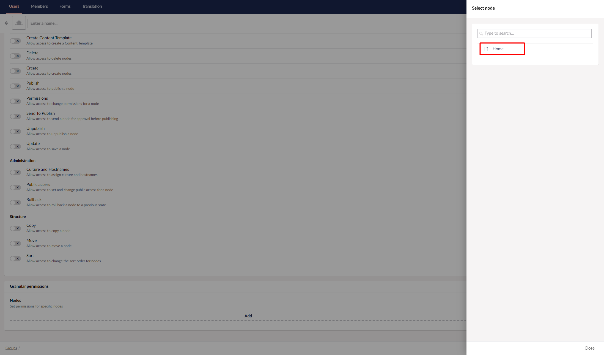

# Users on Umbraco Cloud

On Umbraco Cloud, users work in almost the same way as on a normal installation of Umbraco. However, there are a few more settings available for the backoffice users on Umbraco Cloud.

In this article, we will show how users work, as well as explain the different settings for users on Umbraco Cloud.

## Adding users on Umbraco Cloud

There are two ways of adding a user to your backoffice on Umbraco Cloud.

You can add them as a [Team member](../Team-Members/) from the project portal on Umbraco Cloud.

By default, when added to the project as a Team member, they will be added as users to the backoffice of all the environments as administrators.

Users can also be invited directly from the backoffice of your Umbraco Cloud project, from where you can give them different permissions.

Check out the [Users article](../../../Getting-Started/Data/Users/) for an in-depth explanation about Umbraco users in general.

:::note
Users are environment-specific on Umbraco Cloud. This means that they will not be transferred over when doing a deployment to the next environment they will need to be added on the different environments on Umbraco Cloud.
:::

## Invite user through the Umbraco backoffice

As mentioned it is possible to invite new users to your Umbraco Cloud project through the backoffice as you would on a normal installation of Umbraco.

To invite a user you need to do the following:

1. Go to the backoffice of your Umbraco Cloud project
2. Go to the user section in the backoffice
3. Invite new user to the project
4. Enter name and email and add a User Group to assign access and permissions and optionaly enter a new message for the invitation

Once the user have been invited they will receive an invitation for the project.

If you already have a user on Umbraco Cloud you will get a invitation in the project portal under "Project Invites".

If the user being invited does not have a user on Umbraco Cloud, they will receive a email to create one.

 

 Once the User have been created, it is now possible to login to the Umbraco Cloud portal.

 From here they will have a pending invitation to the project they have been invited to.

 Once the invitation have been accepted, they can now access the project through the Umbraco Cloud portal and access their site from there.

:::note
This only applies on project on version 8.9.1 and above.
Users invited to projects on lower versions will not need an Umbraco Cloud User.
:::

## User group permissions for transfers and restores

On Umbraco Cloud, it is possible to control which users have access to transferring and restoring content and media on your Umbraco Cloud project.

This can be done when creating a new User Group or when editing an existing group.

You have the option to decide whether a specific User Group has permission to do a restore, partial restore, or queue content for transfer to the next environment.

It is also possible to get Granular control on a per-node basis so that you can disable restore and transfer for specific content on your site. This can help avoid mistakes and ensure that the proper workflows are followed.

### Set up Permissions for transfers and restores

There are two ways that you can set up these permissions:

- Create a new User Group
- Edit an existing one

To create or edit a User Group, go to the User section of the backoffice.

1. Click on "Groups" in the right corner, from here you are able to either create a new User Group or edit an existing one.

    

2. Click "Create group"
3. Scroll down and look under "Default permissions" here you can see three options:

    

4. Decide whether the users in the new User Group can restore, partially restore, or transfer content.

5. Edit an already existing User Group.

6. Go to the User Group you want to edit, e.g Editors or Writers, and set the permissions from there.

### Granular Permissions

As mentioned it is also possible to set Granular permissions for a specific content node on your Cloud project.

You can set the permission when you are creating or editing an existing User Group.

1. Add the setting for Granular permission for your content nodes at the bottom of the User Group.

    

2. Click "Add".

3. Choose the content node which you want to set the Granular settings for.

    

4. Set permissions for restore, partial restore, and queueing content for transfer.

    
