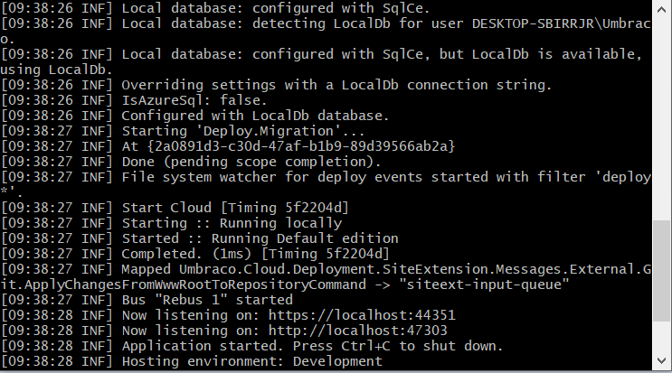

# Working with a Local Clone of an Umbraco Cloud Site

To work with a local copy of your site, you'll need to use Windows and have a local web server installed (like WebMatrix / IIS). If you're not using Windows, you can still work with your site's files (Templates, Css, JavaScript, etc...) but you'll need to deploy these to your development site before you can "see" your updates - head over to our chapter on [Working with UaaS Cli](../Working-With-UaaS-Cli/) for more information on this.

## Video Tutorial

<iframe width="800" height="450" src="https://www.youtube.com/embed/e3spd6Nqrf8?rel=0" frameborder="0" allow="accelerometer; autoplay; encrypted-media; gyroscope; picture-in-picture" allowfullscreen></iframe>

## Cloning the Umbraco Project

From the Umbraco Cloud portal, copy your development environments git repository endpoint using the **How to connect my machine** option and then clone the site using your favorite Git client. We like [Fork](https://git-fork.com/), [SourceTree](https://www.sourcetreeapp.com/), [Git Extensions](https://gitextensions.github.io), or [GitKraken](https://www.gitkraken.com/).

Here are the steps to clone your site (**We'll use Fork in this example.**):

1. Open the dropdown menu for your Developement machine and choose the **Clone project** option to open the Clone project dialog.

    

2. Copy the Clone Url from the portal for your dev environment.

    

3. From **Fork**, select **Clone**.

    

4. Set your destination path to where you keep your local work.
5. Paste the URL in to the URL box.
6. Choose a name for the local project folder (preferably using the project name).
7. Click **Clone the repo!**

    
8. You’ll be prompted to log in - Use the same credentials as you use for Umbraco Cloud.

    

Now, you have an exact copy of your Umbraco Cloud environment that you can run locally. For information on how to run the site locally, see the [Running the Site Locally](#running-the-site-locally) section or the `Readme` file in the project.  

We like to use Visual Studio Code when working locally, but you can use Visual Studio or any other development tool or web server. When you run your local site for the first time, you’ll be prompted to restore your site's content. Wait until this process completes as it also creates the local SqlCE database for your site.


That's it! Now you can work with your site locally as you would with any other Umbraco site. You can create content, add media, even create your own custom code. When you're ready to deploy your changes make sure to have a look at the [deployments](../../Deployment/) documentation.

:::note
If you have more than "a few" media items see our recommendations for working with [media in Umbraco Cloud](../Media/).
:::

### Running the Site Locally

To run Umbraco locally, you will need to [install the latest .NET SDK](https://dotnet.microsoft.com/download) (if you do not have this already).

With that installed, run the following commands in a terminal application of your choice:

1. Navigate to the newly created project folder:

    ```cli
    cd src/UmbracoProject
    ```

2. Build and run the new Umbraco .Net Core project:

    ```cli
    dotnet build
    dotnet run
    ```

The terminal output will show the application starting up and will include localhost URLs which you can use to browse to your local Umbraco site.



The first time the project is run locally, you will see the restore boot-up screen from Umbraco Cloud. If the environment you have cloned already contains Umbraco Deploy metadata files (such as Document Types), these will automatically be extracted with the option to restore content from the Cloud environment into the local installation.

:::note
When running locally, it is recommend to setup a developer certificate and run the website under HTTPS. If you haven't configured one already, then run the following dotnet command:

```cli
dotnet dev-certs https --trust
```
