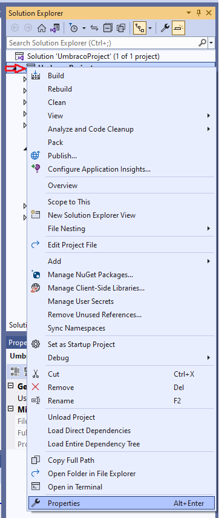

# Upgrading an Umbraco 9 Cloud project to Umbraco 10

This article will provide steps on how to upgrade an Umbraco 9 Cloud project to Umbraco 10.

The upgrade path between Umbraco 9 and Umbraco 10 can be done directly by updating your project using NuGet. You will need to ensure the packages you are using are available in Umbraco 10.

## Prerequisites

* An Umbraco 9 Cloud project running **the latest version of Umbraco 9** with **at least 2 environments**.

* A backup of your Umbraco 9 project database.

:::note
We strongly recommend having at least 2 environments on the Umbraco 9 project. If something fails during the upgrade, the Development environment can be removed and added again to start over with the upgrade process.
:::

## Step 1: Content Migration

* Create a backup of the database from your Umbraco 9 project, see the [Database backups](https://our.umbraco.com/documentation/umbraco-cloud/Databases/Backups/) article or clone down the V9 project and take a backup of the local Database (Ensure to restore the content from your cloud environment).

* On the Cloud portal, go to the project that you wish to upgrade and navigate to **Settings** -> **Advanced**. Scroll down to **Runtime Settings** section and **Enable .NET 6 for your Umbraco 9 install** for each environment of your cloud project.

    

* Clone down the **Development** environment from the Umbraco 9 Cloud project, build and run the project locally and make sure to log in to the backoffice.

## Step 2: Upgrade the project locally using Visual Studio

* Open your Umbraco 9 project in Visual Studio.

* Right-click your project solution in the **Solution Explorer** and select **Properties**.
    

* In the **General** section of the **Application** tab, select **.Net 6.0** from the **Target Framework** drop-down.
    

* Go to **Tools** > **NuGet Package Manager** > **Manage NuGet Packages for Solution...**.

* In the **NuGet Package manager Solution**, go to the **Installed** tab and choose **Umbraco.Cms**.

* Select your project, choose **10.0.0** from the **Version** drop-down and click **Install** to upgrade your project to version 10.
    

* Similarly, update the below packages referenced in your project to the latest versions available on NuGet either through the **NuGet Package Manager** or **Package Manager Console (PowerShell)**:
  * <https://www.nuget.org/packages/Microsoft.Extensions.DependencyInjection.Abstractions/6.0.0>
  * <https://www.nuget.org/packages/Umbraco.Cms/10.0.0>
  * <https://www.nuget.org/packages/Umbraco.Deploy.Cloud/10.0.0>
  * <https://www.nuget.org/packages/Umbraco.Deploy.Contrib/10.0.0>
  * <https://www.nuget.org/packages/Umbraco.Forms/10.0.0>
  * <https://www.nuget.org/packages/Umbraco.Cloud.StorageProviders.AzureBlob/5.0.0>
  * <https://www.nuget.org/packages/Umbraco.Cloud.Identity.Cms/10.0.0>
  * <https://www.nuget.org/packages/Umbraco.Deploy.Forms/10.0.0/>

* Update the `Program.cs` to the following:

    ```CSharp
    using Umbraco.Cms.Web.Common.Hosting;
    public class Program
        {
            public static void Main(string[] args)
                => CreateHostBuilder(args)
                    .Build()
                    .Run();

            public static IHostBuilder CreateHostBuilder(string[] args) =>
                Host.CreateDefaultBuilder(args)
                    .ConfigureUmbracoDefaults()
                    .ConfigureWebHostDefaults(webBuilder =>
                    {
                        webBuilder.UseStaticWebAssets();
                        webBuilder.UseStartup<Startup>();
                    });
        }
    ```

* To re-enable the appsettings IntelliSense, update your schema reference in the **appsettings.json**, **appsettings.Development.json**, **appsettings.Production.json**, and **appsettings.Staging.json** files from:

    ```json
    "$schema": "./umbraco/config/appsettings-schema.json",
    ```

    To:

    ```json
    "$schema": "./appsettings-schema.json",
    ```

* Remove the following files and folders *manually* from your local project and on the cloud **Development** environment through [KUDU](../../Set-Up/Power-Tools/index.md) both from the `repository` and `wwwroot` folders:

  * `/wwwroot/umbraco`
  * `/umbraco/PartialViewMacros`
  * `/umbraco/UmbracoBackOffice`
  * `/umbraco/UmbracoInstall`
  * `/umbraco/UmbracoWebsite`
  * `/umbraco/config/lang`

* Build and run your project locally to verify the Umbraco 10 upgrade.
    

## Step 3: Deploy and test on Umbraco Cloud

Once the Umbraco 10 project runs locally without any errors, the next step is to deploy and test on the Cloud Development environment.

* Push the changes to the Umbraco Cloud **Development** environment, see the [Deploying from local to your environments](../../Deployment/Local-to-Cloud/index.md) article.

* Test **everything** on the **Development** environment.

* Deploy to the **Live** environment, see [Deploying from one Cloud environment to another](../../Deployment/Cloud-to-Cloud/index.md) article.

## Step 4: Going live

Once the upgrade is complete, and the Live environment is running without any errors, the site is ready for launch.

* Setup [URL Rewrites](../../../Reference/Routing/IISRewriteRules/index.md) on the Umbraco 10 site.
* Assign hostnames to the project.
    :::note
    Hostnames are unique and can only be added to one Cloud project at a time.
    :::

## Related information

* [Issue tracker for known issues with Content Migration](https://github.com/umbraco/UmbracoDocs/issues)
* [Forms on Umbraco Cloud](../../Deployment/Umbraco-Forms-on-Cloud)
* [Working locally with Umbraco Cloud](../../Set-Up/Working-Locally/)
* [KUDU on Umbraco Cloud](../../Set-Up/Power-Tools/)
