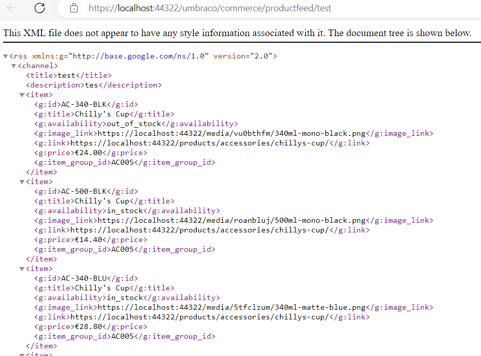

The Product Feeds package can be installed directly into your project's code base using NuGet packages. 

# Getting started

Below you can find some steps on installing the package using NuGet and getting started with implementing the Product Feeds into your Umbraco Commerce store.

1. Install the package from [NuGet](https://www.nuget.org/packages/Umbraco.Commerce.ProductFeeds/)

2. Locate where you [register the dependencies](https://docs.umbraco.com/umbraco-commerce/key-concepts/umbraco-commerce-builder#registering-dependencies) `IUmbracoBuilder.AddUmbracoCommerce()` and add a call to `IUmbracoCommerceBuilder.AddCommerceProductFeeds()` to add this plugin to your website.

        umbracoBuilder.AddUmbracoCommerce(ucBuilder => {
            ucBuilder.AddCommerceProductFeeds(); // add this line
        }

3. Open your store's setting page in the backoffice.
	
4. Click on `Product Feed` section.

5. Click on `Create Product Feed` button and fill in the feed settings. Mandatory fields are marked with a red asterisk (*). You can add more product data by adding new mappings in `Property And Node Mapping` section.

6. After saving the feed setting, a link to access the feed will show up under `Feed URL Segment` field and at the bottom of the page.

**Google Merchant Center Feed** sample:

## Upgrading


Even though the package modifies only `umbracoCommerceProductFeedSetting` table, 
it is always advisable to take a complete backup of your site/database before upgrading.


The Product Feeds package uses a database migration for both installs and upgrades. Upgrading is generally a case of installing the latest version via nuget over the existing package and re-start your website.
