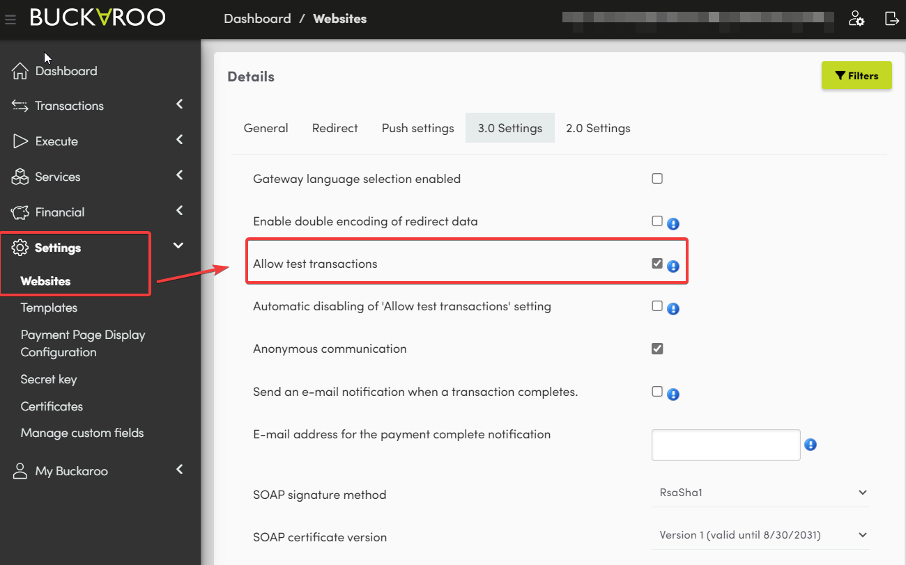
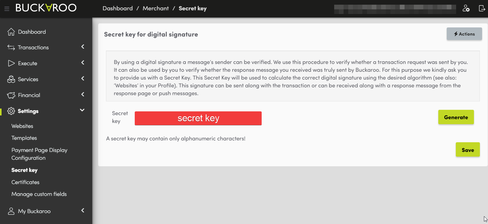

# Configure Buckaroo

## Step 1: Sign up & Sign in

You can sign up in 2 different ways:
1. For a business account, head over to the [Buckaroo site](https://www.buckaroo.eu/large-corporations/start) to register for a Buckaroo account.
2. For a test account, you can fill in a request form: https://www.buckaroo.eu/large-corporations/solutions/request-form

### Test & Live mode

When logged in to the [Buckaroo Dashboard](https://plaza.buckaroo.nl/) it is important to know that there are two modes you can view data and perform tasks under. These are **Test mode** and **Live mode**:
- **Test mode** allows you to perform test transactions to ensure your solution is set up correctly.
- **Live mode** is where real-life transactions will take place.

In order to enable test mode, you can check the [Buckaroo documentation](https://docs.buckaroo.io/docs/test-transactions#how-to-make-a-test-transaction).


For each of these modes, multiple settings need to be configured.

## Step 2: Website key and secrets
In order for Umbraco Commerce to communicate with Buckaroo securely, we need to generate an API key that Umbraco Commerce can use to authenticate with.

#### Website key
1. Go to [Buckaroo Dashboard](https://plaza.buckaroo.nl/).
2. Settings > Websites > General tab.


#### Secret key
1. Go to [Buckaroo Dashboard](https://plaza.buckaroo.nl/).
2. Settings > Secret key.


## Step 3: Webhook
For Buckaroo to notify Umbraco Commerce of a transaction, Buckaroo makes use of webhook technology to send notifications of the changing transaction statuses. By using webhooks it ensures that the system will always be notified of these status changes. This is also the case if a customer decides not to return to the store once a transaction is complete.

When generating a payment request form, Umbraco Commerce set the callback URL to the value below automatically.
```bash
  https://{store_domain}/umbraco/commerce/payment/callback/buckaroo-checkout/{payment_method_id}/
```
1. Go to [Buckaroo Dashboard](https://plaza.buckaroo.nl/).
2. Settings > Websites > Push settings > Scroll to `Select push content type` and set it to `json`


When testing the webhook, if you use a service like ngrok to forward requests from a public domain to your localhost server. In that case, you need to set `Webhook hostname for test mode` value to be the public domain.


