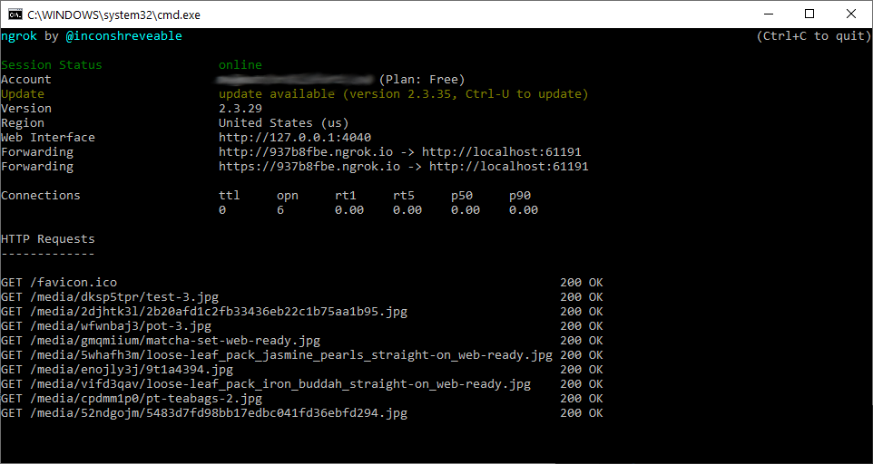

# How to test Stripe webhooks locally

The Stripe payment provider uses webhooks to finalize payments. Due to this, it can be tricky to test payments locally as Mollie must have a public-facing URL to be able to notify you.

You could expose your website through your network's firewall or use tools that to create temporary tunnels through your network.
You could expose your website through your network's firewall or use tools to create temporary tunnels through your network.
Below you can find two options to create temporary tunnels through your network:

- [Using Stripe CLI](using-stripe-cli)
- [Using ngrok](using-ngrok)


## Using Stripe CLI
### Step 1: Install the Stripe CLI

Go to the [stripe documentation](https://stripe.com/docs/stripe-cli#install) and install the stripe CLI.
### Step 2: Log in to the Stripe CLI
Go to the [stripe documentation](https://stripe.com/docs/stripe-cli#login-account) and log in to the CLI.
### Step 2: Forward the stripe events to your local environment.

Whilst running the site locally, make a note of your local store domain, e.g. `https:localhost:44321`. Using the Stripe CLI, to can configure Stripe to forward any events to that url. 

To do so, run the following from the command line.

```
stripe listen --forward-to {local_store_domain}/umbraco/commerce/payment/callback/stripe-checkout/{payment_method_id}/
```

The `{payment_method_id}` is configured as part of the Stripe [webhook configuration](../configuring-stripe.md#step-3-webhook) step.

e.g. 
```
stripe listen --forward-to https:localhost:44321/umbraco/commerce/payment/callback/stripe-checkout/7fb00000-0000-0000-0000-000019094a7a/
```

### Step 3: Test the site

With the Stripe CLI running, you can now test the site using your local dev domain. You will see any configured stripe events configured for the webhook displayed in the console window, and can debug them using Visual Studio.

## Using ngrok
### Step 1: Install ngrok

1. Head on over to [ngrok.com](https://ngrok.com/).
2. Download and install the tool on your system.

### Step 2: Launch ngrok

You can either launch ngrok from the command line or use the steps below to create a batch file to be run at any time.

1. Open NotePad.
2. Type the following:

```
C:\PROGRA~1\ngrok\ngrok.exe http --host-header=rewrite localhost:61191
```

3. Swap the local domain/port number at the end according to the configuration of your site.
4. Save the file as `ngrok.bat` at the root of your web project.

You can run the batch file at any time to launch ngrok and create a publicly accessible tunnel to your website.




When you launch ngrok for the first time, it will ask you to sign in. Enter the credentials you used to sign up. It will remember them from now on.


### Step 3: Test the site

With ngrok running you can now test the site using the URLs displayed in the console window. Use these URLs (preferably the secure `https` one) for your Stripe [webhook configuration](../configuring-stripe.md#step-3-webhook) and you should now be able to test your Stripe webhooks locally.

You will see webhook requests displayed in the console window, and you can debug them using Visual Studio.
