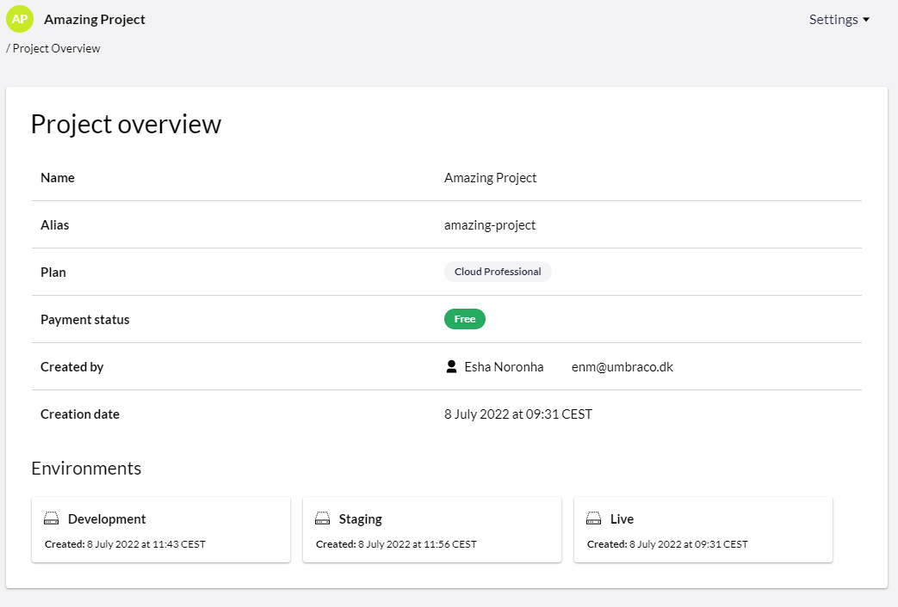

# Umbraco Cloud

In this article, you can read about [Umbraco Cloud](https://umbraco.com/products/umbraco-cloud/) and how to get started.

## Umbraco Cloud Overview

Umbraco Cloud is a great way to work with your favorite CMS. Built on the Microsoft Azure Cloud and encompassing web standard approaches, Umbraco Cloud is familiar to Umbraco's new and old users. With Umbraco Cloud, there are no limits to what you can accomplish - anything you can do with Umbraco and web technology you can do with Umbraco Cloud.

Umbraco Cloud takes care of installation, infrastructure, and security. Umbraco also provides you the tools to work with your project in the Cloud or locally by cloning the project down to your PC or Mac.

When you are ready to show your work to the world, Umbraco Cloud provides a safe deployment mechanism that lets you publish to the web. When you have changes or updates to your site, Umbraco Cloud follows the process of moving, testing, and deploying your changes to your public site.

With all the success you will have to build your site with Umbraco Cloud, you will want to add more using the same account and team members all from a single place. [Learn more and sign up for Umbraco Cloud](https://umbraco.com/campaigns/try-umbraco-today/).

## Umbraco Cloud Plans

Umbraco Cloud offers shared hosting in 3 different plans:

- Starter
- Standard
- Professional

You can [learn more about quotas](umbraco-cloud-plans) that are put in place to ensure the stability of your website.

## Umbraco Cloud Project

### Trial Project

The easiest way to get started with an Umbraco Cloud project is to take a [14-day free trial](https://umbraco.com/?product_tour_id=103162). The project is automatically created and you are ready to get started within a few minutes.

## [Insert video](https://www.youtube.com/embed/TcmuTpJT1Kw?rel=0)

Since we set up the entire project, we recommend that you get to know your project before you start building.

To start working with and building your site, you can either work directly in the backoffice on the Cloud environment or you can [clone down the project to your local machine](../set-up/working-locally.md). For Mac users, see [Working with Mac](../set-up/working-with-mac.md).

### Umbraco Cloud Portal Project

To create a project in Umbraco Cloud Portal:

1. Log in to the [Umbraco Cloud Portal](https://www.s1.umbraco.io/projects) with your credentials.
2. Click **Create New Project**.
    
3. Select **Umbraco Cloud** from the list of projects.
4. Choose a **Plan Selection** as per your choice.
5. On the **Project Information** page, enter the **Project Name**.
6. *[Optional]* Select **Create from baseline** and **Choose baseline** from the drop-down list to select the Cloud project the new project should be based on.
7. **Choose an Umbraco version** from the drop-down list.
8. Choose the **Region** from the drop-down list.
9. **Choose an owner** from the drop-down list.
10. In the **Technical Contact** section, enter the **Name**, **Email**, and **Telephone** number.
11. Select **I have read and agree to the terms and conditions and the Data Processing Agreement**.
12. Click **Create Project**.

### Naming a Project

When you create a:

- Trial project for the first time - a unique project name will be generated for you.
- Project from the Umbraco Cloud Portal - you will get to choose a name for the project.

To rename the project file and folder, see the [Renaming the Project file and folder](../set-up/project-settings.md#renaming-the-project-file-and-folder) article.

An Umbraco Cloud project name is unique, which means if a project with the name you choose already exists, you will need to choose another name before you can create the project.

### Project Overview

Once a project is created, you can view its overview in Umbraco Cloud Portal:

1. Log in to the [Umbraco Cloud Portal](https://www.s1.umbraco.io/projects) with your credentials.
2. Select your Project from the **Projects** dashboard.
3. Go to the Project **Settings** and click **Overview**.
    

The Overview Page consists of:

- Name: The name of the project.
- Alias - The alias of the project.
- Plan - The plan selected for the project. Available plans are Starter, Standard, or Professional.
- Payment status - The payment status of the project.
- Created by - The name and email of the project creator.
- Creation date - The date the project was created.

    

## Different ways to start an Umbraco Cloud project

You might not always want to start your Umbraco Cloud project with a clean slate. Perhaps you have an already existing site that you want to move on to the Cloud. For this purpose, we've created a [Migration guide](Migrate-Existing-Site/README.md) that you can follow to successfully move your project to Umbraco Cloud.

If you are creating several similar projects, we have a feature called [Baselines](Baselines) that lets you create new projects based on existing Umbraco Cloud projects.
