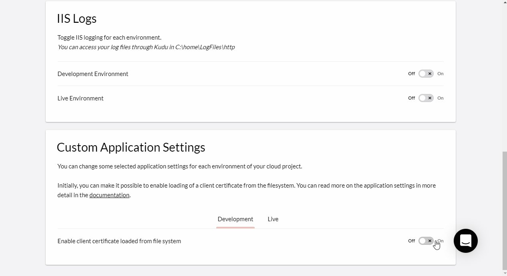

# Release Notes, April, 2022

_Enable client certificates from filesystem + Various Cloud Portal improvements_

## Key Takeaways

* **Enable client certificates from file system** - If you need to load a client certificate from the file system in your cloud project at runtime you can make this possible by turning on the new setting on the _Advanced_ page of the project.
* **Various tweaks and improvements** - During March and April, we have focused on fixing minor issues and adding minor improvements. The highlights of these changes are shown below.

## [Enable client certificates from file system](../set-up/project-settings/application-settings.md)

If your cloud project needs to load a client certificate (such as an X.509 certificate) at runtime you can turn on this feature for one or more environments. By turning this feature on for an environment, you will be able to load a client certificate as a file during the run-time of your cloud project.

## Various tweaks and improvements

During March and April, we have provided a lot of small improvements to the Umbraco Cloud Portal. Actually, too many to mention, but you will find the highlights in the list below.

* Display the time of creation for environments (_now presented on the “Overview” page of the project_)
* Restrict access to function when environments are changing (_to avoid actions on environments that are being created, deleted, or modified_)
* Ordering Umbraco Logs correctly by date (_the logs and errors log of cloud projects were not always listed chronologically_)
* Always display a link to the error page for environments on the project page (_and not exclusively when the project has new errors_).
* Better user guidance when visiting the project page before accepting the project invite.
* Only show usage warnings for cloud projects on Starter or Standard cloud plans (_as these are less relevant to projects on a Professional and Enterprise plan_)
* Ensure cloud project name is part of email subjects (_to ease the overview of received mails for the technical contacts_)
