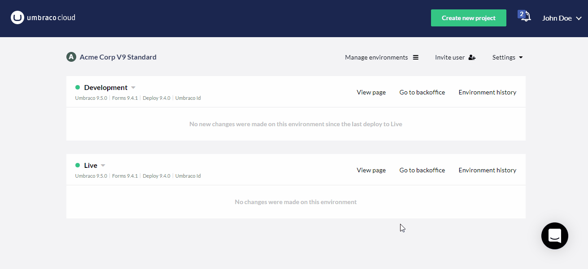

# Release Notes, June 2022

_Runtime setting for .NET version + New version of “Edit team” page + Several improvements_

## Key Takeaways

* **Runtime setting for .NET version** - We have made it possible for you to change the .NET runtime for Umbraco 9 and Umbraco 10 cloud projects. You can change the runtime on a per-environment basis.
* **New version of “Edit team” page** - The project subpage “Edit team” has received a noticeable facelift and reflects the future design of the Umbraco Cloud Portal.
* **improvements and bug fixes** - A whole bunch of improvements and bug fixes have been added to Umbraco Cloud recently. Here you will find a list of the most noticeable tweaks and improvements

## Runtime setting for .NET version

For Umbraco 9 projects and Umbraco 10 you can on the project subpage “Advanced” toggle the runtime settings between .NET 5 til .NET 6 on a per-environment basis.

Before updating, you need to ensure the packages used are available in Umbraco 10 and that your custom code is valid with the .NET 6 Framework.

## New version of “Edit team” page

The “Edit team” page has received a facelift and is now based on the Umbraco UI Library web components. The new design has a more modern look and gives you a sneak preview of how the Umbraco Cloud Portal pages will look and feel in the future.

We will continuously improve the many other sections in the Portal and ensure that all pages will adopt the new design as shown on the reworked “Edit team” page.

## Improvements and fixes

During May and June, we provided small fixes and improvements to the Umbraco Cloud Portal. Here are some of the highlights:

- The much-used project subpage “Edit team” has been updated with a fresh new look using the Umbraco UI Library based on web components. Go have a look today!
- Custom hostnames for a few Umbraco 7 projects were not shown on the project subpage “Hostnames”.
- For Professional plans, the download of IIS logs required you to log into the Azure portal.
- Download of error logs at times opened in a new tab instead of starting downloading.
- A new project member could not instantly create a new cloud project.
