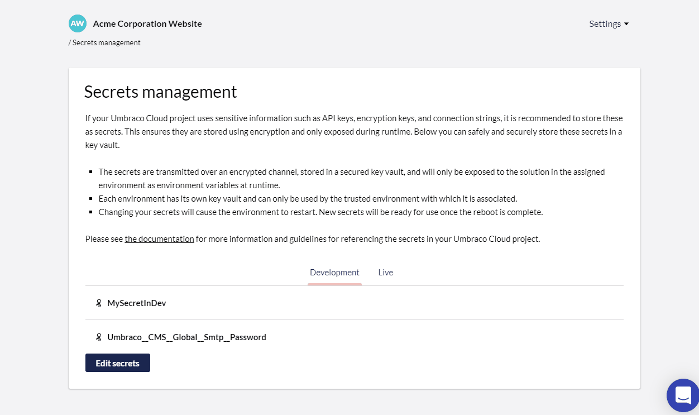
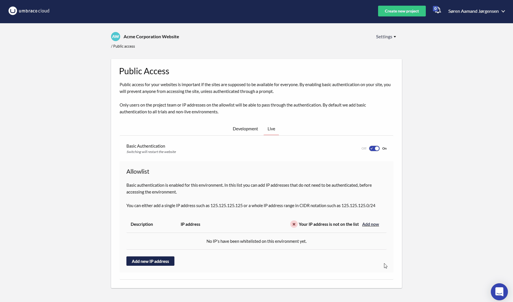

# Release Notes, December 2022

## Key Takeaways

* **Secrets Management** - Secure your secrets in Azure key vaults in an intuitive user interface and easy access to secrets during the run-time of your Umbraco solution.
* **Organization Project view** - You will now see a lot more information for each of your organization projects on the project page under your organization.
* **Updated public access page** - We have added the option to specify a name when you choose to specify a new entry to the allowlist for an environment.
* **Kudu quicklink in Projects Dashboard** - You now have the option to navigate to Kudu for a cloud project environment from the "Projects Dashboard".

## [Secrets Management](../set-up/project-settings/secrets-management.md)

The new _secrets management_ feature in Umbraco Cloud enables you to store your secrets (digital authentication credentials such as private keys, database passwords, and 3rd-party API tokens) securely in Azure key vaults. Hereby, you will never have to worry about exposing the most sensitive information of your Umbraco Cloud solution in code repositories.

Every environment has its own key vault and the secured values can only be accessed by the associated environment. The secret will be referenced with the assigned name as an environment variable. During runtime of your Umbraco application, the secret can be accessed using standard .NET conventions such as
_secretMessage = Environment.GetEnvironmentVariable("SecretName");

Storing Secrets Management in Azure key is enabled for all Umbraco cloud projects on Standard and Professional plans. 

See the documentation section [Secrets Management](https://docs.umbraco.com/umbraco-cloud/set-up/project-settings/secrets-management) for more information.

## Organization Project view

As a member of a Umbraco Cloud organization, on the "Projects" page under your organization, you will find a more detailed overview of your projects than before.

In addition to the name, plan, and status of the project, you can now also see the creation date, hosting region, payment status, and the number of environments running on the solution.

You can sort your organization projects ascending and descending for all columns in the projects table.

## Public access page

On the new version of the "Public Access" page, you can now specify a name when you add a new entry in the allowlist for an environment.

When you choose to add the public IP for the network you are currently working on, your name will automatically be used as the descriptive text.

## Kudu quicklink in Projects Dashboard

And finally, we've added a quicklink to Kudo that you can see by hovering over an environment.

You now have the opportunity to access both the cloud project's page, back office and Kudo from the "Projects Dashboard".
