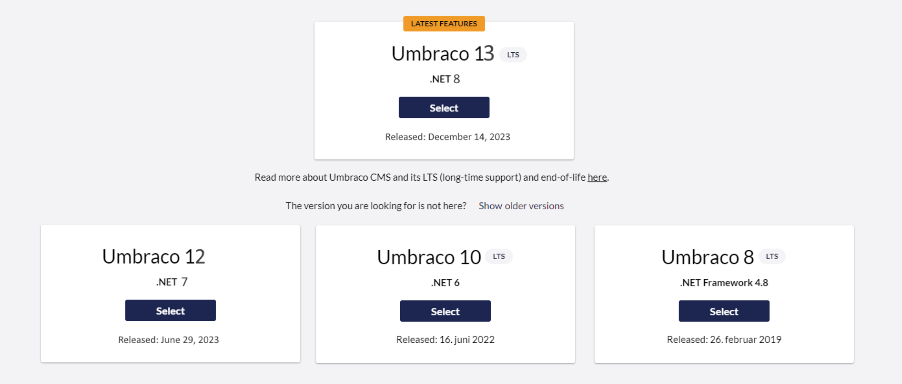
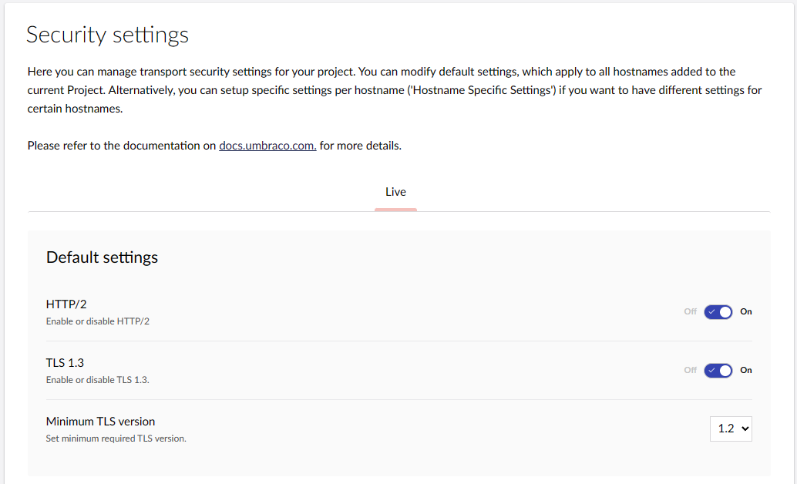

# December 2023

## Key Takeaways

* **Umbraco 13 On Cloud**  - As the default setting for new projects, Umbraco 13 brings enhanced features and compatibility for a modern digital experience.
* **Umbraco Deploy Enhanced Content Management** - Improving content and schema import and export, simplifying large-scale content management and project transitions.
* **TLS 1.3 For All Plans** - Now available for all plans, Transport Layer Security (TLS) 1.3 enhances security across Umbraco Cloud, offering advanced protection for every user.
* **Umbraco CI/CD Flow out of beta**  - Fully launched post-beta, the Umbraco CI/CD Flow offers robust, reliable tools for improved continuous integration and delivery.

## Umbraco 13 On Cloud

As part of our continuous evolution, **_Umbraco 13_**, is now the default setting for all new cloud projects created in Umbraco Cloud.

We maintain a versatile approach in our offerings to support the unique needs and preferences of our diverse user community. While we position version 13 as the new benchmark for excellence and innovation in new projects, we also acknowledge the importance of choice and flexibility. To this end, we continue to offer access to other actively supported CMS versions, including 8, 10, and 12. 

For an in-depth understanding of how Umbraco 13 improves your developer and editor experience, we encourage you to visit our detailed [blog post](https://umbraco.com/blog/umbraco-13-lts-release/).

## Umbraco Deploy Enhanced Content Management
The standout feature in the recent minor Deploy release introduces valuable options for handling large content transfer, restores, and migrations to Umbraco Cloud and between Umbraco versions. This feature is particularly beneficial in two key scenarios where **exporting** and **importing** Umbraco content, files and schema are crucial.

### Streamlined Content Operations for Editors and Managers
A key aspect of the upgraded Umbraco Deploy is its focus on streamlining content operations, particularly beneficial for editors and website managers. This feature robustly supports substantial content transfers to upstream environments and ensures the efficient restoration of content to downstream environments. The enhanced functionality addresses the challenges of operational failures and timeouts, which are particularly prevalent in cloud-based environments like Azure web apps.

### Simplified Project Migration for Developers
For developers, the latest iteration of Umbraco Deploy improves the process of project migration. Whether transitioning projects into Umbraco Cloud or navigating between different Umbraco versions, the new Deploy feature simplifies these tasks. It offers an intuitive interface for selecting and exporting specific content items, content trees, or entire workspaces into a zip file format.

This capability eases the migration process, allowing for the efficient handling and transfer of large data volumes. Upon importing this zip file into a new environment, the content is thoroughly read, validated, and seamlessly integrated, updating the information in Umbraco.

When exporting, you can choose to include associated media files and, if your account has access to the Settings section, the schema information and files as well.

That exported zip file can be used to import the content, files, and/or schema into a new environment.  You can upload the file via the browser.

For more in-depth information on the import/export feature and other additions in the latest Deploy minor release, see the [deploy release candidate blog post](https://umbraco.com/blog/umbraco-deploy-release-candidates-49103121/).
You can also visit the documentation page for the [export/import of schema and content](https://docs.umbraco.com/umbraco-deploy/deployment-workflow/import-export) for more details.

## TLS 1.3 For All Plans
In our commitment to providing top-tier security, we have expanded the availability of TLS (Transport Layer Security) 1.3 to all Umbraco Cloud plans. This enhancement means users can now activate TLS 1.3 for their custom hostnames, bringing advanced security settings to all project plans.

The initiative also includes optimizing default settings for new projects where TLS 1.3 will be the standard protocol, alongside other security standards like HTTP/2 and the upcoming HTTP/3. This not only boosts security and performance but also contributes to sustainable digital operations by optimizing resource use.

## Umbraco CI/CD Flow out of beta
After a successful beta phase, the Umbraco CI/CD Flow is now fully operational. This feature, designed to refine and streamline the development process in Umbraco, is now out of beta and available for all users. This full-scale launch of the CI/CD Flow promises to enhance the development experience in Umbraco, offering robust and reliable tools for continuous integration and delivery.

Our [documentation](https://docs.umbraco.com/umbraco-cloud/set-up/project-settings/umbraco-cicd) serves as a roadmap, detailing various routes tailored to your needs. Learn how to invoke the Umbraco Cloud API from within your CI/CD pipeline, explore the specific endpoint details, or discover how to call this endpoint from an already established pipeline. Each path culminates in a seamless, automated deployment experience, empowering you to deploy with confidence.
