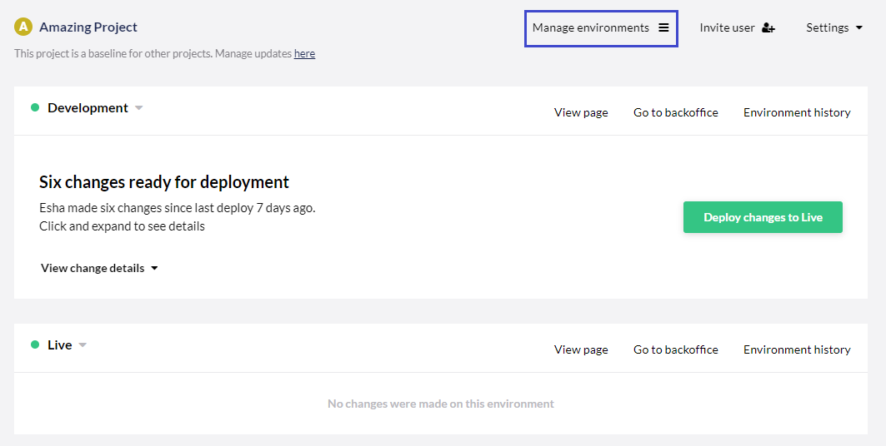
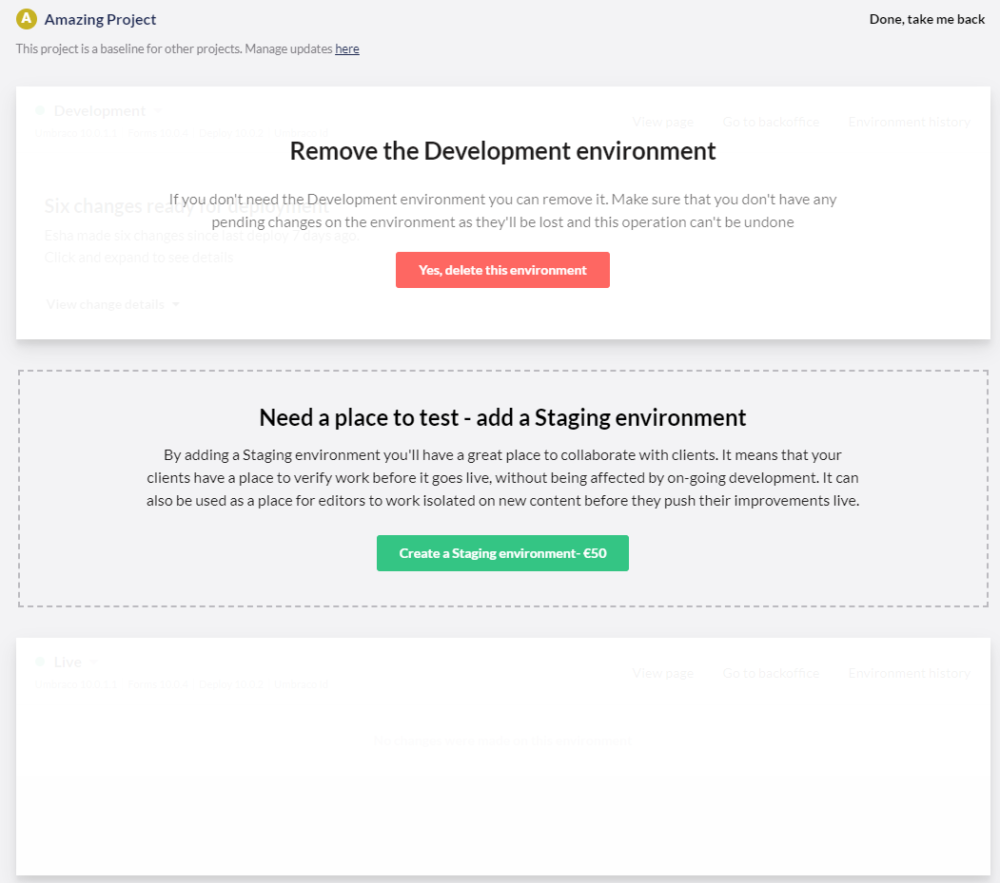

# Manage Environments

When working with an Umbraco Cloud project, you can add or remove extra environments depending on the plan you are in:

- For the Starter plan, you can add a Development environment for an additional price per month.

- For the Standard plan, you get the Development environment for free and can add a Staging environment for an additional price per month.

- For the Professional plan, you get the Development and Staging environment for free. Additionally, you can add and remove environments whenever you like without any additional cost.

[Learn more about the additional prices on Umbraco Cloud](https://umbraco.com/cloud-pricing/).

## [insert video here](https://www.youtube.com/embed/uqSWAkv5tBQ?rel=0)

## Adding or Removing Environments

__Important:__ *Before* adding an environment, you should consider if you have any changes locally that are not on Live yet. If you do, you should make sure to push it as adding another environment will also push it into the deployment chain.

__Important:__ *After* adding a Development environment, you need to do a fresh clone of the site. The local version you have will be set up to push directly to Live, a fresh clone will push to Development.

You can find the interface for adding or removing environments from your project page here:

On the **Manage Environments** page, you can add or remove an environment. If you wish to remove an environment, you will be prompted to type in the environment alias.


There is a specific order that the environments are being added. You will need to have a Development environment before you can have a Staging environment.


If you have both a Development and a Staging environment and need to remove the Development environment, then you will first need to remove the Staging environment before you can remove the Development environment.

Once you have added or removed an environment, it will take a couple of minutes for Cloud to set it all up, and then you will be ready to use it.
