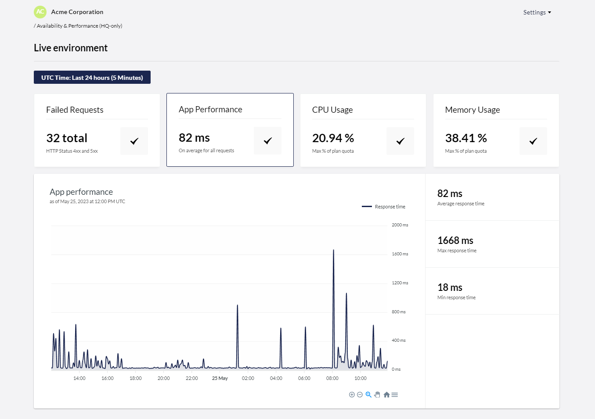
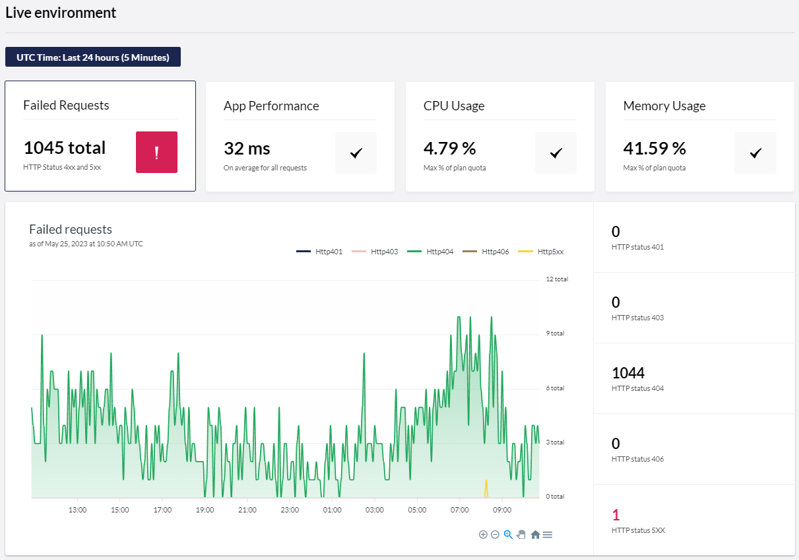
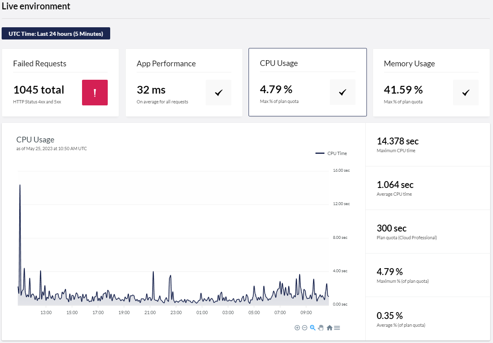
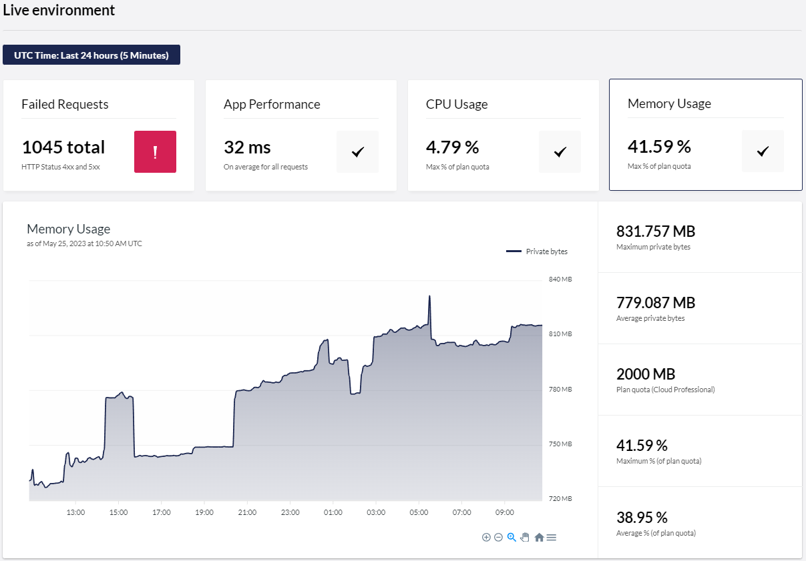

# Availability & Performance

The "Availability & Performance" feature lets you see get an overview of your cloud projects' past and current health. Leveraging Azure metrics data, the page provides users with valuable insights into the availability and performance of the cloud project enabling them to monitor and address any issues that may impact the user experience.

## Overview

Under Availability & Performance, you'll find visualization and statistics for three sections:

- Time range and granularity selector
- Panel view
- Chart and statistics view


The page initially displays metrics for the live environment for all Umbraco Cloud projects. More detailed visualization and tools intended for troubleshooting to be added in the future will be restricted to “Standard” and “Professional” project plans.


### Time range and granularity selector

When entering the page, you'll see a default visualization of failed requests for the last 24 hours with a data point set for every fifth minute. You are able to change the time range to a predefined interval or define a specific start and end time. You can also select the granularity of the data points.

Initially, you will only be able to set the time granularity to “5 minutes”.

### Panel view

The panel selector consists of four tiles, each representing a specific segment of data. The four segments are **failed request**, **App Performance**, **CPU Usage**, and **Memory Usage**.

Each tile includes relevant statistics and potentially a warning or an error indicator in case there is something you might want to consider.

An error indicator is shown in the following situations:
- **Failed Requests**: when one or more server errors have occurred in the selected time range.
- **CPU Usage**: when the maximum CPU time has exceeded 100% of the plan quota in a 5-minute period during the selected time range.
- **Memory Usage**: when the maximum private time has exceeded 100% of the plan quota in a 5-minute period during the selected time range.

A warning indicator is shown in the following situations:
- **Failed Requests**: when one or more client errors (but no server errors) have occurred in the selected time range.
- **CPU Usage**: when the maximum CPU time has exceeded 80% percent of the plan quota in a 5-minute period during the selected time range.
- **Memory Usage**: when the maximum private time has exceeded 80% percent of the plan quota in a 5-minute period during the selected time range.

Errors and warnings for CPU Usage and Memory Usage are only shown for cloud projects on shared plans with a granularity of 5 minutes selected.

### Chart and statistics view

For each segment, there will be shown a chart and a set of related statistics.

#### Failed request
The chart shows the breakdown of HTTP status codes for each data point with the selected granularity. Only responses indicating a client (4xx region) or server errors (5xx region) are shown.

In the statistics panel on the right, you will find the total instances of the status code in the time range.

#### App Performance
The chart shows the average response time during the selected time range. All requests to the Umbraco solution in the time periods with the length of the selected granularity count to average response time.

The statistics panel shows the average, maximum, and minimum response for the shown data points.

#### CPU Usage
The chart depicts the CPU time consumed by the application in the selected time range with time periods equalling the selected granularity.

Cloud projects using a shared resource and a granularity of 5 minutes, users will see the assigned CPU time in seconds and a comparison against the [plan quota](https://docs.umbraco.com/umbraco-cloud/getting-started/umbraco-cloud-plans).  
In this case, the statistics panel shows the following:
- The maximum CPU time 
- The average CPU time
- The plan quota
- The maximum and average percentage of the consumed CPU in a 5-minute period compared to the plan quota.

Cloud projects on dedicated options (or a shared plan with another granularity than 5 minutes), users will see the average assigned CPU time in seconds.
Here the statistics panel will display the maximum, average, and minimum CPU time based on selected granularity.

#### Memory Usage
The chart shows the memory usage in private bytes consumed by the application in the selected time range with time periods equalling the selected granularity.

Cloud projects on shared resources with a granularity of 5 minutes, will see the assigned private bytes in megabytes (MB) and a comparison against the [plan quota](https://docs.umbraco.com/umbraco-cloud/getting-started/umbraco-cloud-plans).

For cloud projects with a dedicated option (or shared plans with another granularity than 5 minutes), users will see the average assigned private bytes in bytes.
Here the statistics panel will display the maximum, average, and minimum allocation of private bytes based on selected granularity.

## Key benefits
Below you can read about the benefits with the “Availability & Performance” feature gives.

### Health Monitoring
Umbraco Cloud's "Availability and Performance" feature allows users to monitor the health of their cloud projects more effectively. By leveraging Azure metrics data, you can access critical information such as HTTPS status codes, response times, CPU time, and memory usage in private bytes.

 The CPU and memory usage is particularly important to keep an eye on from time to time. 
 This is to ensure the cloud project running on a shared that the plan quotas aren’t exceeded.

### Issue Discovery
The feature enables users to discover application issues that may impact the overall performance of their Umbraco Cloud projects. By analyzing Azure metrics data, you gain valuable insights into the performance of your app service, including response times and CPU/memory usage.

Real-time monitoring of HTTPS status codes helps you identify any errors or disruptions to your application's availability. This proactive approach allows you to respond swiftly, ensuring that your website or application remains accessible and responsive to users.

### User-Friendly Interface
Umbraco Cloud provides a user-friendly interface for accessing and interpreting the "Availability and Performance" feature. The interface presents Azure metrics data in a clear and understandable manner, making it easier for users to navigate and gain actionable insights. With intuitive SVG-based visualizations and highlighted statistics for the selected time range, you can monitor the health and performance of your cloud projects effortlessly.

### Future updates
The first version of the “Availability and Performance” feature released on May 26th, 2023 includes a basic visualization and a set of highlighted numbers for failed requests, application performance, CPU time, and memory usage.

More detailed information about each of these domains will be provided for each of the four domains in the future. While the visualization and basic numbers are accessible for any project plan, the detailed information and insight to be added will be exclusive to the upper cloud project plans
