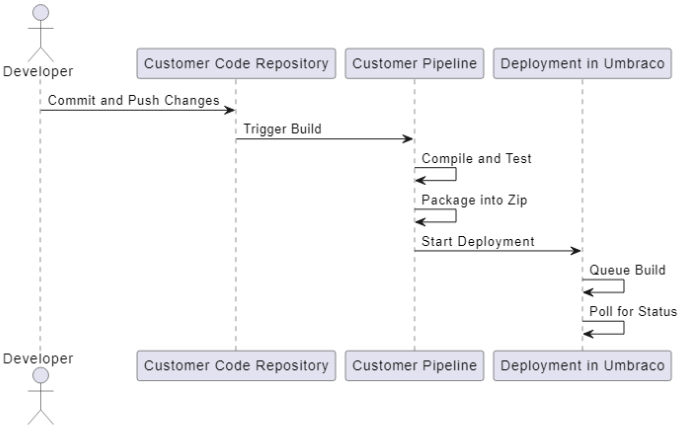
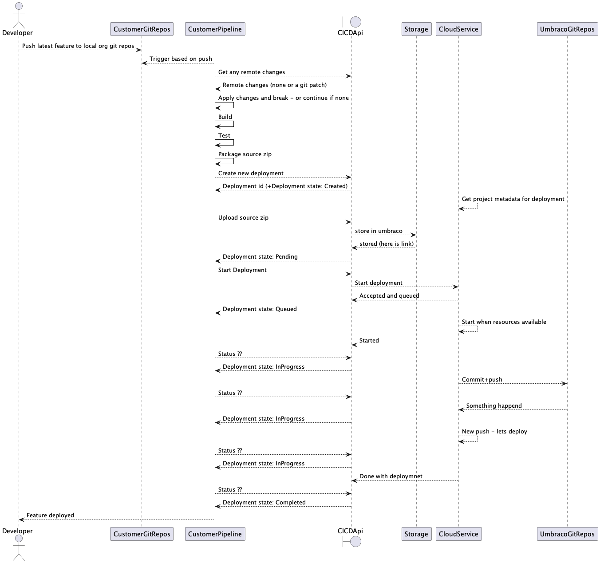

# What is Umbraco CI/CD Flow?

_Umbraco CI/CD Flow_ is designed to facilitate the seamless integration of your existing CI/CD flow with Umbraco Cloud. The primary objective of this feature is to enable your automated workflows to deploy directly to Umbraco Cloud. This lets you leverage the best of both worlds: the robustness of your current CI/CD setup and the specialized hosting environment of Umbraco Cloud.

Umbraco Cloud continues to be a cornerstone in this setup, providing a cloud-based hosting solution specifically optimized for Umbraco CMS. With an integration to your Continuous Integration and Continuous Deployment (CI/CD) pipeline, Umbraco CI/CD allows the inclusion of automated workflows for building, testing, and deploying your Umbraco projects. 

## Advantages of Utilizing Umbraco CI/CD Flow

Explore the practical benefits of using Umbraco CI/CD Flow for your development and deployment needs. This solution aims to simplify your workflow, improve team collaboration, and reduce deployment time. Here are some key advantages to consider:

_Seamless Integration with Existing CI/CD_
- Umbraco CI/CD Flow allows customers to connect their existing CI/CD pipelines to Umbraco Cloud, making the transition smoother and reducing the learning curve.

_Enhanced CI/CD Features_
- The feature enables unique CI/CD features like PR-flows and automated tests, which are not natively available in Umbraco Cloud. This adds a layer of quality assurance and streamlines the development workflow.

_Scalability and Flexibility_
- Umbraco CI/CD Flow allows for greater scalability and flexibility in your deployment process. You can easily adapt your existing CI/CD pipeline to handle larger projects or more complex workflows without having to overhaul your Umbraco Cloud setup.

_Centralized Management_
- With Umbraco CI/CD Flow, you can centralize the management of your deployments, tests, and workflows. This makes it easier to monitor, troubleshoot, and optimize your processes, leading to more efficient and reliable deployments. Automating deployment minimizes the risc for human errors that could have a negative effect on the target environment.

Umbraco CI/CD Flow serves as a bridge between your existing CI/CD pipeline and Umbraco Cloud, enabling a more streamlined and automated deployment process. While it offers several advantages, there are also limitations that need to be considered. On the page 'Known Limitations and Considerations' you will find a detailed list of the pros and cons of using Umbraco CI/CD Flow.

## Overview of Flow

The CI/CD process for Umbraco projects involves some key steps, from code development locally to deployment to Umbraco Cloud. The flow is generally as follows:

1. **Code Development**: Developers work on features or bug fixes in their local environments.
2. **Customer code repository**: Changes are committed and pushed to a version control system like Git in the customer's own repository.
3. **Customer pipeline**: The code is compiled and built. Tests can be run automatically in the associated pipeline to ensure code quality. Finally, the code is packaged into a zip file and prepared for deployment.
4. **Deployment**: The deployments starts. This triggers queueing of the build in Umbraco services. It will be possible to poll for status updates.

In a bit more detail the flow will look like this from a pipeline perspective.

## Next Steps: Dive into the Documentation

To ensure you make the most of Umbraco CI/CD Flow, we suggest exploring the documentation further. Familiarizing yourself with the fundamentals is a good starting point, but delving deeper will enable you to fully harness its capabilities.. Here are three essential pages to get you started:

1. **[How to use the Umbraco Cloud API for CI/CD Flow](../umbraco-cicd/UmbracoCloudApi.md)**: Gain a comprehensive understanding of how to interact with the Umbraco Cloud API for seamless deployments and management.

2. **[How To Configure A Sample CI/CD Pipeline](../umbraco-cicd/SampleCiCdPipeline.md)**: Follow our step-by-step guide to set up a sample pipeline, making your development and deployment process more efficient.

3. **[Known Limitations and Considerations](../umbraco-cicd/KnownLimitationsAndConsiderations.md)**: Familiarize yourself with the current limitations and considerations to ensure you're making the most out of Umbraco CI/CD Flow.

These resources will provide you with the knowledge and tools you need to successfully implement and optimize your use of Umbraco CI/CD Flow.
