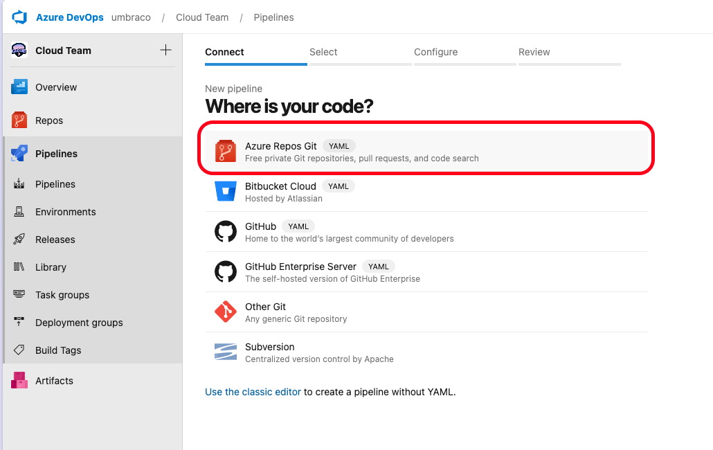
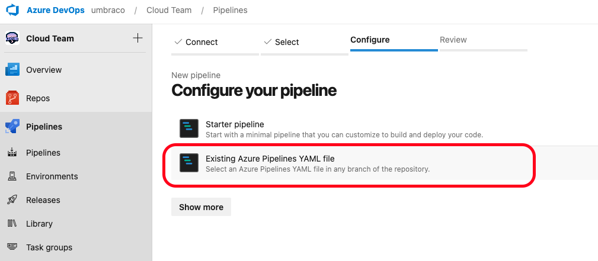
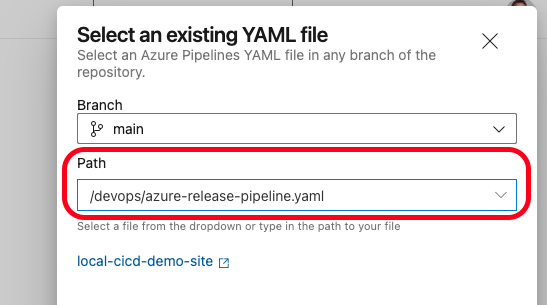
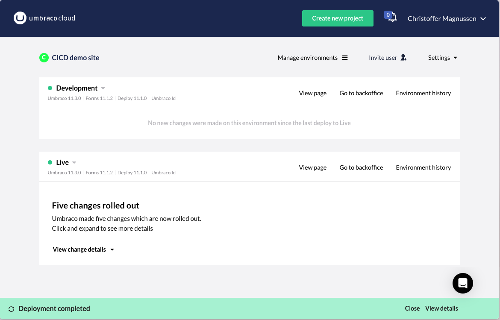

# Getting started with configuring a CI/CD pipeline

Learn how to configure a CI/CD pipeline in Azure DevOps and GitHub Actions Workflows using the scripts provided.

You'll find example shell scripts and pipeline configurations in the "Sample scripts" section, covering both Azure DevOps and GitHub Actions Workflows.

# Why should one configure a sample CI/CD pipeline?
Umbraco Cloud repositories are not meant to be used as source code repositories. More details on our official documentation.

Once you commit your code to Cloud the build pipeline converts your C# code to DLLs and deploys it on the respective environment.



Only C# code is built, and all frontend artifacts need to be built and committed to the repository.




You can use AzureDevops as an external repository and with the pipelines, it will automatically keep your Azure Devops source code repository in sync with the git repository of Umbraco Cloud of the development environment.


# Prerequisites: Setting Up an Umbraco Cloud Project

Before proceeding, you'll need an Umbraco Cloud project and a CI/CD pipeline. You will also need the required files to add to your pipeline for successful interaction with the Umbraco Cloud API.

1. Create an Umbraco Cloud Project: Preferably with a development environment. You can either create a trial,  create a new project, or use an existing one.
2. Create a new or use an existing CI/CD pipeline: For Azure DevOps see this [page](https://learn.microsoft.com/en-us/azure/devops/organizations/projects/create-project?view=azure-devops&tabs=browser). 
3. Get your set of supporting files: Download sample files as a [zip-file](https://drive.google.com/file/d/1Wpxib2F5-eIyVsSdm3EBvA54eOrgiwLi/view?usp=drive_link). Note, that the only file you properly need to make changes to is the .yaml file. 

**Note**: On the page "What is Umbraco CI/CD Flow", deployments are targeted at the leftmost environment in your Umbraco Cloud setup. This means if you have a Development environment, it will be automatically selected for deployment. If no Development environment exists, the Live environment will be used.

## Obtaining the Project ID and API Key

To get started with API interactions, you'll need to obtain your Project ID and API key. If you haven't already enabled the CI/CD feature, follow these steps:

1. Navigate to the [Umbraco Cloud Portal](https://www.s1.umbraco.io/projects) and select your project.
2. Go to `Settings` -> `Advanced`. This is where you can generate an API key and find your Project ID.

**Important Note**: The API key is tied to the specific project for which it is generated. Make sure to keep it secure, as it will be used for all subsequent API interactions related to that project.

## Cloning the Umbraco Cloud Repository

To get started with your local development, you'll need to clone the repository of the environment you intend to work with—either the development or live environment. Once cloned, make a copy of it in a new folder. In this example, we'll create a new folder named `local-cicd-demo-site` for the local repository.

```sh
# Clone the development environment repository
git clone https://scm.umbraco.io/euwest01/dev-cicd-demo-site.git

# Copy the repository to a new local folder
cp -r dev-cicd-demo-site local-cicd-demo-site
```

This will set up your local workspace, allowing you to work on the project before pushing changes back to the Umbraco Cloud repository.

## Reconfiguring Git Remotes

After cloning the Umbraco Cloud repository, it's essential to remove its remote settings so that you can link it to your own company's repository. In this example, we'll be using an Azure DevOps-hosted repository as the new origin. Follow the steps below to reset the Git remote from the root folder of `local-cicd-demo-site`:

```sh
# Reset the Git remote to point to the new Azure DevOps repository
git remote set-url origin git@ssh.dev.azure.com:v3/umbraco/Cloud%20Team/local-cicd-demo-site
```

By executing this command, you'll disconnect the local repository from the Umbraco Cloud repository and connect it to your company's Azure DevOps repository. This allows you to manage your project within your own version control system.

## Optional: Renaming the Master Branch to Main

If you prefer to use the term "main" instead of "master" for your primary branch, you can easily rename it with the following commands:

```sh
# Rename the 'master' branch to 'main'
git branch -m master main

# Push the newly renamed 'main' branch to the remote repository
git push -u origin main
```

By executing these commands, you'll rename the local 'master' branch to 'main' and update the remote repository to reflect this change. This is an optional step but aligns with the industry trend towards more inclusive language.

## Setting Up the Pipeline in Azure DevOps

This section provides a step-by-step guide to setting up a CI/CD pipeline in Azure DevOps using the provided sample scripts[link to "Sample scripts" section of this document]. The pipeline is defined in an Azure YAML file and includes several steps that call custom shell scripts to interact with the Umbraco Cloud API.

### Creating the Pipeline in Azure DevOps

1. **Load from Existing Repositories**

    Begin by loading your existing repositories into Azure DevOps.

    

2. **Select the Repository**

    Choose the repository you want to use for the pipeline.

    

3. **Configure the Pipeline**

    Next, configure the pipeline to use the existing YAML file from your selected repository.

    

4. **Select the YAML File from the Repository**

    Finally, specify the YAML file that defines your pipeline. You can find a YAML file for Azure DevOps and Google Actions, respectively here [link to the “Sample Script” section]

    

By following these steps, you'll have successfully set up a CI/CD pipeline in Azure DevOps for your Umbraco Cloud project.

## Configuring a Staged Pipeline in Azure DevOps

This guide outlines how to set up a multi-stage pipeline in Azure DevOps using the provided sample scripts. The pipeline is defined in an Azure YAML file and consists of three key stages:

* **Preflight**: Validates if there are any remote changes since the last successful deployment.
* **Build, Test, and Package**: Executes standard build and test procedures, and packages the project.
* **Deploy**: Manages the creation, initiation, and monitoring of the actual deployment.

### Import Scripts and Configure Variables

1. **Copy Scripts**: Start by copying the pipeline and associated scripts into a new folder within your own project repository.

2. **Configure Variables**: Open the `azure-release-pipeline.yaml` file and set the appropriate variables in the variables section. These variables can be found in the Settings -> Advanced section of your project on the [Umbraco Cloud Portal](https://www.s1.umbraco.io/projects).

3. **Variable Requirements**: The sample pipeline expects the following variables to be set:
    * `umbraco-cloud-api-key`: The API key needed to access the Umbraco Cloud API.
    * `git-pat`: A Personal Access Token (PAT) for Git interactions.
    * `project-id`: The ID of the project that the pipeline will be used for.

By following these steps, you'll have a staged pipeline configured in Azure DevOps tailored for your Umbraco Cloud project.

### Pipeline Stage: Preflight Checks

This stage involves making an API call to retrieve the latest completed deployment. The goal is to identify any remote changes that may have occurred since the last successful deployment. If such changes are detected, they are applied to a new Git branch and pushed. A manual validation gate is introduced if changes are found.

Note: The current pipeline script has room for improvement. For instance, it may falsely indicate remote changes even after a patch has been applied. It also requires manual intervention twice, as changes persist until they are deployed.

### Pipeline Stage: Build, Test, and Package

In this stage, the Umbraco CMS project is built and tested. While this step is optional, it provides significant value, especially if you're running custom frontend builds with different npm versions for both the back office and website views.

Automated tests can be run to ensure everything is functioning as expected. Additionally, manual verification steps can be included, such as deploying to a local server for QA validation.

The deployment artifact consists of source files to maintain consistency with Umbraco Cloud's existing Git-based deployment flow. Only zip-archived files are currently supported, and the folder structure must align with a standard Umbraco Cloud project. A configuration file, named `project-files-to-zip-list`, specifies which files and folders to include in the zipped archive, ensuring that only the necessary files are packaged.

### Pipeline Stage: Deploy

This stage is responsible for creating a new deployment and ensuring that it can be initiated. For more details, refer to the "Create Deployment API" section.

The deployment artifact, which is a zip file containing the source files, is uploaded at this stage. For more information, see the "Upload Zip Source File" section.

The deployment is then initiated. For further details, consult the "Start Deployment" section.

Feedback on the deployment's progress can be obtained by polling the "Get Status" API. Although this step is optional, it's the only current method for tracking deployment progress.

## Utilizing the Pipeline

### Initial Run

Upon running the pipeline for the first time without making any modifications to the Umbraco CMS codebase, no deployment will be initiated in the leftmost environment. Consequently, it will also be impossible to generate any difference reports, as no deployment has taken place.

**Umbraco Cloud Project Overview (After the First Run)**  


### Triggering a New Deployment

The pipeline is designed to be triggered automatically upon any changes to the local repository. When you update and push a change, the pipeline will initiate.

**Pipeline Overview (After a Run with Changes)**  


**Umbraco Cloud Project Overview (After the Second Run)**  


These changes are also synchronized to the Umbraco Cloud Git repositories. The red box in the image below indicates the code that was changed locally and pushed to the local repository. The pink box shows the state of the Umbraco Cloud Git repositories after the pipeline execution.

### Deploying to Live Environment

Once changes have been made and tested in the Development environment, you can deploy them to the Live environment using Umbraco Cloud's standard deployment process. Simply click the green "Deploy Change to Live" button to initiate this.

**Changes Deployed to the Live Environment**  



## Sample scripts

The script samples are currently shared as GitHub Gists:

### Azure DevOps

* Azure pipeline including stages and preflight check for building and releasing [azure-release-pipeline.yaml](https://gist.github.com/stoffer13/83282d6efde25c1d57b25ea8554070f6)
* Create new deployment [create_deployment.sh](https://gist.github.com/stoffer13/dc784556d94844e0301a0a554945fb9e)
* List of files and folders to include in zip [project-files-to-zip-list](https://gist.github.com/stoffer13/5ac1800b560bf410598a70fda3acaa09)
* Upload zip package for deployment [upload_package.sh](https://gist.github.com/stoffer13/f1ca570a45640160f1bbb1674044ded0)
* Start deployment [start_deployment.sh](https://gist.github.com/stoffer13/47580af6c41493d075262d19e12b4fdc
)
* Get deployment status: [get_deployment_status.sh](https://gist.github.com/stoffer13/2abe249246f8c0d537c8071d31031a50)
* Get diff since latest deployment: [get_changes_since_last_deployment.sh](https://gist.github.com/stoffer13/fd8bc2629657263aa7d3a586f5519073)

### Github Actions

Zip is done using explicit zip action excluding the folders that should not be part of git-source. api-key (Umbraco-Cloud-Api-Key) is stored in the GitHub Secrets, project Id is stored as a variable.

* GitHub Action workflow pipeline [main.yaml](https://gist.github.com/stoffer13/908cdd61c924eb154f85411ae00e42ef)
* Create new deployment [create_deployment.sh](https://gist.github.com/stoffer13/3774493ee4e84fcc07574784106a87ba)
* Upload zip package for deployment [upload_package.sh](https://gist.github.com/stoffer13/e055b450e6c0ca18eb90511044d53fc0)
* Start deployment [start_deployment.sh](https://gist.github.com/stoffer13/f5b52ce78626e61f636c7a13fca775aa)
* Get deployment status: [get_deployment_status.sh](https://gist.github.com/stoffer13/7c318b6c2354e2e0db5d40c7defd383b)
