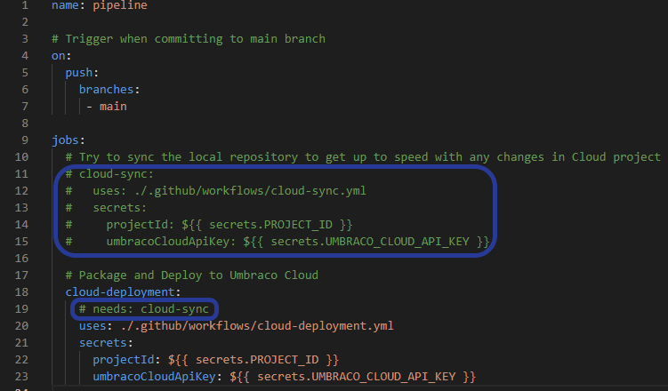
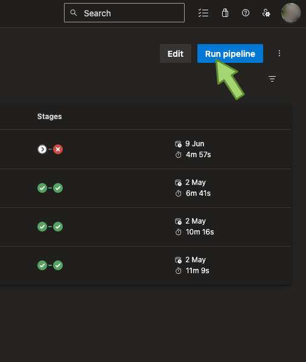
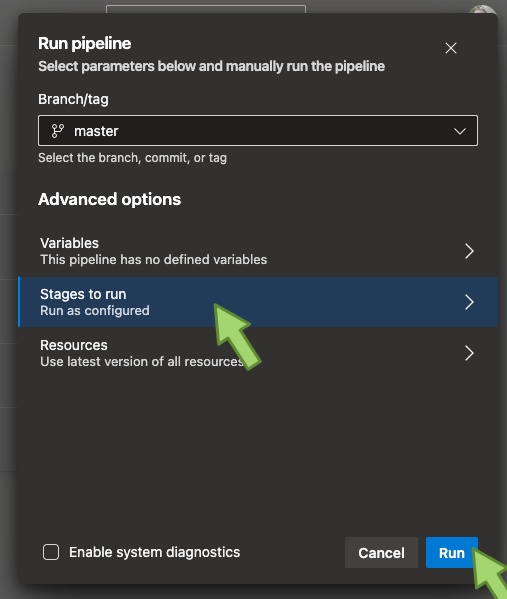
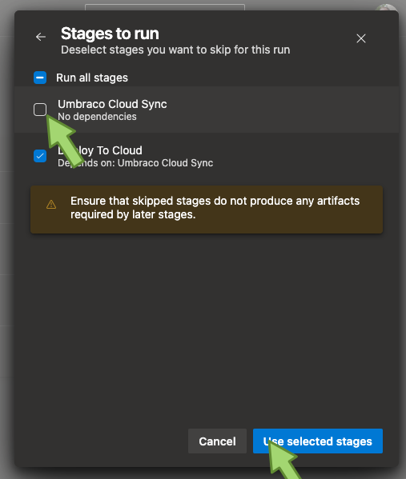

# Troubleshooting

## Special Cases

### Using `RestorePackagesWithLockFile` in your .csproj file
If `RestorePackagesWithLockFile` is used and set to true, you will experience that no changes will be made to the website. This happened even though the CI/CD deployments were completed successfully, and files were updated as expected in the Cloud repository.

The reason for this is that the KUDU deploy process fails. This process takes the newly committed files from the cloud repository and runs restore, build, and publish on the cloud environment.

To resolve this issue, remove the `RestorePackagesWithLockFile` to allow the deployments to go through as expected.

## cloud-sync

### The projects left-most environment has changed
The mechanism to determine changes since last deployment is not able to do so when the left-most environment has changed. This happens when you either add or remove the development environment.
The [get diff endpoint](./UmbracoCloudApi.md#get-deployment-diff) responds with status 409 and the following json payload:

```json
{
  "type":"LeftMostEnvironmentChanged",
  "title":"The projects left-most environment has changed",
  "status":409,
  "detail":"Unable to calculate changes based on a different left-most environment",
  "traceId":"..."
}
```

You will need to *manually* make sure that all latest changes on your left-most environment in cloud is also present in your local copy. 

Once this is done you can run a new deployment, where you skip the cloud-sync step.
- [Skip cloud-sync in GitHub](#skip-cloud-sync-in-github)
- [Skip cloud-sync in Azure DevOps](#skip-cloud-sync-in-azure-devops)

If you experience problems with your development environment not properly booting up after deployment, [please read this guide](#unable-to-determine-environment-by-its-environment-id).

### “Apply Remote Changes” step is failing
The sample pipelines are naively trying to apply any change coming from the generated patch file on cloud. This doesn't always work and you might see an error similar to the following:

```sh
error: patch failed: src/UmbracoProject/UmbracoProject.csproj:9
error: src/UmbracoProject/UmbracoProject.csproj: patch does not apply
```

The root cause is due to conflicts between your source and the code in the repository on Umbraco Cloud. This is usually due to one of two things:

1. Cloud project package(s) has been auto-upgraded, and that diff was already applied.
2. You and your team are not following the ["left to right" deployment model](../../../deployment/README.md).

In both cases you have to make sure that your repository is up too speed with any changes there are in the cloud environment. You will have to resolve potential conflicts manually.

Once that has been done, you should run a new deployment without the `cloud-sync` step.

### Skip cloud-sync in GitHub
For Azure DevOps, see the [Skip cloud-sync in Azure DevOps](#skip-cloud-sync-in-azure-devops) section.

1. Ensure your GitHub repository is up-to-date with any changes in your Umbraco Cloud environment.
2. Locate the main.yml file in the following directory: {projectname}\.github\workflows on tour local project.
3. Open the main.yml file in a text editor and navigate to the “jobs” section. 
4. Comment out the entire “cloud-sync” section and the “needs: cloud-sync” under “cloud-deployment”. An example is provided in the screenshot below.



5. Commit the changes, and push them to GitHub. This action will trigger a build and run the pipeline.
6. At this point, the pipeline should execute successfully and your changes will be pushed to Umbraco Cloud. If this is the case, proceed to the next step.
7. Uncomment the lines you previously commented out and make a new commit. Push these changes to GitHub. 
  - Optional: Add "[skip ci]" to the last commit message, to avoid automatically triggering the pipeline

Your pipeline should now be functioning as expected.

### Skip cloud-sync in Azure DevOps
For GitHub, see the [Skip cloud-sync in GitHub](#skip-cloud-sync-in-github) section.

With a few clicks you can manually trigger a pipeline to run without the cloud-sync:

1. Ensure that your Azure DevOps repository is up to date with any changes in your Umbraco Cloud environment.
2. Find the pipeline in Azure DevOps.
3. Click on "Run Pipeline" in the top right corner.



4. Click on "Stages to run"



5. Uncheck the "Umbraco Cloud Sync" checkbox. Confirm on "Use selected stages".



5. Click on "Run" back in the "Run Pipeline" view.

As no changes were made to your pipeline, it will run as usual on next push to Azure DevOps.


## Upload Errors

### Failed to read the request form. Multipart body length limit 134217728 exceeded

We currently have a size limit set to 134217728 bytes or about ~128 MB. 

Make sure that the package you are trying to upload does not contain anything unnecessary.

You can see an example of how you could zip your repository before uploading it, by referring to our [Github](samplecicdpipeline/github-actions.md) or [Azure Devops](samplecicdpipeline/azure-devops.md) samples. 

## Deployment failed

### Cannot apply update because the following packages would be downgraded: Package: Umbraco.{abc}, Version: {x.y.z}

The service goes through all .csproj-files contained in the uploaded package, and compares that to the versions running in your left-most cloud environment.
We do this to try to prevent you from downgrading the crucial Umbraco packages used by cloud.

The full error could look like this: 

```
Cannot apply update because the following packages would be downgraded: Package: Umbraco.Cms, Version: 13.4.0 ==> Project file: /Update/src/MyAwesomeProject.Code/MyAwesomeProject.Code.csproj contains lower Version: 13.1.0 .
```

The error tells you which package to look for and which version is currently in your left-most cloud environment. The error also contains the problematic incoming .csproj-file and the version referenced by it.

If the incoming package references multiple packages with lower versions, the error will list each one.

We recommend aligning the package versions in your _.csproj_ files with the higher version mentioned in the error for that package or a later version.

If you have orphaned csproj-files you should remove them or rename them. 
Orphaned would be backup _.csproj_ files or files not referenced by any of the main project files nor referenced in a _.sln_ file.

### Could not find '/app/work/repository/Readme.md' to stat: No such file or directory

In some instances we see an issue where filename casing is causing an error. 

Rename the `Readme.md` file in the root of your repository to something different, the file can keep the markdown-extension.
Commit the change to your repository and run the pipeline.

If you want you can change the filename back to `Readme.md` after a successful CI/CD deployment.

### The site can't be upgraded as it's blocked with the following markers: updating

In rare cases deployments fail, and the cloud infrastructure doesn't clean up correctly. This leaves behind an "updating" marker.
The next time you try to deploy through your pipeline you will encounter an error.

In order to fix this issue, you need to use [KUDU](../../power-tools/README.md) to remove the leftover marker file.

1. Access KUDU on the "left-most" environment
  * If you only have one environment you want the live environment
  * If you have more than one environment, you want the development environment

3. Navigate to `site` > `locks` folder  In there, there should be a file named `updating`

4. Remove the `updating` file.

Once the marker file is removed, run your pipeline again.

## Environment errors after deployment

### Unable to determine environment by its {environment-id}

The issue happens when you have used the CI/CD feature of Umbraco Cloud to deploy changes to your live environment, and later added a development environment to your project. Your development environment will fail to boot up and will show the following error message:

```
“System.InvalidOperationException: Unable to determine environment by its {environment-id}”
```

This issue arises because the development environment is missing in the local umbraco-cloud.json file.
To resolve this issue, follow these steps:

1. Navigate to Kudu in your Live environment
2. Select “Debug console” and choose “CMD”.
3. Find the umbraco-cloud.json file. Path to this file may vary depending on your setup, but the default location on cloud is C:\home\site\repository\src\UmbracoProject
4. Click ‘edit’ on the file and copy all its content. This content is consistent across environments, so it’s safe to do so.
5. Paste the copied content into the umbraco-cloud.json file in your local project and push the changes.

After completing these steps, your development environment should be correctly registered across all environments, allowing you to continue your work without any issues.
