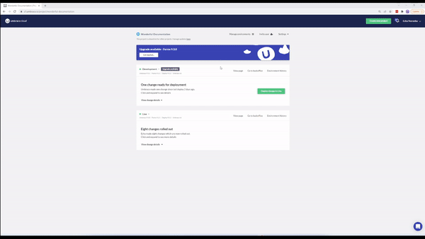

# Team Members in the Project Portal

This article is about team members that are added via the **Invite User** button in the Umbraco Cloud Portal. If you are looking for more information about Users in the Backoffice, see [Users](../../../umbraco-cms/fundamentals/data/users.md). Users added through the backoffice do not have access to the Umbraco Cloud Portal.

Team members are users that you add to your project via the Invite User button in the Umbraco Cloud Portal. They are automatically added as users in the Backoffice of all environments for the project. These users can clone down the project locally and log in using the same credentials they use for Umbraco Cloud.

When adding a user, the default permission is _Read_ for each environment. You can assign backoffice user groups to the user for each environment.

## Team Member User Permissions

User Permissions for each environment can be set in the **Edit Team** page available from the **Settings** dropdown. User Permissions can be set per environment. For example, a user can have Write access on the Development environment and Read access on the Live environment. 

* **Admin**: Has access to everything on a project. An admin can delete a project and edit the team. An admin can deploy changes between environments in the Project Portal and has access to git, as well as the Power Tools Kudu.
* **Read**: A team member with Read permissions can only view the project in the portal as well as the backoffices. They are not able to deploy or change anything on the project itself. They can clone down the project, but cannot push changes they have made locally. By default, they are added as an admin in the backoffice so they can make changes in the backoffice. If you want to change this, see Team Member Permissions in the Umbraco Backoffice below.
* **Write**: A team member with Write permissions can do everything on a project except delete it and edit the team. A user with Write permissions can deploy changes between environments through the portal. They have access to the git repositories and can push local changes to the environment.
* **No Access**: A team member with No access permissions cannot restart the environment, deploy changes between environments, check error logs or log files, or access Kudo in the Project Portal. They can clone down the project, view the project in the portal, and access the backoffice.

## Backoffice User Groups for Team Members

You can view the user group memberships of the project’s backoffice users. Currently, you can manage the backoffice user groups of a user through the Umbraco backoffice. A backoffice user is only created once the user logs into the backoffice of the project for the first time.

## Team Members Pending Invitation

You can see the details of your project invitation in the **Member(s) who still needs to accept the project invitation** section of the **Edit Team** page. You can view the team member's name, email, the expiration date of the invitation, the status of the invitation, copy the invitation link, resend the invitation, or delete the invitation.

## [Technical Contacts](technical-contact.md)

For us to reach the correct person when sending out information about server maintenance, you need to add a technical contact to your Umbraco Cloud project.
