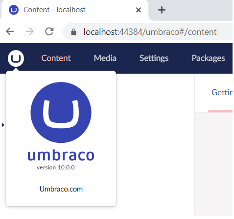

# Major Upgrades


**Are you using any custom packages or code on your Umbraco Cloud project?**\
****\
****You will need to ensure the packages you are using are available in the latest version of  Umbraco and that your custom code is valid with the .NET Framework.\
\
**Breaking Changes**\
\
Make sure that you know the [Breaking changes](../../umbraco-cms/fundamentals/setup/upgrading/version-specific/) in the latest version of Umbraco CMS.


## Content

An overview of what you will find throughout this guide.

* [Prerequisites](major-upgrades.md#prerequisites)
* [Video Tutorial](major-upgrades.md#video-tutorial)
* [Step 1: Enable .NET](major-upgrades.md#step-1-enable-net-6)
* [Step 2: Clone down your project](major-upgrades.md#step-2-clone-down-your-environment)
* [Step 3: Upgrade the project locally using Visual Studio](major-upgrades.md#step-3-upgrade-the-project-locally-using-visual-studio)
* [Step 4: Deploy and Test on Umbraco Cloud](major-upgrades.md#step-4-deploy-and-test-on-umbraco-cloud)
* [Step 5: Going live](major-upgrades.md#step-5-going-live)

## Prerequisites

* A Umbraco Cloud project running **the latest version of Umbraco**
* **At least 2 environments** on your Cloud project.
* A backup of your project database.
  * Directly from your environment. See the [Database backups](../databases/backups.md) article,
  * Or clone down and restore the project, and take a backup of the local database.

## Video Tutorial


Video example.


## Step 1: Enable .NET

* Go to the project in the Umbraco Cloud portal.
* Navigate to **Settings** -> **Advanced**.
* Scroll down to the **Runtime Settings** section.
* **Enable the latest version of .NET** for each environment on your Cloud project.

<figure><figcaption>
Runtime settings
</figcaption></figure>

## Step 2: Clone down your environment

* Clone down the **Development** environment.
* Build and run the project locally.
* Log in to the backoffice.
* Restore content from your Cloud environment.

## Step 3: Upgrade the project locally using Visual Studio

* Open your project in Visual Studio - use the `csproj` file in the `/src/UmbracoProject` folder.
* Right-click your project solution in **Solution Explorer**.
* Select **Properties**.

<figure><figcaption></figcaption></figure>

* Select the same **.Net** **Target Framework** drop-down in the **General** section of the **Application** tab as on your Cloud project.

* Go to **Tools** > **NuGet Package Manager** > **Manage NuGet Packages for Solution...**.
* Navigate to the **Browse** tab.
* Install the _latest stable_ version of the `Microsoft.Extensions.DependencyInjection.Abstractions`.
* Navigate to the **Installed** tab.
* Choose **Umbraco.Cms**.
* Select your project.
* Choose **the latest stable version** from the **Version** drop-down.
* Click **Install** to upgrade your project.

### Upgrading Add-on packages

Follow steps 9-12 to update the following packages to the latest stable version as well:

* Umbraco.Deploy.Cloud
* Umbraco.Deploy.Contrib
* Umbraco.Forms
* Umbraco.Deploy.Forms
* Umbraco.Cloud.Identity.Cms
* Umbraco.Cloud.StorageProviders.AzureBlob


Choose the package version corresponding to the CMS version that you are currently upgrading to.

For example, if you are upgrading to "Umbraco.Cms 11.0.0" update the forms package to "Umbraco.Forms 11.0.0" as well. \

Also, if you have more projects in your solution or other packages, make sure that these are also updated to support the latest .NET framework.


## Step 4: Finishing the Upgrade

*   Choose your Database configuration:

    * To re-use the existing LocalDB database, configure the [ConnectionStrings](../../umbraco-deploy/upgrades/version-specific.md#database-initialization) or use the [`PreferLocalDbConnectionString` setting](../../umbraco-deploy/deploy-settings.md#preferlocaldbconnectionstring).
    * To use the default SQLite database, skip this step.

* Enable [Unattended Upgrades](../../umbraco-cms/reference/configuration/unattendedsettings.md#upgrade-unattended) to verify the Upgrade locally.
* Remove Unattended Upgrades and build and run the project to verify everything works as expected.

Once the Umbraco project runs locally without any errors, the next step is to deploy and test on the Cloud Development environment.

* Push the changes to the **Development** environment. See the [Deploying from local to your environments](../deployment/local-to-cloud.md) article.
* Test **everything** in the **Development** environment.

We highly recommend that you go through everything in your Development environment. This can help you identify any potential errors after the upgrade, and ensure that you are not deploying any issues onto your Live environment.

## Step 5: Going live

Once everything works as expected in the development environment, you can push the upgrade to the live environment.

* [Working locally with Umbraco Cloud](../set-up/working-locally.md)
* [KUDU on Umbraco Cloud](../set-up/power-tools/)
