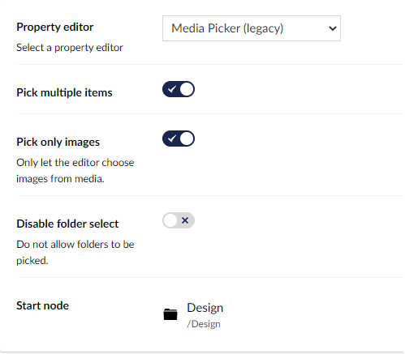
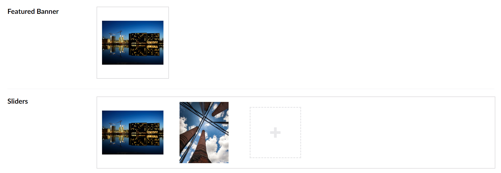

# Media Picker (Legacy)

:::note
We highly recommend that you use the [Media Picker](../Media-Picker-3/) instead.

This updated property contains more customizable features, and we recommend using this over the Media Picker, which is also marked as the *old* version of the picker.
:::

`Alias: Umbraco.MediaPicker`

`Returns: IEnumerable<IPublishedContent>` or `IPublishedContent`

This property editors returns a single item if the "Pick multiple items" data type setting is disabled or a collection if it is enabled.

## Data Type Definition Example



### Ignore user start nodes

Use **Settings** to overrule user permissions, to enable any user of this property to pick any Media Item of the choosen Start node.

When this setting is enabled, a user who doesn't normally have access to the media selected as "Start Node" (/Design in this case), can access the media when using this particular Media Picker. If no Start node has been defined for this property any content can be viewed and selected of this property.

## Content Example



## MVC View Example

### Multiple enabled without Modelsbuilder

```csharp
@{
    var typedMultiMediaPicker = Model.Value<IEnumerable<IPublishedContent>>("sliders");
    foreach (var item in typedMultiMediaPicker)
    {
        
    }
}
```

### Multiple enabled with Modelsbuilder

```csharp
@{
    var typedMultiMediaPicker = Model.Sliders;
    foreach (var item in typedMultiMediaPicker)
    {
        
    }
}
```

## Multiple disabled without Modelsbuilder

```csharp
@{
    var typedMediaPickerSingle = Model.Value<IPublishedContent>("featuredBanner");
    if (typedMediaPickerSingle != null)
    {
        <p>@typedMediaPickerSingle.Url()</p>
        
    }
}
```

## Multiple disabled with Modelsbuilder

```csharp
@{
    var typedMediaPickerSingle = Model.FeaturedBanner;
    if (typedMediaPickerSingle is Image image)
    {
        <p>@image.Url()</p>
        
    }
}
```

## Add values programmatically

See the example below to see how a value can be added or changed programmatically. To update a value of a property editor you need the [Content Service](../../../../../Reference/Management/Services/ContentService/index.md).

```csharp
@using Umbraco.Cms.Core;
@using Umbraco.Cms.Core.Services;
@inject IContentService Services;
@{
    // Get access to ContentService
    var contentService = Services;

    // Create a variable for the GUID of the page you want to update
    var guid = Guid.Parse("32e60db4-1283-4caa-9645-f2153f9888ef");

    // Get the page using the GUID you've defined
    var content = contentService.GetById(guid); // ID of your page

    // Get the media you want to assign to the media picker 
    var media = Umbraco.Media("bca8d5fa-de0a-4f2b-9520-02118d8329a8");

    // Create an Udi of the media
    var udi = Udi.Create(Constants.UdiEntityType.Media, media.Key);

    // Set the value of the property with alias 'featuredBanner'. 
    content.SetValue("featuredBanner", udi.ToString());

    // Save the change
    contentService.Save(content);
}
```

Although the use of a GUID is preferable, you can also use the numeric ID to get the page:

```csharp
@{
    // Get the page using it's id
    var content = contentService.GetById(1234); 
}
```

If Modelsbuilder is enabled you can get the alias of the desired property without using a magic string:

```csharp
@using Umbraco.Cms.Core.PublishedCache;
@inject IPublishedSnapshotAccessor _publishedSnapshotAccessor;
@{
    // Set the value of the property with alias 'featuredBanner'
    content.SetValue(Home.GetModelPropertyType(_publishedSnapshotAccessor, x => x.FeaturedBanner).Alias, udi.ToString());
}
```
