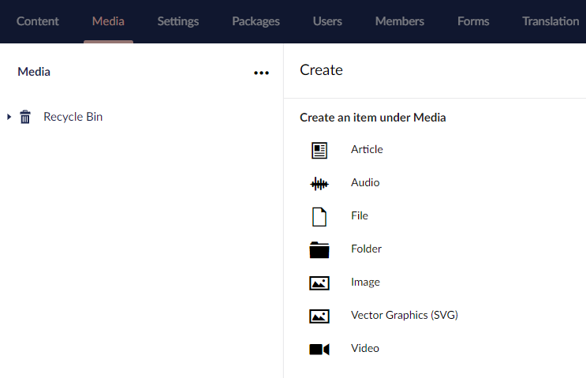
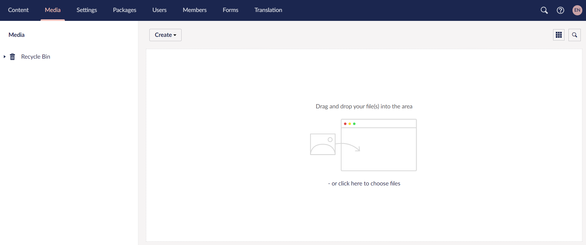
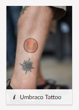
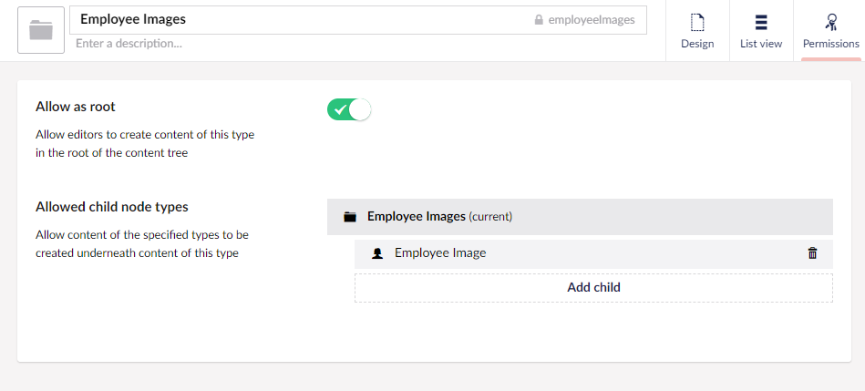

# Creating Media

Media in Umbraco is handled the same way as content. Instead of defining Document Types you define Media Types that acts as a base for media items. The following default Media Types are available:

* Article - Used for uploading and storing documents.
* Audio - used for uploading and storing digital audio files.
* File - used for uploading and storing different types of files in the Media section.
* Folder - a container for organizing media items in the media tree.
* Image - used for uploading and storing images.
* Vector Graphics (SVG) - used for uploading and storing Scalable Vector Graphics files which are text files containing source code to draw the desired image.
* Video - used for uploading and storing video files.

This means you don't have to define your own Media Types to start using the Media section. You have already got the tools for organizing and uploading the media.


If you have upgraded from an older version than 8.14 then the new media types are not added automatically. You can add those types manually yourselves by following the steps below ['Creating a new Media Type'](./#creating-a-media-type). On the [default media types page](default-media-types.md), you will find an overview of all new media types.


## Uploading Media

You can upload media in two different ways:

* Through the Media section and
* Through the Content section

### Add media through the Media section

From the Media section in the Umbraco backoffice you can add new media items by following either of the approaches defined below.

* Click **...** next to **Media** and choose the media type, enter a name for your media item and select the **Click to upload** field to choose a file type or drag the file into the upload field to upload the item.

    
* Drag and drop your files in the **Upload** field in the Media section.\
    \
    Umbraco will automatically detect the media type and create a media item in the folder. You can even drop entire folders (with subfolders) and the folder and file structure will be recreated.

    
* Click the **Create** dropdown, and choose the media item. Enter a name for your media item and select the **Click to upload** field or drag the file into the upload field to upload the item.

    

### Add media through the Content section

New media items can be added to your site without interupting the content creating flow. This can be done following either of the two approaches outlined below.

* Drag and drop the image(s) from your file explorer directly into the Media Picker property on the Content page.

    

  * Images added this way is automatically added to the user's start node in the Media section of the Umbraco backoffice.
* Select the "+" icon to open the "Add Media" dialog where you can add image(s) from your file explorer directly or by drag and drop.

## Creating a folder

It is always a good idea to start by creating a folder for your Media items. Make sure to name your folders in a way that makes it possible for editors to upload their media items in the right place.

To create a media folder, go to the **Media section** and click **...** next to **Media**. Alternatively, you can right-click the **Media** node and choose **Create**. This will bring up the list of available media types. Select **Folder**, enter a name for the folder and click **save**.

## Media Type properties

The **Image** Media Type has 5 properties (**Upload Image**, **Width**, **Height**, **Size** and **Type**) that is populated once the image is uploaded. These properties can be viewed in the **Media** section and accessed in your templates.

Except the **Folder** Media Type, the rest of the media types has 3 properties - **Upload Image**, **Type**, and **Size**.

## Organizing and editing media items

The default view for the media section is a card view that let's you preview the different media files.

Click the items to select multiple media items and perform bulk operations like moving or deleting them. To edit properties on a media item, click the name of the item, which you will see once you hover over the item.

You can switch to a list view by clicking the view toggle next to the search field and selecting the listview.

## Using media items in content

By adding a **Media Picker** property to a Document Type the editor will have the ability to select media items when creating content.


The **Upload File** property on the images use the Image Cropper Data Type. If crops are added to this you can adjust the individual crops on the media item and access them in templates. You can add crops by editing the Upload File property on the Image Media type in the Settings section.


## Creating a Media Type

You can create your own Media Types and add tabs, properties, and control the structure of the Media tree as you would with Document Types. This means you can store information that is specific to the media on the item itself.

A Media Type is created in the **Settings** section using the Media Type editor.

Go to the **Settings** section. On the **Media Types** node click **...** next to **Media Types** (or right click the Media Types node) to bring up the context menu. Here you can choose between creating a **New Media Type** or a **Folder**.


Having different folders for different media types makes it possible to restrict where media items can be created. Only allowing PDF uploads in a certain folder or employee images in another makes it easier for editors to keep the Media section organized.


Choose **New Media Type**. This will open the Media Type editor. It is similar to the editor used for creating Document Types. The difference is that Media Types define items for the Media section and you do not have the ability to assign a template for the Media Type.

Name the Media Type _Employee Image_. Choose an icon by clicking the icon to the left of the name.

### Adding tabs/groups

Before we start adding properties to the Media Type we need to add a tab/group to put these in. To add a tab/group, Click on **Add tab** or **Add group** and call it _Image_.

For more information on adding a tab, see [Using tabs](../adding-tabs.md) article.

### Adding properties

We need to add the same properties as on the default **Image** Media Type. These are:

* `umbracoFile`
* `umbracoWidth`
* `umbracoHeight`
* `umbracoBytes`
* `umbracoExtension`

On the Image group, click **Add property**. Name it _Upload image_ and change the alias to _umbracoFile_.

Click **Add editor**, search for _cropper_ and choose **Image cropper** under **Create new**. This will create a new Image Cropper Data Type. The name of the new Data Type type is a bit long so rename it to _Employee Image Cropper_.

Add two new crops called _Thumbnail_ (200px x 350px) and _wideThumbnail_ (350px x 200px).

Name the remaining four properties _Width_, _Height_, _Size_ and _Type_ and give them the aliases as mentioned in the image below. They should all use the **Label** editor. As mentioned before these properties will automatically be populated once an image has been uploaded.

## Defining a Media Type folder

Next up, we'll create a folder to hold the employee images. We could use the existing **Folder** Media Type but that would mean editors can upload employee images to any folder of that type. If we create a folder specifically for employee images there is only one place to put them thus making it easier to have an organized Media section.

### Structure and inheritance

Go back to the **Settings** and create a new Media Type and name it _Employee Images_. Select the folder icon by clicking the icon to the left of the name.

We want the same basic functionality (same properties and tabs) as the **Folder** Media type and that can be achieved by clicking **Compositions** and selecting the **Folder** Media Type. Now, Employee images will inherit tabs and properties from the Folder Media Type.

Switch to a list view by clicking the **List view** tab and toggle the **Enable list view** option.

We need to allow the Employee Image Media Type in our new folder. Go to the **Permissions** tab. Click **Add child** under **Employee Images** and select **Employee Image**.

Finally, define where the folder can be created. We want to create the folder in the root of the Media section so select the **Allow at root** option at the top of the Permission tab.

### Creating the folder and media items

Go to the **Media** section and click the menu icon next to Media and select the **Employee images** folder. Name it "Employee Images" and click **Save**.

There are four options to add a new media items to the folder, as you can see here:


Remember you can uncheck the **Allow at root** option on the **Employee images** Media Type to prevent editors from creating multiple folders of this type. This will not affect created folders, only disable the creation of new ones.


### Cropping the images

If you select an image that has been uploaded to this folder you'll see the full image and the two crops we have defined below. Moving the pink focal point on the on the image will update the crops to focus accordingly. You can also edit the individual crops by selecting them and moving the image or adjust the slider to zoom.

## More information

* [Rendering Media](../../design/rendering-media.md)
* [Customizing Data Types](../data-types/)

## Related Services

* [MediaService](../../../reference/management/services/mediaservice.md)
