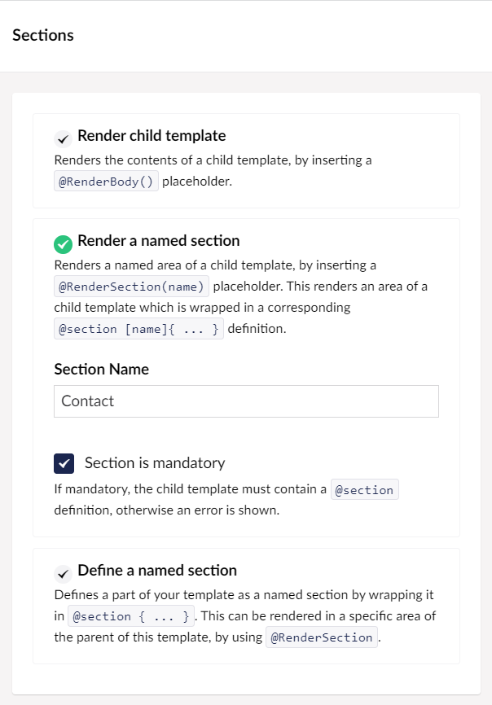

# Named Sections

Template sections support the ability to add additional *Named Sections* to layout templates. These sections can be defined anywhere in the layout file (including within the <head> section of the HTML) and allow you to output dynamic content in your template.

## Defining a Named Section

You can define a part of your template as a named section by wrapping it in `@section`. This can be rendered in a specific area of the parent of this template, by using `@RenderSection`.

For example, you can define the following section within a child template like a Content page:

```csharp
@section Contact
{
    <div class="container">
        <div class="row section">
            <div class="col-md-9">
                <p>@Model.AuthorName()</p> 
            </div>
        </div>
    </div>

}
```

To define a Named Section, follow these steps:

1. Go to **Settings**.
2. Navigate to a template and click **Sections**.
    
3. Select **Define a named section** and enter the **Section Name**.
    
4. Click **Submit**.

## Render a Name Section

Renders a named area of a child template, by inserting a `@RenderSection(name)` placeholder. This renders an area of a child template that is wrapped in a corresponding `@section [name]` definition.

For example, you can define the following section within a Master template:

```csharp
@RenderSection("Contact", false)
```

To render a Named Section, follow these steps:

1. Go to **Settings**.
2. Navigate to a template and click **Sections**.
    
3. Select **Render a named section** and enter the **Section Name**.
    
4. [Optional] Select **Section is mandatory**. This means that the child templates need to have the named section defined for them to work.
5. Click **Submit**.
