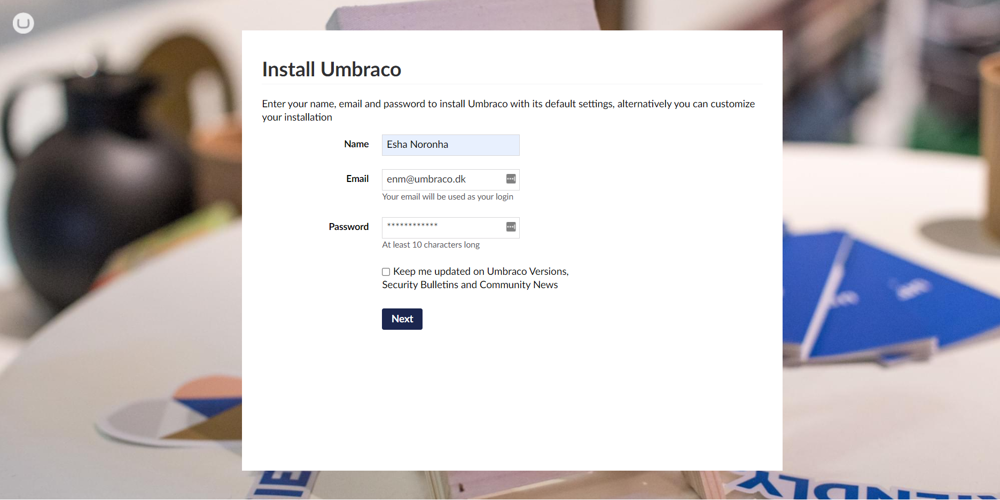
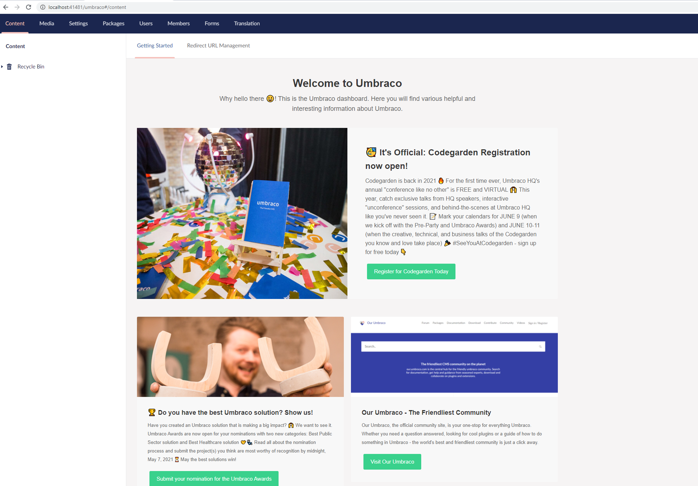

# Introduction

The **Creating a Basic Site** tutorial provides step by step instructions to build an Umbraco website using a set of flat HTML, CSS, and JavaScript files. The tutorial allows you to use a website template, customize it, and wire up the sections that need content managing in the Umbraco CMS.

## **What You Need**

To install a basic website in the Umbraco CMS, you need the following:

* A clean and empty installation of the Umbraco CMS.
* This tutorial uses a copy of the Custom Umbraco Template – a HTML5, responsive website template. Download the [Custom Umbraco Template](https://umbra.co/Umbracotemplate) or, if you prefer, you can use your own flat HTML files.

## **Getting Started**

### Installing Umbraco

To download the latest version of Umbraco, refer to the [Installation article](../../fundamentals/setup/install/). On the installation wizard, follow the steps:

1. Enter your **Name**, **Email**, and **Password**. 
2. Click **Next**.
3. In the **Configure your database** window, enter the connection and authentication details for the database you want to install Umbraco.
4. Click **Continue**.
5. The installation will take a couple of minutes to complete.
6. Once the installation is complete, you will see the **Umbraco Backoffice** screen.

### Preparing the Custom Umbraco Template Site

1. Unzip the [Custom Umbraco Template](https://umbra.co/Umbracotemplate) to a folder on your system.
2. Open the **index.html** from the folder in your preferred browser to see the template. The template contains some text with dummy links. We’re going to turn this into a fully fledged, Umbraco-powered site! 

### Logging in to Umbraco

You can login to Umbraco in two ways:

1. Once the installation is complete, you will see the **Login** screen. You can enter the **Name** and **Password** used during the installation process.
2. Run localhost in your browser, you will see the **Login** screen:
   1. Enter the **Name** and **Password** used during the installation process. You should see a similar Umbraco Backoffice as the image below: 
