# Creating a Multilingual Site

You can use **language variants** to setup a multilingual site. **Language Variants** allow you to have variants of the same content all under the same project. So, if you open a page and a language variant is enabled, you will see the option to switch the language from the drop-down list. Additionally, you can view or input the translated content.

This tutorial explains how to set-up a basic multilingual website.

## Adding a New language

To add a new language, follow these steps:

1. Go to the **Settings** section.
2. Go to **Languages** in the **Settings** tree. The **Languages** window opens in the editor.
3. Click **Add Language**. The **Add Language** window opens in the editor.
4. Select a **Language** from the dropdown list. In this tutorial, we will pick *Danish*.

   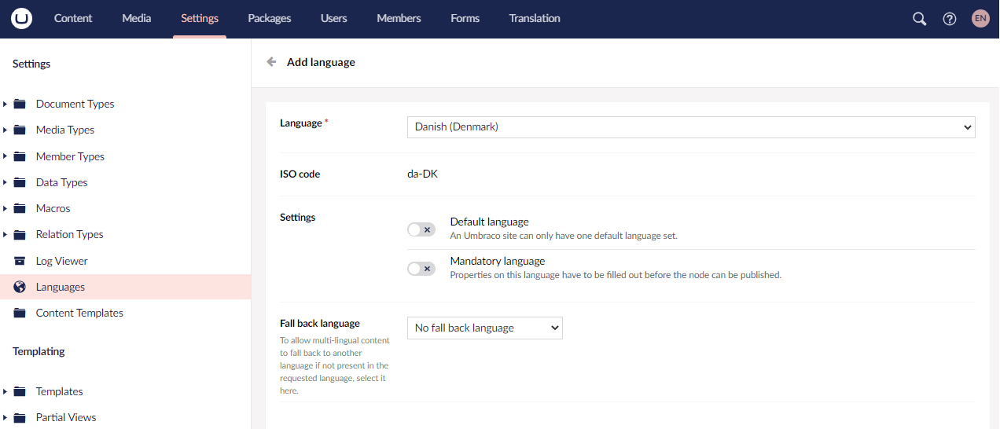
5. In **Settings**, select the following options to set the new language as the:
    - Default language for your site, toggle **Default Language**.
    - Mandatory language for your site, toggle **Mandatory Language**.
6. Select a **Fallback Language** from the drop-down list.

    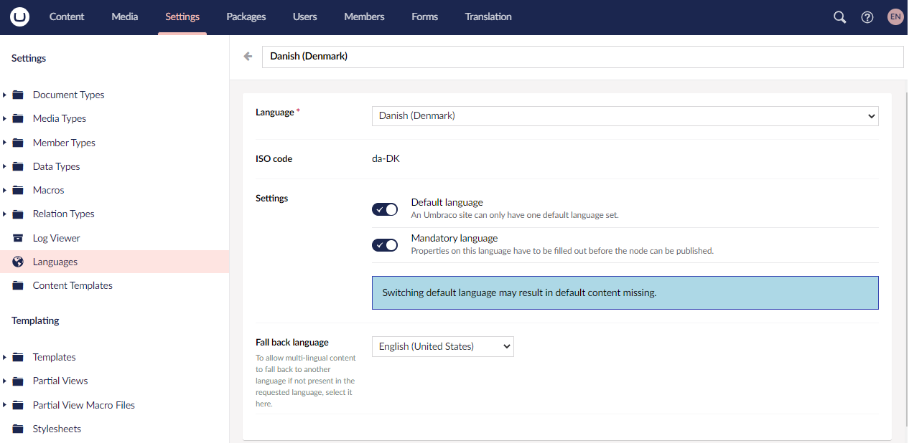
7. Click **Save**.

### Adding Multiple Languages

We can add multiple languages depending on our website requirements. In the previous step, we have already set Danish as our default language. We will now set-up English and German as our variants for this tutorial.

1. Go to **Languages** in the **Settings** tree and click **Add Language**.
2. For English Variant:
    - Select **English (United States)** from the drop-down list.
    - Click **Save**.
3. For German Variant:
    - Select **German** from the drop-down list.
    - Toggle **Mandatory Language** option.
    - Select **Danish** from the **Fallback Language** drop-down list.
    - Click **Save**.

   

### Changing the Default Language of a Website

To change the default language of a website:

1. Go to **Languages** in the **Settings** tree.
2. Select the language you want to set as the new default language.
3. Toggle **Default Language**.
    
4. Click **Save**.

### Changing the Default Backoffice Language of a User

To change the default language of a User:

1. Go to **Users** section.
2. Select the user whose backoffice language you wish to change.
3. Select the new language from the **Language** drop-down list.
    
4. Click **Save**.

## Document Types

For this tutorial, we will create the following document types:

- Home Page

    
- Blogs

    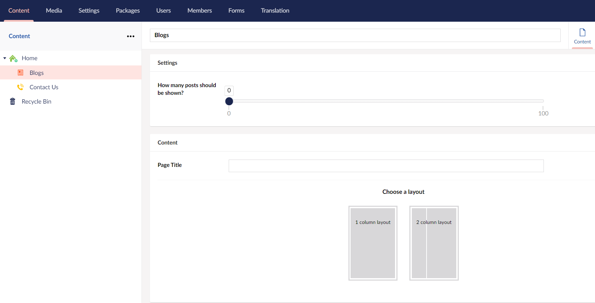
- Contact Us

    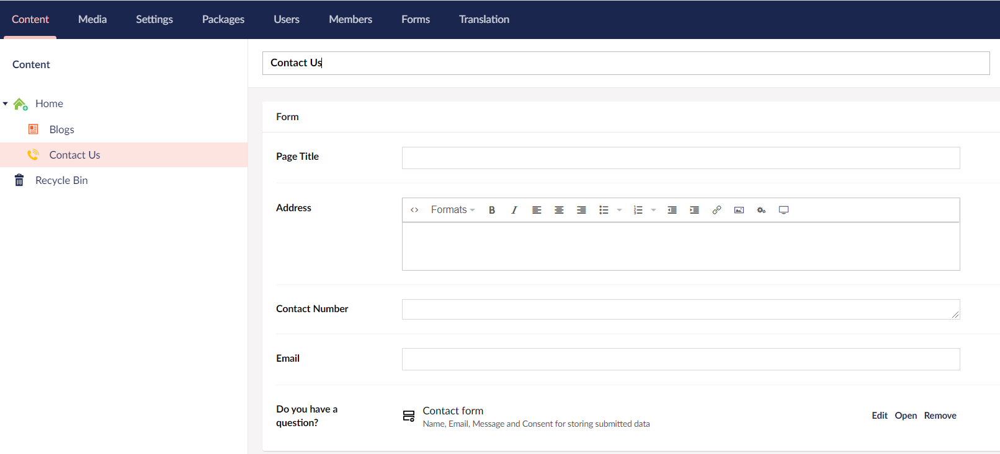

## Enabling Language Variants on Document Types and Properties

To enable language variants on Document Types, follow these steps:

1. Go to the **Settings** tab.
2. Select **Contact Us** from the **Document Types** folder.
3. Go to the **Permissions** tab and toggle **Allow vary by culture**

    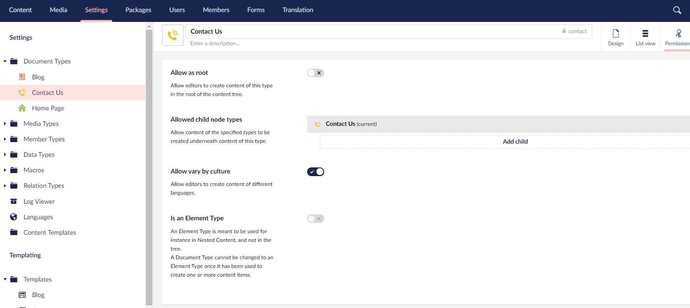
4. Click **Save**.
5. Go to the **Design** tab.
6. Click on the gear icon ⚙ of the **Page Title** and toggle **Allow vary by culture**.

    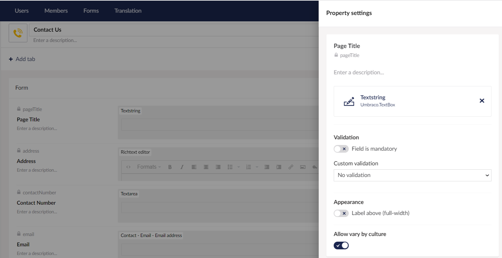
7. Click **Submit**.
8. For this tutorial, we will not make any changes to the **Address**. Click **Save**.

## Viewing the Language Variants in the Content section

When you return to your content node you will notice two things:

1. At the top of the content tree, there is a dropdown to view the content tree in the language of your choice.

   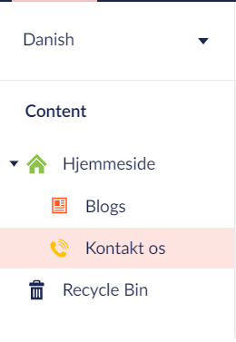
2. To the right of the content name, there is now a dropdown where you can select a language. You can also open a split view so you can see two languages at once.

   

## Adding Culture and Hostnames to the Root Node of the Website

To add culture and hostnames, follow these steps:

1. Go to the **Content** tab.
2. Right-click on the **...** dots next to the **Contact Us** content node and select **Allow access to assign culture and hostnames**.
    :::note
    In Umbraco 9, this option is called **Culture and Hostnames...**.
    :::
3. In the **Allow access to assign culture and hostnames** pane, let's add a domain for each hostname, like it's done here:

    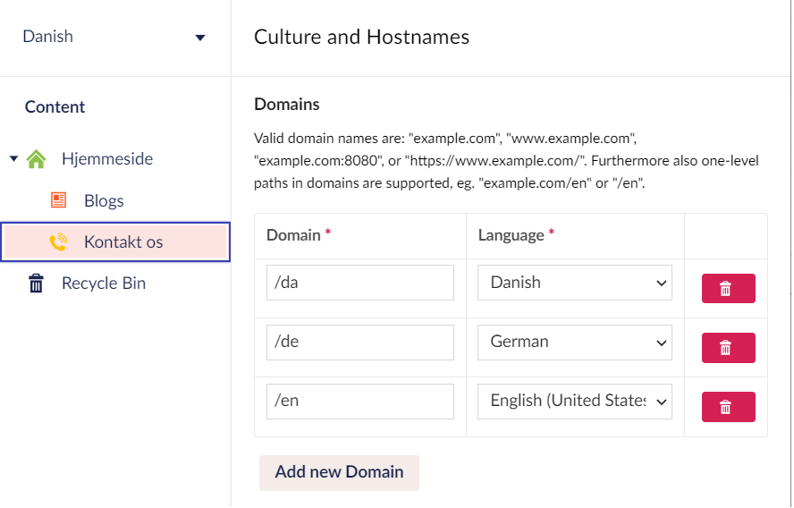
4. Click **Save**.

## Using Side-by-Side Mode for Editing Content

To use side-by-side mode for editing content at the same time, follow these steps:

1. Go to the **Contact Us** node. You will find a language dropdown next to the title at the top:

    
2. Click the dropdown and hover over the new language. You will see an **Open in Splitview** option will appear.

    
3. Click **Open in Splitview**. In this splitview, we can see the content node with each language side by side.

    You may notice that the **Address** and other fields are greyed out - this is because we haven't checked the **Allow vary by culture** checkbox.

    

    To enable these fields, follow the steps mentioned in the [Enabling Language Variants on Document Types and Properties](#enabling-language-variants-on-document-types-and-properties) section.

## Adding Language Variants to the Content

To add language variants to the content.

1. Go to the **Contact Us** node.
2. Enter the **Name** for your content node and the **Page Title** in the new language.
3. Click **Save and Publish**. The **Ready to Publish** window opens providing the option to publish in one or more languages.

    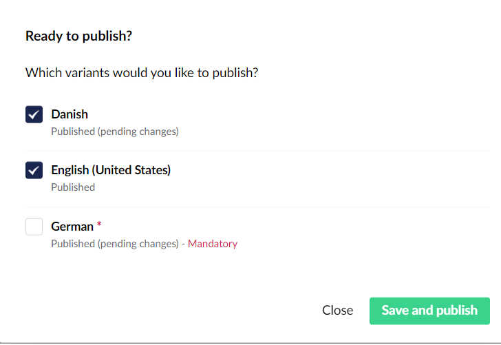
4. You can select either one or multiple languages and click **Publish**.

## Rendering Variant Content in Templates

To render the values of the Contact Us page, use the following in the template:

```csharp
@Model.Value("pageTitle")
```

The `.Value()` method has a number of optional parameters that support scenarios where we want to "fall-back" to some other content, when the property value does not exist on the current content item. To use the fallback type, add the `@using Umbraco.Cms.Core.Models.PublishedContent;` directive.

To display a value for a different language, if the language we are requesting does not have content populated:

```csharp
@Model.Value("pageTitle", "en-Us", fallback: Fallback.ToLanguage)
```

For more information, see the [Using fall-back methods](../../Fundamentals/Design/Rendering-Content/#using-fall-back-methods) article.

## Using Dictionary Items

Depending on how your site is set up, not all content is edited through the content section. Some of the content may be written in the template or labels of the content node and dictionary items can play a part here. Dictionary items store a value for each language. They have a unique key and can be managed from the **Translation** section. For this tutorial, let's add dictionary items for the **Address** and **Contact Number** labels of the Contact Us page.

### Creating Dictionary Items

To create dictionary items:

1. Go to the **Translation** section.
2. Right-click **Dictionary** in the **Translation** tree and select **Create**.
3. Enter a **Name** for the dictionary item. Let's say **Address** and click **Create**.
4. Enter the different language versions for the dictionary item.
    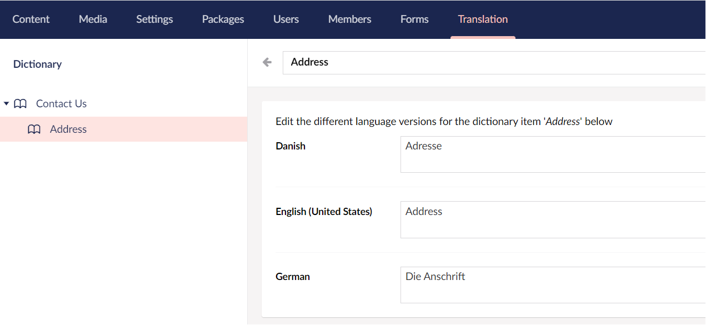
5. Click **Save**.
6. Similarly, we will add different language versions for the **Contact Number** field.

### Rendering Dictionary Items

To render dictionary items in the template, replace the text with the following snippet:

```csharp
@Umbraco.GetDictionaryValue("Address")
@Umbraco.GetDictionaryValue("Contact Number")
```

## Adding a Translator to the Website

You can assign a Translator when you need a 1-1 translation of your site. For example, let's say we originally created a website in "Danish" which works from a `.dk` domain and now there is a need for an "English" site on a `.com` domain. In this case, it might be easier to copy the entire danish site and then provide access to a Translator who can then translate the site page by page.

Translators are used for the translation workflow. By default, Translators have permission to **Browse** and **Update** nodes. Someone must review the translations of site pages before publishing the nodes. For more information on managing User Groups, assigning accesss or User permissions, see the [Users](../../Fundamentals/Data/Users/index.md) article.

## Viewing the Language Variant on the Browser

To view the language variant on the browser, follow these steps:

1. Go to the **Content** tab.
2. Select your new language from the language dropdown above your content tree.
3. Select the **Contact Us** node and go to the **Info** tab.
4. You will notice the links with the new language domain added to it. If it's not there, you might need to refresh the page.

    
5. Click on the link to view the new language varied node in the browser.
6. Alternatively, you can add the domain name to your localhost in the browser. For example: <http://localhost:xxxx/da/>

For viewing purposes, I've added a stylesheet to my website. The final result should look similar to the image below:

Danish Version: 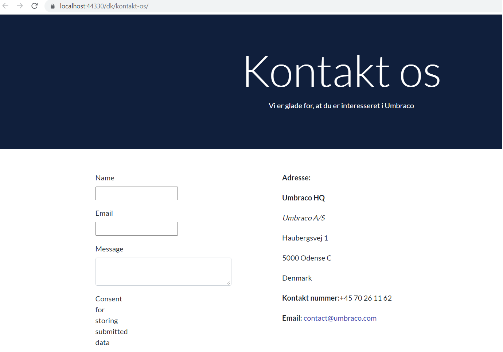

German Version: 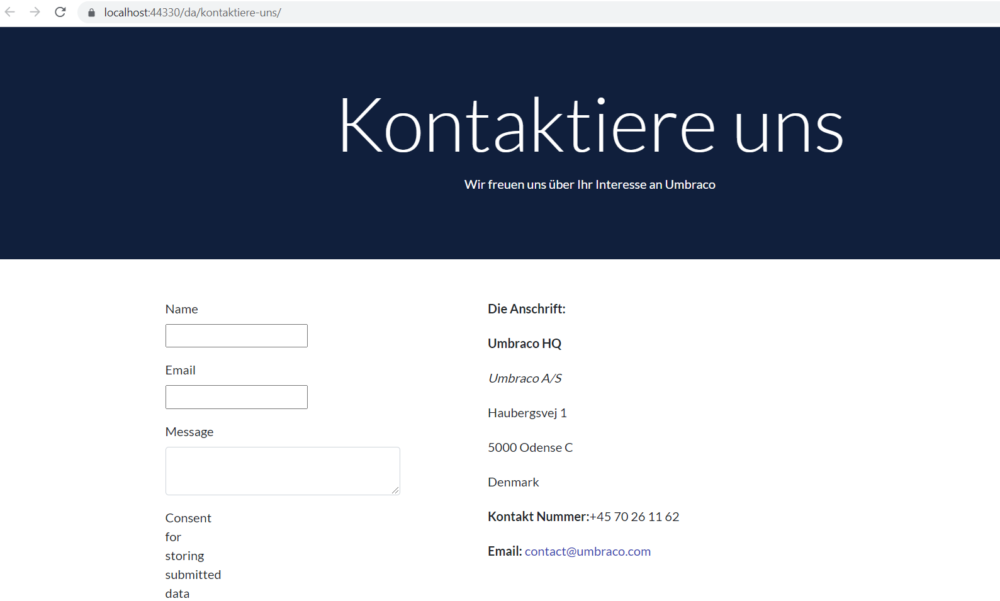
