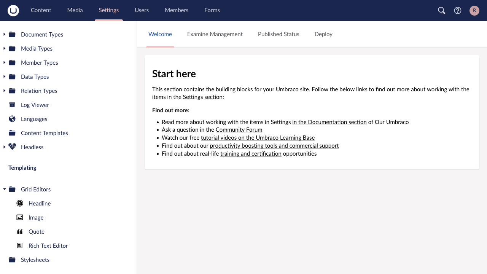
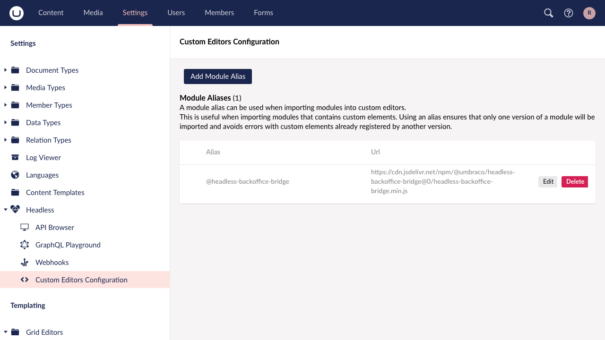

# Custom Grid Editors

A custom Grid Editor in Heartcore is built using [custom elements](https://developer.mozilla.org/en-US/docs/Web/Web\_Components/Using\_custom\_elements).

Custom Grid Editors can be created under the **Grid Editors** tree in the **Settings** section.



The Grid Editor must export a default class inheriting from `HTMLElement`

```javascript
export default class extends HTMLElement {
}
```

For the Grid to be able to save the value the editor must contain a `set value(value)` function and for the editor to be able to show the stored value, it must also contain a `get value()` function.

```javascript
#value // private field
get value() { return this.#value }
set value(value) { this.#value = value }
```

The `set value()` is called when the editor is loaded and when the value is changed outside of the editor.

The `get value()` is called when the grid is saving and when the editor raises an [input event](https://developer.mozilla.org/en-US/docs/Web/API/HTMLElement/input\_event).

## Using external libraries

External libraries can be imported by using the [import](https://developer.mozilla.org/en-US/docs/Web/JavaScript/Reference/Statements/import) statement.

For example, if you want to use [Lit](https://lit.dev/) to create your web component it can be done like this

```javascript
import { LitElement } from 'https://cdn.jsdelivr.net/gh/lit/dist@2/all/lit-all.min.js'

export default class extends LitElement {
  static properties = {
    value: { type: String }
  }
}
```

When importing libraries that registers variables or functions on the global object or custom elements it's advised to create a Module Alias and import that instead. By using Module Alias when importing we can ensure that only one version of a library is imported.

A Module Alias can be configured under **Headless -> Custom Editors Configuration** in the **Settings** section.



:::tip Use a Module Alias when importing libraries to ensure only a single version of that library is loaded. :::

## Accessing backoffice components

Accessing backoffice components like the Media Picker must be done using the [Headless Backoffice Bridge](https://github.com/umbraco/Umbraco.Headless.Backoffice.Bridge).

Using this library reduces breaking changes in the exposed API that would otherwise happen if the backoffice components were accessed directly.

Currently, the library is exposing only a few components but Feature Requests and Pull Requests are more than welcome.

:::note The Headless backoffice Bridge has custom elements so it's advised to import using a Module Alias :::

## JSON Schema

A [JSON Schema](https://json-schema.org/) is used to describe how the value is stored and returned by the REST and GraphQL API.

This allows for advanced configurations where, for example, an [UDI](https://our.umbraco.com/Documentation/Reference/Querying/UDI-identifiers/) is converted to a URL.

The default Schema looks like this:

```json
{
  "$schema": "https://json-schema.org/draft/2020-12/schema",
  "type": "string"
}
```

Since it has `"type": "string"` the different APIs will return the stored value as a string.

If the editor stores an `object` we can use `"type": "object"` instead, now the APIs will return the value as a JSON object.

By also adding properties, the API will be more clever about how the data is returned.

For example, an image editor that stores an `UDI` in the `url` field and the alt text in the `altText` field like this

```json
{
  "url": "udi://media/45d27aa9fcb446e48ef4a07d754d9c9d",
  "altText": "An example image"
}
```

Could have a schema like:

```json
{
  "$schema": "https://json-schema.org/draft/2020-12/schema",
  "type": "object",
  "properties": {
    "altText": {
      "type": "string"
    },
    "url": {
      "type": "string",
      "format": "uri-reference"
    }
  },
  "required": [
    "url"
  ]
}
```

Notice how there's a `"format":·"uri-reference"` to the `url` property in the schema. Combined with `"type": "string"` the APIs knows this is a URI and will try to parse the value stored as an `UDI` and if successful, return the URL of the referenced item.

Currently, the following combinations are supported:

**type**: `string`\
**format**: `uri-reference`\
**value**: Content or Media `UDI`\
**returned**: A URL to the item if exists.\


**type**: `string`\
**format**: `rich-text`\
**value**: Rich Text, for example from the TinyMCE editor\
**returned**: The value where all `a` tags with a `locallink` href and `img` tags with a `data-udi` attribute is replaced with the correct links to the items.\


## Limitations and best practices

Currently, some functionality and components that do not work well in the preview pane. This includes integrations with the backoffice like Pickers and the Rich Text Editor. However, they still work when inserted on a page.

To make your custom editors less likely to break with future updates, do not use any of the backoffice JavaScript directly. Always use the [headless backoffice bridge](https://github.com/umbraco/Umbraco.Headless.Backoffice.Bridge).

If the library is missing any functionality, raise an issue on the [Heartcore issue tracker](https://github.com/umbraco/Umbraco.Heartcore.Issues/issues).

Try to avoid relying on backoffice CSS-classes. Instead, it's recommended creating isolated elements using [shadow DOM](https://developer.mozilla.org/en-US/docs/Web/Web\_Components/Using\_shadow\_DOM).

:::links

## Related articles

* [Creating a Custom Grid Editor](../../Tutorials/Creating-A-Custom-Grid-Editor/) :::
