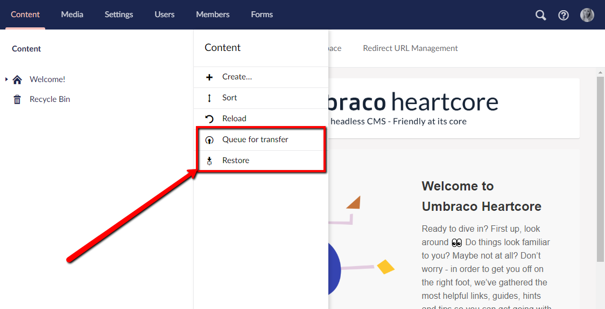

# Content and media transfer / restore

While structure changes are deployed between environments using the Cloud Portal, content and media transfers and restores are handled through the Umbraco Backoffice.


In order to be able to transfer/restore content and media, you need to make sure that the environments you're transferring between are in sync.

Learn more about how to do that, in the [Structure deployments](structure-deployment.md) article.


Another difference between the two steps, is that content and media can be restored _against_ the left-to-right flow. This means that when you have a lot of content on a Live environment, it is possible to restore all this content on a Development and/or Staging environment.

The screenshot above is from the Content section on a Development environment. Right-click the Content tree to open the menu as shown in the screenshot.

**Queue for transfer** gives you the option to queue all content in the Content tree for transfer to the next environment (Staging or Live). It is also possible to right-click single nodes in the content structure in order to only queue some of it for transfer.

**Restore** gives you the option to restore all content from environments right of the current environment. In some cases you might not want to restore all content as once, in which case you should use the _Partial restore_ option instead, which you can find by right-clicking a node in the content tree.
