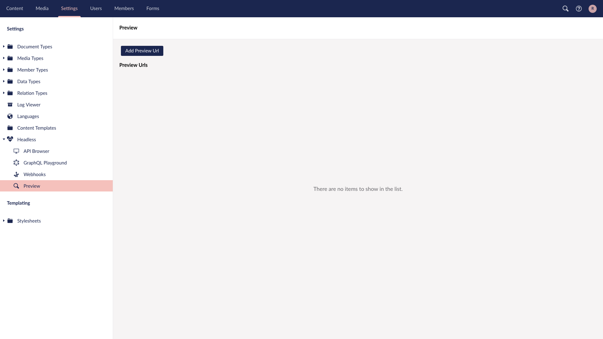
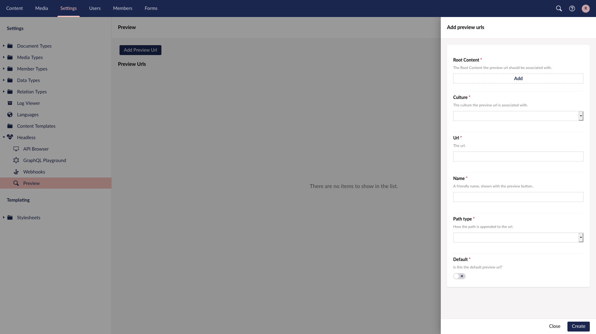
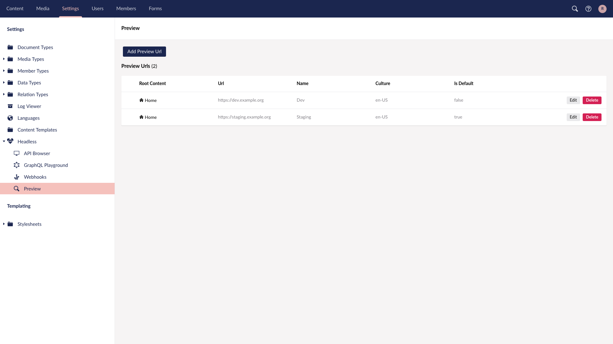
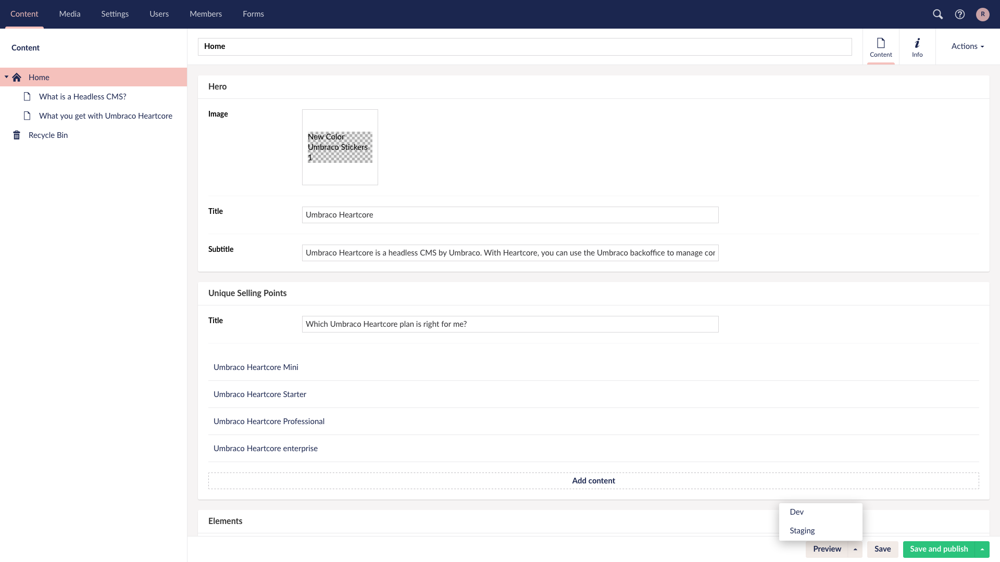

# Preview

In this article you will get an overview of the Preview functionality in Umbraco Heartcore and how to use it with our [Client Libraries](../../Client-Libraries/).

## Prerequisites

The Preview API is always protected, this means it requires an API Key with **Browse Node** permission to be able to access it. If you don't already have an API Key ready, head over to [Backoffice Users and API Keys](../Backoffice-Users-and-API-Keys/) to learn how to create one.

You will also need a client consuming the Content Delivery API. If you don't already have one you can use one of the samples included with the Client Libraries.

## Enabling preview for editors

To make it easier for your editors to access the preview version of you website, you can add a Preview button to content nodes in the backoffice.

This can be done by going to the **Settings** section, expanding the **Headless** item and clicking on **Preview**.

Here you'll get an overview of the preview urls created.



Right now the list is empty, so go ahead and click on **Add Preview Url**



This will open up a dialog on the right side of the backoffice, from where you can select which **Root Content** the preview url should be assigned to, and for which language it should be available for.

The **Name** field is used when there are multiple Preview Urls for a Content item.

**Path Type** controls how the path should be appended to the url, there are 3 different options.

* **Append path to url**: this will append the path of the Content item to the end of url.
* **Path in querystring**: this will add a querystring parameter to the url containing the path of the Content item.
* **Id in querystring**: this will add a querystring parameter to the url containing the id of the Content item.

**Default** controls whether this url is the default one when clicking the Preview button.

After you click save you'll return to the overview where the configured urls is shown. From here, you can edit or delete them.



Now if you go back to the **Content** section and click on the node you selected as the **Root node** or one of its child items, you should now have a **Preview** button in the bottom right section of the screen.

If multiple urls have been added for the Content item, there will be an arrow next to the button. When clicked, it will show all the Preview Urls available.



## Accessing the Preview API

Now that we have setup the backoffice, we need to update our site to use the Preview API.

The Preview API is available on `https://preview.umbraco.io` and its endpoints are identical to the [Content Delivery API](../../API-Documentation/Content-Delivery/content), meaning that you can swap the url out if you don't use one of our Client Libraries.


The Preview API is always protected and requires an API Key to be passed with the request.


If you are using the GraphQL API a `preview` argument can be passed to the root query fields.

```graphql
query {
  allContent(
    preview: true
  ) {
    edges {
      node {
        name
      }
    }
  }
}
```

If you are using the [Node JS Client](https://github.com/umbraco/Umbraco.Headless.Client.NodeJs) you set `preview: true`, set an `apiKey` as shown below, this switches all of the `client.delivery` functions to use the Preview API instead of the Content Delivery API.

```javascript
import {Client} from '@umbraco/headless-client'

const client = new Client({
  projectAlias: 'your-project-alias',
  apiKey: 'your-api-key',
  language: 'iso-code',
  preview: true,
})
```

For the [.NET Client](https://github.com/umbraco/Umbraco.Headless.Client.Net) you'll create a new instance of the `Umbraco.Headless.Client.Net.Delivery.ContentPreviewService`. Note that its based on the `IContentDeliveryService` interface, which the `ContentDeliveryService` also implements.

```csharp
using Umbraco.Headless.Client.Net.Delivery;

class Program
{
    static async Task Main(string[] args)
    {
        var previewService = new ContentPreviewService("your-project-alias", "your-api-key");
    }
}
```

To test that you get draft content back try changing the name of a Content item in the backoffice and click on **Save**, the change should now show up on your preview site but not on the live site.
