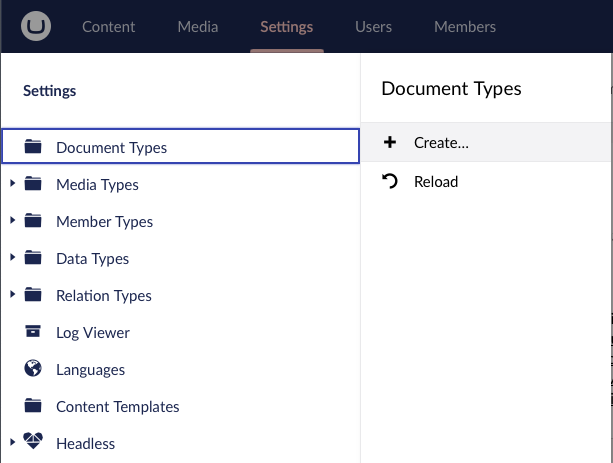
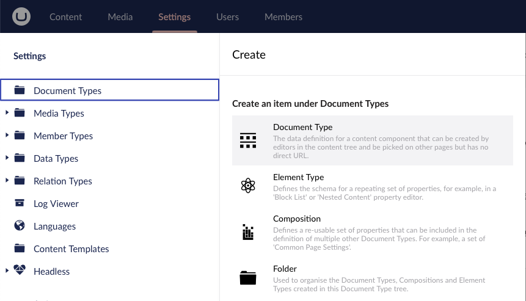
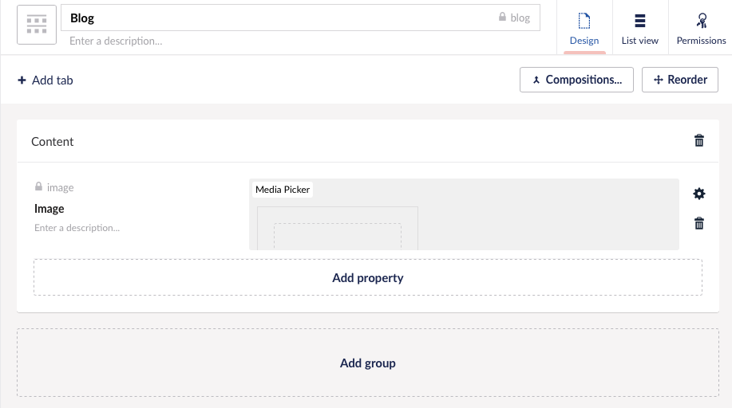
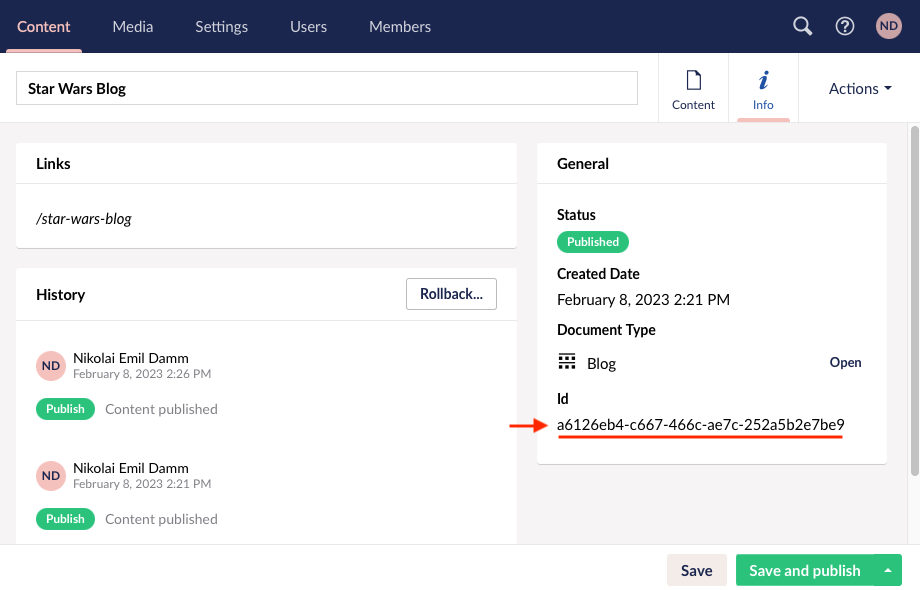
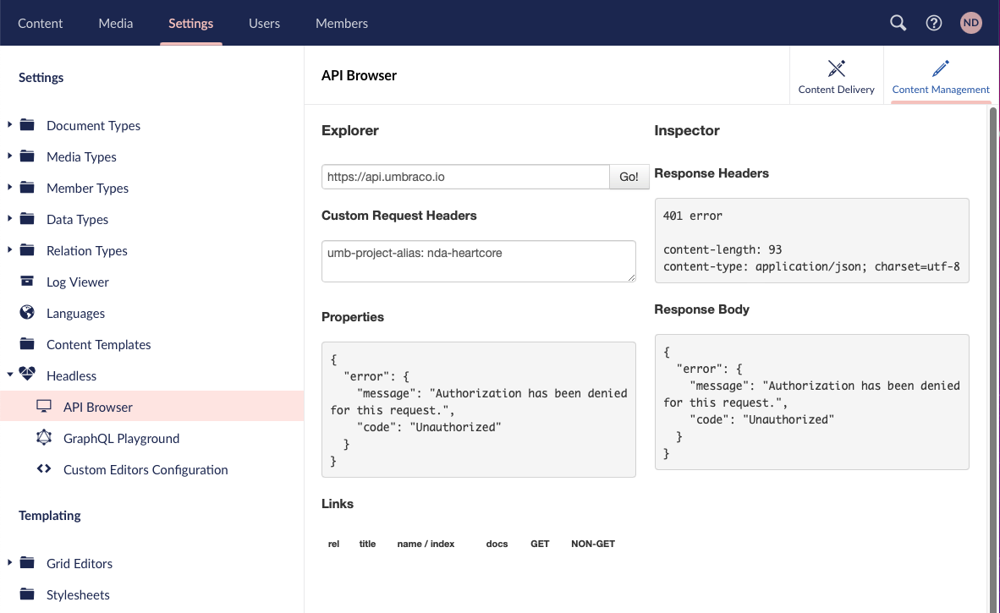
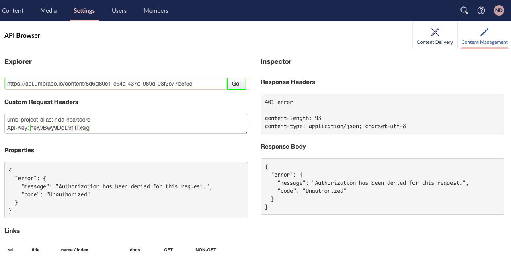
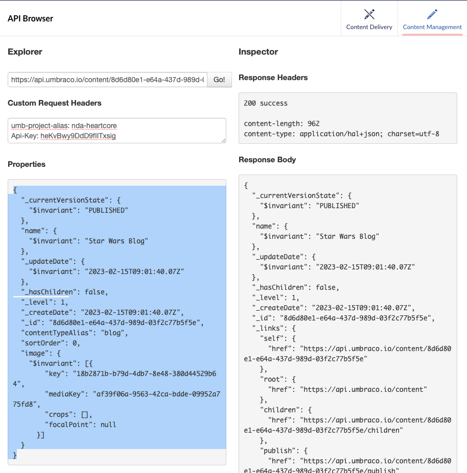
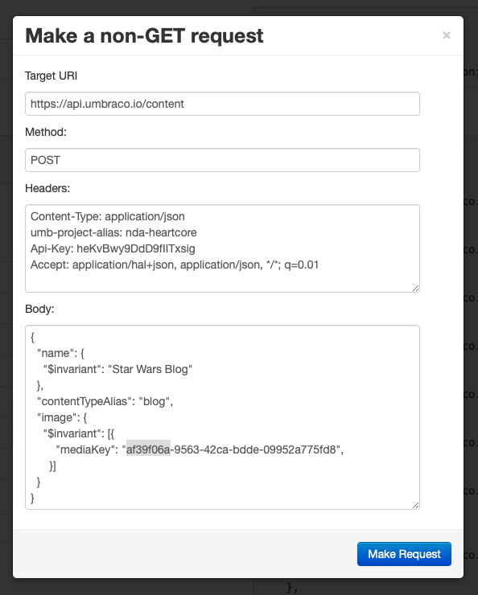
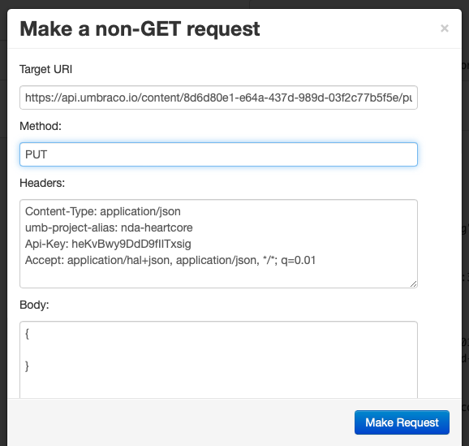

# Creating content with media

In this tutorial, you will learn how to create content with media using the Management API.

The example will be using the Media Picker V3 property editor.

## Determining the request body

Determining the right request body for creating content through the Management API can be a bit tricky. One way to figure out the correct request body is to:

1. Create the content in the backoffice
2. Use the Management API Browser to get the properties for the content created.

You can then use the properties as a template for your request body when creating content through the Management API.

The following tutorial shows you the detailed process for determining the request body while creating content with a Media Picker V3 property.


To follow this guide using the Media Picker (legacy) property you need to replace the Media Picker V3 property. You need to do this when creating the Document Type and content nodes.


### Create a new Document Type with a Media Picker V3 property

First, we must create a Document Type with a Media Picker V3 property. This will allow us to create content with the Media Picker V3 property.

To create a new Document Type with a Media Picker V3 property, follow these steps:

1. Go to the settings section in the backoffice and click the Document Types `Create...` option, and then select the option to create a new Document Type in the sub-menu.

    
    

2. Fill in the name of the Document Type, create a new group and add a new property of the Media Picker V3 type.

    

3. Go to the Permissions page for the Document Type and enable 'Allow as root'.

    

4. Save the Document Type.

### Upload an image to the media section

Now we must upload an image to the media section. This will allow us to select the image in the Media Picker V3 property on the content node we will create later.

To upload an image to the media section, do one of the following:

- Do it later when creating the content node and selecting the image for the Media Picker V3 property.

- Go to the media section in the backoffice and drag-and-drop an image into the media section.

    

- Go to the media section in the backoffice and upload the image through the `File` or `Image` option in the `Create` dropdown.

    

- Send a request (for example with the Management API) to upload an image from binary data. See the [API Documentation](../api-documentation/content-management/media/README.md#create-media) for more information on how to do this.

### Create a new content node of the new Document Type

Next, we need to create a new content node of the new Document Type. This will allow us to query the content node using the Management API Browser.

To create a new content node of the new Document Type, follow these steps:

1. Go to the content section in the backoffice, click the three dots on the right side of the content sidebar, and select the Document Type we created earlier.

    

2. Fill in the name of the content node and select a fitting image for the Media Picker V3 property.
   - If you have not uploaded an image to the media section yet, you can do it when selecting the image for the Media Picker V3 property.

    

3. Save and Publish the content node.

### Getting your API key for using the Management API

To use the Management API, you need an API key. You can get your API key by following these steps:

1. Go to the `Users` section in the backoffice and click the `API Keys` tab in the editor window.
2. Click show on the API key you want to use.

If you do not have an API key yet, you can create one under `Users > Your User > API Keys > Create API Key`. See the [Getting Started](../getting-started/README.md#backoffice-users-and-api-keys) section for more information on how to do this.

### Getting the content node ID

To query content using the Management API, you need the ID of the content node. You can get the ID of the content node by following these steps:

1. Go to the content section in the backoffice.
2. Click the content node you want to query.
3. Click the `Info` tab in the editor window.
4. Copy the ID from the `General` section in the editor window.

    

### Query the content node using the Management API Browser

Now we can query the content node using the Management API Browser, the content node ID and our API Key. This will allow us to get the properties for the content node we created.

To query the content node using the Management API Browser, follow these steps:

1. Go to the settings section in the backoffice, unfold the Headless section, select the API Browser menu item, and click the Content Management tab in the editor window.

    

2. Write the request URL to query the newly created content, fill in the API Key as a Custom Request Header, and click the `Go!` button.

    

3. Copy the properties from the response section in the editor window.

    

### Clean up the properties and use it as a template for your request body

Finally, we need to clean up the properties, so it can be used as a template for our request body.

In this case, we can omit ID's and create/update dates as these are auto-generated at creation time:

```json
{
//"_currentVersionState": {
//  "$invariant": "PUBLISHED"
//},
  "name": {
    "$invariant": "Star Wars Blog"
  },
//"_updateDate": {
//  "$invariant": "2023-02-08T13:26:16.6Z"
//},
//"_hasChildren": false,
//"_level": 1,
//"_createDate": "2023-02-08T13:21:35.27Z",
//"_id": "a6126eb4-c667-466c-ae7c-252a5b2e7be9",
  "contentTypeAlias": "blog",
//"sortOrder": 0,
  "image": {
    "$invariant": [{
      //"key": "394c9bfd-be7b-486d-968a-ce844aa76b5e",
        "mediaKey": "766c9c5b-f4eb-4a5c-b94e-06701eafcbab",
      //"crops": [],
      //"focalPoint": null
      }]
  }
}
```

Resulting in the following request body:

```json
//You cannot use this request body as-is, as the mediaKey will differ.
{
  "name": {
    "$invariant": "Star Wars Blog"
  },
  "contentTypeAlias": "blog",
  "image": {
    "$invariant": [{
        "mediaKey": "766c9c5b-f4eb-4a5c-b94e-06701eafcbab",
      }]
  }
}
```

The media key is the ID of the image in the media section. As such it is the image reference to the image the Media Picker V3 property uses.

See the [Media Picker 3](../../umbraco-cms/fundamentals/backoffice/property-editors/built-in-umbraco-property-editors/media-picker-3.md) section for more info on the other properties.

## Creating a Media Picker with the Management API

Following the steps demonstrated in the [previous section](#determining-the-request-body), we can now create a new content node with a Media Picker using the Management API.

To create a new content node with a Media Picker, follow these steps:

1. Go to the Management API Browser, fill in the API Key as a Custom Request Header, and click the `Go!` button.
2. Now click the small orange exclamation mark button next to the `content` link in the `Links` section. This opens up a modal with the option to make non-GET requests.

    

3. Next copy and paste your request body into the request body section in the modal.

    

4. Click the `Make Request` button.

Now you have created a new content node with a Media Picker property editor that correctly references the image with the ID "766c9c5b-f4eb-4a5c-b94e-06701eafcbab".

## Publishing a Media Picker with the Management API

After having created the content node it is time to publish it, so it can be viewed on the front-end.

To publish a content node with a Media Picker, follow these steps:

1. Go to the Management API Browser, fill in the API Key as a Custom Request Header, Write the request URL for the content, and click the `Go!` button.
2. Navigate to and click the small orange exclamation mark button next to the `publish` link in the `Links` section.
3. Change the request type to `PUT`, and leave the request body empty as an empty object.
4. Click the `Make Request` button.

    

And you are done! You are now able to upload a media item and create a new content node using the newly uploaded media item in a Media Picker v3 property.
You can use a similar approach for discovering the format of more complex content for when you want to create it through the Content Management API.
Please note that the .NET Client Library also supports the use of the Management API if you want to do it from C# code.
