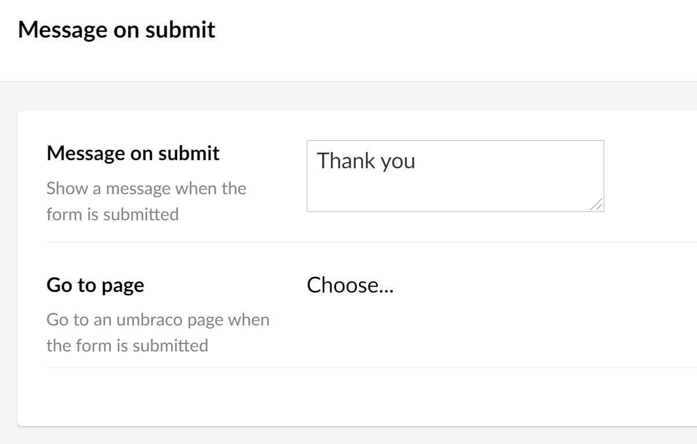
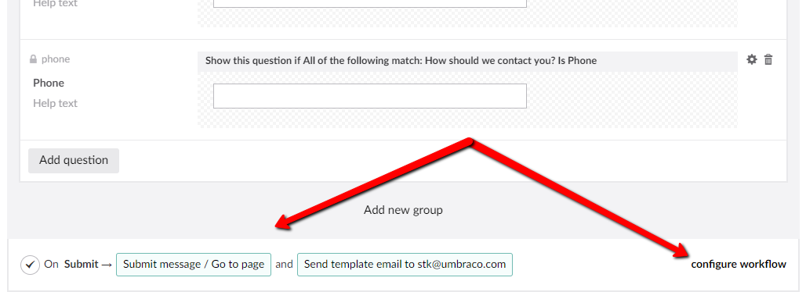
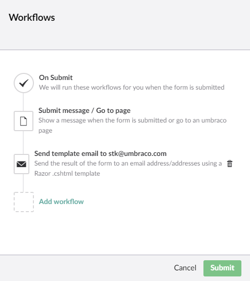
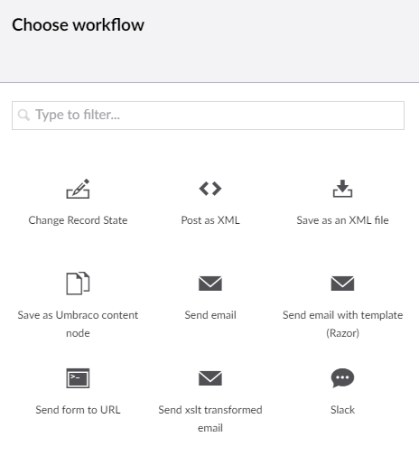
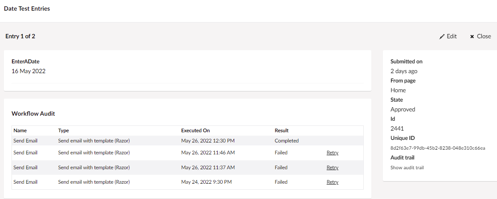

# Attaching Workflows

In this article, you can learn how to add extra functionality to your Form by attaching **workflows**.

Workflows are a way of defining actions after your Form is submitted like sending an email or creating a content node.

## Default Workflow

By default, when a Form is submitted the record data is stored in the database. This can be configured in the [Store records](../Creating-a-Form/Form-Settings/index.md#settings-options) of the Forms settings.

The behaviour to display a message to the user that submitted the form, or to redirect to another page, can be configured by clicking on the built-in first workflow step, labelled **Submit message/Go to page**.

If a value is selected for **Go to page**, it will be used to redirect to that page once the form has been submitted.

If no value is selected, the message in **Message on submit** is displayed to the user on the same page, instead of the form fields. From version 8.8 onwards, this is implemented via a redirect to the current page, ensuring that the form can't be accidentally resubmitted.

## Video Tutorial

<iframe width="800" height="450" title="Attaching Workflows to Umbraco Forms" src="https://www.youtube.com/embed/qJrf1drw1Bg?rel=0" frameborder="0" allow="accelerometer; autoplay; encrypted-media; gyroscope; picture-in-picture" allowfullscreen></iframe>

## Adding a Workflow

At the bottom of your Form, a default workflow is already attached to the Form, as well as an option to configure the workflows.

Clicking **Configure workflow** will give you the option to configure existing workflows, as well as setup new ones.

### Choose a Workflow

A new workflow can be of different types and Umbraco Forms ships with a few default ones. You can find an overview of the types in the [Workflow types](Workflow-Types) article.

### Update Type-specific Settings

Once the Workflow Type has been selected, you will need to configure the workflow. There are different settings depending on the type that has been selected.

To use data from the submitted Form in your workflow, head over to the [Magic Strings](../../Developer/Magic-Strings) article and learn more about how that's done.

Fill in the settings and hit **Submit**. The workflow is added to your Form and it will be shown at the bottom of the page.

## Workflow Processing

When a form is submitted, any workflows associated with the "submit" stage of the form will run sequentially in the configured order. The record is stored after these workflows are completed, and as such they can make changes to the information recorded.

Similarly, approval of a form entry, whether automatic or manual, will trigger the execution of the workflows associated with the "approve" stage.

If a workflow encounters an unexpected error, it will silently fail from the perspective of the user submitting the form. The exception along with the other details of the failed operation is recorded to the log.

From Umbraco Forms versions 8.13.0 and 10.1, an audit trail has been made available. In the list of entries for a form, a summary is presented that shows how many workflows were executed, and how many were successful:

For each entry, in the backoffice a table can be viewed that shows each of the workflows and the success, or otherwise, of the operation.

For any workflows that did not complete successfully, a "Retry" link is available to trigger the workflow again. This is useful for example if there was a temporary infrastructure issue that perhaps prevented an email going out. You would be able to retrigger the workflow once the issue is resolved.

---

Prev: [Setting-up Conditional Logic on Fields](../Creating-a-Form/Conditional-Logic/index.md) &emsp; &emsp; &emsp; &emsp; &emsp; &emsp; &emsp; &emsp; Next: [Workflow Types](../Attaching-Workflows/Workflow-Types/index.md)
